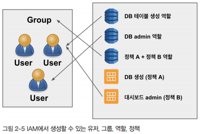

# IAM

## 1. IAM이란?

IAM은 누가, 어떤 리소스나 서비스를 사용할 수 있는지 접근 레벨이나 권한 관리 기능을 제공한다.
 - IAM은 지역과 상관없이 모든 지역에 적용된다.
 - IAM은 리소스에 대한 권한만 관ㄹ니하는 것이 아니라 리소스 안에서 이루어지는 다양한 행동에 대한 세밀한 접근 권한을 관리할 수 있다.
    - DB의 경우 데이터 삽입, 읽기, 수정, 삭제 등 액션을 취할 수 있다.
    - 데이터만 읽을 수 있는 읽기 전용 권한을 부여할 수도 있다.

### 최소 권한 정책

IAM의 목적은 특정 리소스에만 접근할 수 있고, 특정 데이터만 불러오고 수정할 수 있는 제약을 통해 __최소 권한 정책__ 을 적용하는 것이다.

최소 권한 정책은 팀에서 그들의 업무를 진행하는 데 최소한의 역할만 제공하고 그 이외에 대한 접근은 일제 차단시켜버린다.

 - __데이터 엔지니어팀__
    - 데이터를 가져온 후 데이터 전처리를 구현할 수 있는 리소스에 대한 권한만 가지고 있어도 업무에 지장이 없다.
    - 외부로부터 데이터 읽어오기
    - 데이터 전처리 로직 구현
 - __소프트웨어 엔지니어팀__
    - 데이터베이스를 생성하고 관리하는 권한만 가지고 있어도 업무에 지장이 없다.
    - 데이터베이스 구축
    - 스키마 & 테이블 생성
    - 데이터베이스 모니터링
 - __데이터 분석팀__
    - 대시보드 구현
    - 데이터 기반 리포트 제작
    - 데이터 분석

### IAM에서 생성하고 관리하는 것

IAM은 유저, 그룹, 역할, 정책 총 4가지로 나뉜다.

 - `유저(User)`
    - 액세스 키와 비밀 키를 가지고 AWS 리소스를 사용하는 객체
 - `그룹(Group)`
    - 하나 혹은 여러 유저를 담고 있다.
    - 접근 권한을 설정할 때 유저 개개인이 아닌 그룹에 적용시킬 수 있다.
    - 일반적으로 유저보다는 그룹에 특정 권한을 제공한다.
 - `역할(Role)`
    - 역할은 하나 혹은 다수의 정책을 포함할 수 있다.
    - 대부분의 역할은 AWS에서 디폴트로 제공하지만, 다양한 정책을 합쳐서 새로운 역할을 만들어 유저 및 그룹에 적용시킬 수도 있다.
 - `정책(Policy)`
    - 정책을 만들어 최소 권한 정책을 펼칠 수 있다.
    - 정책 A는 DB 읽기 전용, 정책 B는 대시보드 생성 후 모든 작업을 진행할 수 있는 어드민 모드, 정책 C는 루트 유저 권한으로 설정 할 수 있다.
    - 다양한 정책을 만들어 유저 및 그룹에 적용시킬 수 있다.

<div align="center">
    
</div>
<br/>

## 2. IAM 실습

### 2-1. 유저 만들기

 - `IAM 대시보드 > 사용자 > 사용자 추가`
    - __사용자 세부 정보 설정__
        - 사용자 이름: 유저의 고유 아이디
        - AWS 액세스 유형: 액세스 유형으로 다중 선택이 가능
            - 프로그래밍 방식 액세스: 액세스 키와 비밀 키가 제공되며, API를 통해 다양한 AWS 리소스의 사용이 가능
            - AWS Management Console 액세스: 콘솔에서 비밀번호를 통해 AWS 메인 화면에 로그인할 수 있음
    - __권한 설정__
        - 어떤 그룹에 사용자를 추가할지, 기존에 존재하는 권한을 부여할지 선택
    - __완료__
        - 액세스 키와 비밀 키를 보관한다.
```
사용자 이름: aws_learner
AWS 액세스 유형 선택: 프로그래밍 방식 액세스
권한 설정: 기본값 사용
```

### 2-2. 그룹 생성과 유저 관리

 - `IAM 대시보드 > 사용자 그룹 > 그룹 생성`
    - 사용자 그룹 이름: 고유한 사용자 그룹 이름
    - 그룹에 사용자 추가: 해당 그룹에 속한 모든 유저는 해당 그룹 정책에 영향을 받는다.

### 2-3. 역할 및 정책 생성

역할은 사용자에게 다양한 정책을 제공할 수 있는 기능을 부여한다.

 - `IAM 대시보드 > 역할 > 역할 만들기`
    - 신뢰할 수 있는 엔터티 유형: AWS 서비스
    - 다음 AWS 서비스의 사용 사례: Dynamo DB - Global Tables
        - DynamoDBReplicationRolePolicy가 디폴트로 선택된다.
```json
{
    "Version": "2012-10-17",
    "Statement": [
        {
            "Effect": "Allow",
            "Action": [
                "dynamodb:GetItem", // 데이터 읽기
                "dynamodb:PutItem", // 데이터 삽입
                "dynamodb:UpdateItem", // 데이터 수정
                ".."
            ]
        }
    ]
}
```

 - `IAM 대시보드 > 정책 > 정책 생성`
    - 정책 생성에는 2가지 방식이 존재한다.
        - 첫 번째는 시각적 편집기 방식으로 원하는 리소스를 직접 선택하고, 리소스안에서 실행할 수 있는 다양한 행동에 대한 권한을 부여한다.
        - 두 번재는 JSON 방식으로 JSON 형태의 정책 문서를 직접 생성해서 추가할 수 있다.
    - __시각적 편집기__
        - 서비스: DynamoDB
        - 액세스 레벨: 읽기, 쓰기
        - 리소스: 모든 리소스
            - AWS 서비스 내에서 제공하는 다양한 기능
            
