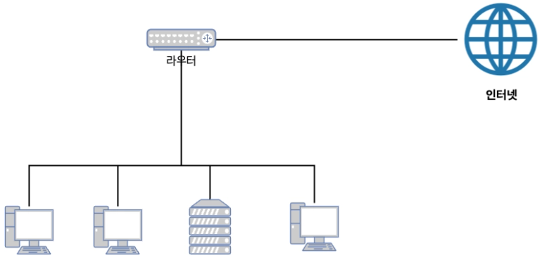

# NAT 이해하기

 - 출처: https://mark-kim.blog/understanding_aws_vpc_1/

## 1. 전통적인 네트워크

네트워크란 여러 대의 디바이스 (PC, 핸드폰 등등)가 서로 통신할 수 있도록 연결되어 있는 상태를 말한다.

 - __디바이스가 많이 보급 되기전__
    - 여러 디바이스 (PC, 핸드폰 등등)가 널리 보급되기전에는 디바이스간의 일대일 (1 : 1)로 연결하여 네트워크를 구성했다.
    - 모든 디바이스가 단일 네트워크를 구축하여 서로 통신했다는 의미이다.
    - 디바이스 수가 기하급수적으로 많아진 현재는 일대일 방식으로는 사무실내의 컴퓨터끼리 통신하는 것도 버겁다.
<div align="center">
    
</div>
<br/>

 - __라우터 사용__
    - 라우터를 이용하는 방식은 디바이스간의 통신에서 모든 데이터를 라우터로 보내고, 라우터가 목적지로 전달하는 방식이다.
    - 여러 디바이스를 라우터에만 연결하여 서로 통신을 쉽게 할 수 있다.
    - 여러 PC를 하나의 라우터 (혹은 스위치)에 연결하면 연결된 PC들은 서로 통신을 주고받을 수 있다. 보통 이더넷 프로토콜 (자주 볼 수 있는 인터넷 선)을 이용하여 PC와 라우터를 연결한다.
    - 이렇게 하여 작은 네트워크를 구성할 수 있다. 그리고 이를 보통 작은 의미의 LAN (Local Area Network)이라고도 부른다.
        - 스위치: 여러 장치를 연결하여 로컬용 네트워크 구축 및 연결 (근거리 통신망)
        - 라우터: 스위치 기능 + 서로 다른 네트워크 연결 (독립적인 LAN과 WAN을 연결)
<div align="center">
    
</div>
<br/>

## 2. 네트워크 주소와 서브넷

라우터가 각 PC에 데이터를 전달하려면 대상을 식별할 수 있는 주소가 필요하다. 네트워크상에서 주소 역할을 하는 것이 바로 IP 주소이다. 모든 디바이스와 라우터는 모두 IP 주소를 가진다.

 - __IP 주소__
    - IPv4 주소는 4개의 8비트(32비트)로 구성되어 있다. (0.0.0.0 ~ 255.255.255.255)
    - IP 주소는 네트워크 ID와 호스트 ID로 구성된다.
        - 네트워크 ID는 각 국가마다 네트워크 ID를 부여하여 관리한다. 네트워크 ID로 어떤 국가의 IP 인지 파악할 수 있다.
        - 호스트 ID는 호스트들을 개별적으로 관리하기 위해 사용하게 된다. 즉, 국가의 지역별 혹은 사용자별로 부여된다.
        - IP에서 어떤 부분까지 네트워크 ID이고, 어떤 부분까지 호스트 ID인지에 따라 IP 클래스가 달라진다. (A, B, C 클래스 등)
        - [네트워크 클래스](https://ko.wikipedia.org/wiki/CIDR)
        - [CIDR](https://ko.wikipedia.org/wiki/CIDR)
<div align="center">
    
</div>
<br/>

 - __공인 IP와 사설 IP__
    - 공인 IP: 인터넷 상에서 고유하게 지정된 IP 주소로, 전 세계적으로 유일하다. 이 주소는 인터넷 서비스 제공자(ISP)에 의해 할당되며, 인터넷 상의 다른 기기들과 직접 통신할 수 있다.
    - 사설 IP: 내부 네트워크에서 사용하기 위한 IP 주소로, 여러 네트워크에서 동일하게 사용할 수 있다. 이 주소는 인터넷에서 직접 접근할 수 없으며, 로컬 네트워크 내에서 장치들을 식별하고 통신하는 데 사용된다.
    - 즉, 공인 IP는 전 세계적으로 고유하며 중복되지 않고, 인터넷에 직접 연결할 수 있다. 반면에 사설 IP는 여러 네트워크에서 중복될 수 있으며, 로컬 네트워크 내에서만 고유하면 되고, 인터넷에서 직접 접근할 수 없으며, 외부와의 통신을 위해서는 NAT를 통해 공인 IP로 변환해야 한다. __공인 IP 한 개로 LAN 안에 있는 컴퓨터 여러 대가 모두 인터넷에 연결할 수 있다.__
    - NAT(Network Address Trarnslation): 사설 IP를 사용하는 네트워크의 장치들이 공인 IP를 사용해 인터넷과 통신할 수 있도록 해주는 기술로 NAT는 라우터에서 주로 사용되며, 내부의 사설 IP 주소를 공인 IP 주소로 변환하여 외부 네트워크와 통신할 수 잇게 한다.
<div align="center">
    
</div>
<br/>

 - __서브넷__
    - __서브넷은 큰 네트워크를 더 작은 네트워크 단위로 나눈 것입니다. 이를 통해 네트워크를 효율적으로 관리하고, 네트워크 내부의 트래픽을 줄일 수 있다.__ 예를 들어, 회사의 전체 네트워크를 여러 부서로 나누어 서브넷을 구성하면, 각 부서의 장치들은 같은 서브넷 안에서만 직접 통신할 수 있다.
    - 네트워크를 분할해 직접 통신할 수 있는 범위를 좁히고, 방화벽을 설정해 보안을 강화할 수 있다. 비교적 큰 네트워크를 서브넷으로 나누어 서브넷 A는 공개하고, 서브넷 B는 비공개로하여 서브넷별 역할을 부여할 수 있다.
    - __네트워크 자원의 효율적인 활용__: IP 주소를 효과적으로 할당할 수 있어, 주소 낭비를 줄일 수 있습니다.
    - __보안 강화__: 네트워크를 서브넷으로 나누어 부서나 기능별로 분리할 수 있습니다.
    - __네트워크 트래픽 감소__: 서브넷은 네트워크를 분할해, 동일 서브넷 내의 통신을 로컬로 제한함으로써 전체 네트워크 트래픽을 줄입니다.
<div align="center">
    
</div>
<br/>

 - __서브넷 마스크__
    - __서브넷 마스크는 IP 주소를 네트워크 주소와 호스트 주소로 구분하는 데 사용되는 값이다.__
    - 서브넷 마스크를 통해 IP 주소가 어느 부분까지 네트워크 주소인지, 그리고 어느 부분이 호스트 주소인지를 알 수 있다.
        - IP 주소가 192.168.1.10이고 서브넷 마스크가 255.255.255.0이라면, 192.168.1 부분은 네트워크 주소를 나타내고, .10 부분은 해당 네트워크에서의 호스트를 나타낸다.
    - __서브넷 마스크 형식__
        - 도트 10진 표기법: 255.255.255.0와 같은 형식으로 표시합니다.
        - CIDR 표기법: /24와 같이 나타내며, 이는 네트워크 부분이 24비트임을 나타냅니다. CIDR 표기법은 네트워크의 크기를 간결하게 표현하는 방법입니다.
            - 슬래시 뒤에 숫자는 몇 개까지 비트가 네트워크 ID로서 유효한지 의미한다.
            - 만약, /24라면 32비트 중에서 24개가 네트워크 ID이고, 나머지를 호스트 ID로 판단한다.
```
# 서브넷 예시
 - IP 주소: 192.168.1.10
 - 서브넷 마스크: 255.255.255.0 (또는 /24)

192.168.1은 네트워크 부분을 나타내고, .10은 해당 네트워크 내의 호스트 주소이다.
/24는 네트워크 주소의 비트가 24개임을 의미한다.
이 서브넷 마스크를 사용하면 네트워크에는 최대 256개의 호스트 주소가 가능하다.
호스트 범위는 192.168.1.1 부터 192.168.1.254 까지이며, .0과 .255는 각각 네트워크 주소와 브로트캐스트 주소로 사용된다.

# 서브넷 예시 2
 - IP 주소: 172.16.1.17
 - 서브넷 마스크: 255.255.0.0 (또는 /16)

172.16은 네트워크 부분을 나타낸다.
172.16로 싲가하는 IP 주소는 나와 동일한 랜(서브넷)에 있는 주소를 의미한다. ARP를 통해 MAC 주소 기반의 스위치 통신이 가능하다.
만약, 다른 IP 주소라면 다른 랜에 존재하며, 라우터를 통해서 통신해야 한다.
```
<div align="center">
    
</div>
<br/>

## 3. 라우터를 통한 내부 통신과 외부 통신

 - __라우터를 통한 내부 통신__
    - __PC C__ 가 __PC A__ 에 데이터를 전송한다고 가정한다.
    - __PC C__ 는 데이터를 __목적지 IP(PC A)__ 에 전송하기 위해 자신의 라우팅 테이블을 확인한다. 그리고 라우터 A에 데이터 패킷을 전송한다.
    - __라우터__ 는 __PC C__ 의 데이터를 수신하여 목적지를 확인하고 자신의 라우팅 테이블을 확인한다.
    - __라우터__ 의 라우팅 테이블엔 __목적지의 IP(PC A)__ 가 Local에 존재한다는 것을 확인하고 해당 IP에 데이터를 전달한다.
    - __PC A__ 는 PC C의 데이터를 수신한다.
    - __PC A__ 의 응답도 동일하게 __라우터__ 를 통해 __PC C__ 에 전달된다.
<div align="center">
    
</div>
<br/>

 - __라우터를 통ㅎ안 외부 통신__
    - __PC C__ 가 구글 서버에 데이터를 전송한다고 가정한다.
    - __PC C__ 는 요청 데이터를 라우터에 전송한다.
    - __라우터__ 는 라우팅 테이블을 확인하고 __목적지 IP(구글 서버 IP)__ 가 로컬에 없다는 것을 판단하고, 데이터를 인터넷 게이트웨이(ISP 라우터)에게 전달한다.
        - 이떄 출발지 IP의 내용을 Private IP에서 Public IP로 변환한다. (NAT)
        - 192.168.0.2 -> 120.160.10.123
    - 인터넷 게이트웨이는 데이터를 수신하고 인터넷(다양한 라우터)을 통해 __구글 서버__ 에 데이터를 전달한다.
        - 이때 출발지와 목적지 모두 공인 IP이다.
    - __구글 서버__ 에서 데이터를 수신하고 처리 결과를 다시 __PC C__ 에 전송한다.
        - 이떄 구글 서버에서 패킷 목적지는 120.160.10.123의 IP를 가진 라우터가 된다.
    - __라우터__ 는 __구글 서버__ 로부터 수신한 데이터의 __목적지 IP__(라우터 A의 IP인 공인 IP)를 NAT 테이블에 따라 Private IP를 찾아낸 후, 해당 IP를 가진 호스트에 데이터를 전달한다.
        - 120.160.10.123 -> 192.168.0.2로 변환하여 192.168.0.2 IP인 PC C에 데이터 전달
    - __PC C__ 는 구글 서버로부터 데이터를 수신한다.
<div align="center">
    
</div>
<br/>

## 4. NAT

 - Network Address Translation. 말그래도 네트워크의 주소인 IP 변환이다.
 - 내부 네트워크에서 외부로 나가는 패킷들의 주소를 외부 네트워크 주소로 변환하고, 그 패킷에 대한 응답 패킷의 목적 주소를 다시 패킷이 발송된 내부 네트워크 주소로 변환해주는 역할을 한다.
 - Private Network가 외부의 Public Network와 통신하기 위해 사용한다.
```
1. PC C에서 www.google.com (1.2.3.4)으로 패킷을 전송한다.
    - DNS 과정은 생략한다.

2. 패킷의 출발지 IP는 PC C에 할당된 Private IP가 지정된다.

3. 패킷이 라우터 A (인터넷 게이트웨이)를 지나면서 출발지 IP를 Private IP에서 외부 통신을 위한 Public IP로 대치한다. (NAT)

4. 라우터 A는 계속해서 목적지 IP로 패킷을 전달한다.

5. 구글 서버에서 요청에 대한 응답 (패킷)을 전송한다.

6. 라우터 A을 지나면서 도착지 IP를 Public IP에서 내부 통신을 위한 Private IP로 대치한다. (NAT)
    - 라우터에선 도착한 패킷의 목적지 Port를 통해 어떤 Private 호스트로부터 온 요청인지 구분한다. (PAT)

7. PC C는 구글 서버로부터 응답을 수신한다.
```
<div align="center">
    <br/>
    
</div>
<br/>

## 5. 패킷 방향에 따른 NAT 종류

 - `Full Cone NAT (one-to-one NAT)`
    - Private IP와 Private Port를 Public IP와 Public Port로 1 대 1로 매핑시키는 방식
    - 외부 호스트에서 매핑된 NAT IP주소로 패킷을 보내 내부 호스트로 패킷을 보낼 수 있다.
    - 보통 서버나 로드밸런싱 인스턴스가 이에 속한다. 서버이므로 외부에서 요청받을 일이 많기 때문이다.
    - AWS에서 EC2에 Public IP를 부여하면 해당 인스턴스만의 IP를 준다. 이는 AWS의 NAT에서 1 : 1로 IP를 부여하는 것이라고 볼 수 있다.
<div align="center">
    
</div>
<br/>

 - `Restricted-Cone NAT`
    - 동일한 Private IP로부터 전송되는 모든 패킷은 동일한 NAT IP 주소로 매핑되는 방식
    - 내부 호스트가 이전에 외부 대상의 IP 주소로 패킷을 보낸 경우에만 해당 외부 호스트가 내부 호스트로 패킷을 보낼 수 있다.
    - 중요한 점은 NAT 매핑 상태가 생성되면 외부 대상이 모든 포트의 내부 호스트와 다시 통신할 수 있다는 점이다.
<div align="center">
    
</div>
<br/>

 - `Port-Restricted-Cone NAT`
    - Restricted-Cone NAT과 유사하지만 제한 사항에 Port 번호도 포함한다.
        - 즉, 내부 호스트와 이전에 정확한 IP와 Port로 통신한 외부 호스트만 내부 호스트로 패킷을 다시 보낼 수 있다.
    - PAT (Port Address Transalation)의 기능과 유사하다.
        - 외부에선 내부에 접근할 수 없지만, 내부에선 외부로 접근이 가능하다.
        - 단, 한번 통신을 했던 외부에선 내부로 접근할 수 있다.
<div align="center">
    
</div>
<br/>

 - `Symmetric (PAT)`
    - Symmetric NAT은 PAT (Port Address Translation)라고 하며, 다른 모든 유형중에서 가장 제한적이다.
        - 이전 3개와 다르게 내부 호스트의 매 요청마다 고유한 NAT IP주소 및 Port에 매핑한다.
        - 이때 패킷을 수신한 외부 대상만 내부 호스트로 패킷을 다시 보낼 수 있다. (응답)
    - 매번 새로운 NAT IP 주소 및 Port에 매핑하기에 외부에선 전혀 내부에 접근할 수 없다.
<div align="center">
    
</div>
<br/>

 - `요약`
    - 1 : 1 NAT의 경우엔 외부에서 공인 IP를 찾을 수 있다.
        - 즉, 외부에서 먼저 통신을 시도할 수 있다.
        - Full Cone NAT가 이에 속한다.
        - 보통 서버나 로드밸런싱 인스턴스가 이에 속한다. 서버이므로 외부에서 요청받을 일이 많기 때문이다.
    - N : 1 PAT의 경우엔 외부에서 공인 IP를 찾을 수 없다.
        - 즉, 외부에서 먼저 통신을 시도할 수 없다.
        - Restricted-Cone, Port-Restricted-Cone, Symmetric가 이에 속한다.
        - 보통 가정 네트워크가 PAT에 속한다. 서버가 아닌 이상 내부의 요청이 있기전엔 외부에서 요청받을 일이 없기 때문이다.
