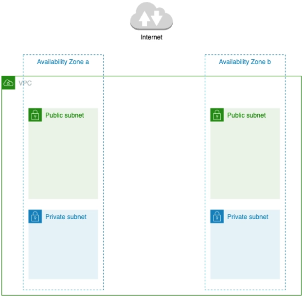
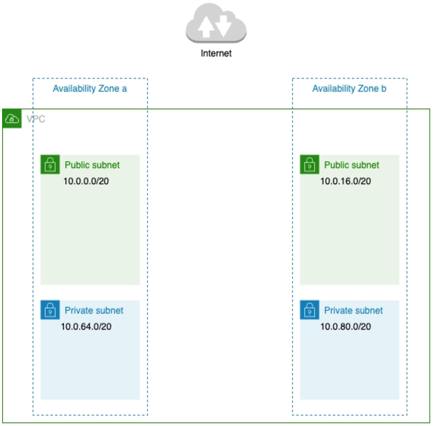
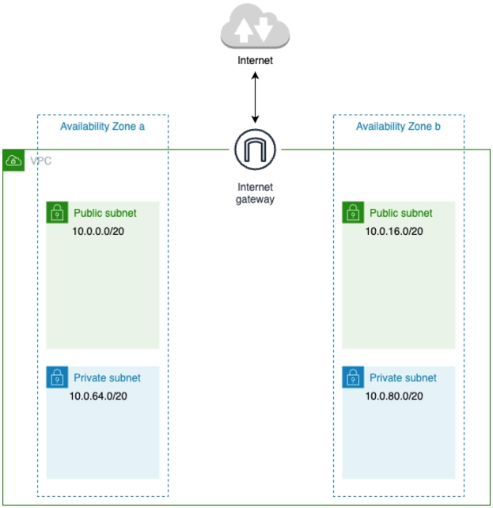
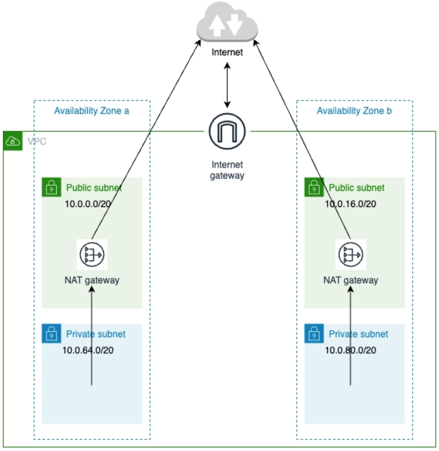
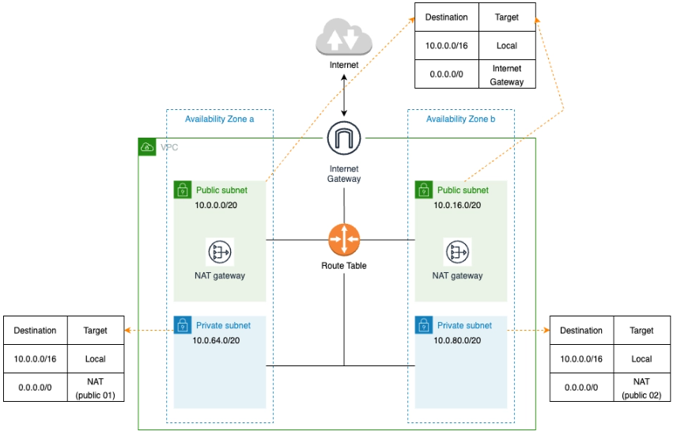
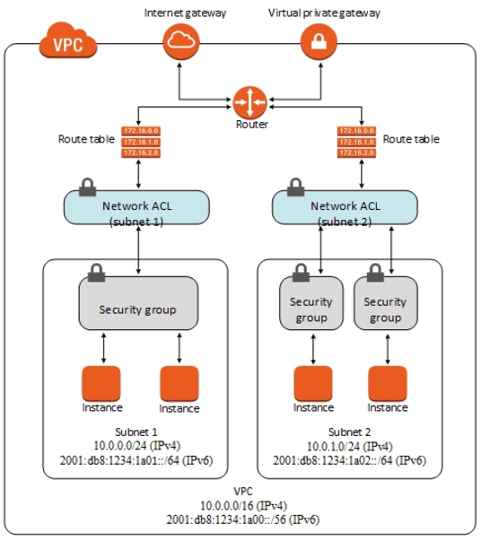

# VPC 이해하기

## 1. VPC 개념

VPC (Virtual Private Cloud)는 AWS에서 제공하는 __가상 네트워크 환경__ 으로, 사용자가 AWS 리소스를 안전하게 격리된 상태로 실행할 수 있도록 하는 서비스입니다. 이를 통해 사용자는 온프레미스 데이터센터와 유사한 방식으로 네트워크를 설정하고 관리할 수 있습니다. VPC는 사용자가 정의한 IP 주소 범위 내에서 여러 서브넷, 보안 규칙, 라우팅 등을 설정해 네트워크를 구성할 수 있게 해줍니다.

가정에서의 네트워크(LAN)는 공유기로 직접 연결했다면, AWS에서의 VPC는 논리적으로 격리된 공간으로 가상 네트워크를 제공한다고 보면된다.

 - VPC 별로 네트워크 설정을 다르게 줄 수 있으며, 이를 통해 보안을 강화하고 공인IP가 아닌 내부IP를 사용함으로써 공인 IP 낭비를 줄일 수 있다.
 - VPC 들끼리는 서로 독립적이므로 서로 영향을 끼치지 않는다.

### 1-1. VPC 주요 구성 요소

 - `서브넷 (Subnet)`
    - 서브넷은 VPC 내부의 IP 주소 범위를 더 작게 나누어 격리된 네트워크 세그먼트를 만듭니다.
    - 퍼블릭 서브넷 (Public Subnet): 인터넷 게이트웨이를 통해 외부와 연결될 수 있는 서브넷으로, 주로 웹 서버처럼 외부에서 접근이 필요한 리소스를 배치합니다.
    - 프라이빗 서브넷 (Private Subnet): 인터넷과 직접 연결되지 않는 서브넷으로, 데이터베이스나 내부 애플리케이션 서버처럼 보안을 위해 외부 접근이 제한된 리소스를 배치합니다.
 - `라우팅 테이블 (Route Table)`
    - 라우팅 테이블은 네트워크 트래픽이 어떤 경로를 통해 이동할지 결정하는 규칙을 정의합니다.
    - 각 서브넷은 라우팅 테이블을 사용해 다른 네트워크와의 연결을 관리하며, 퍼블릭 서브넷은 인터넷 게이트웨이로 가는 경로를 가지고 있습니다.
 - `인터넷 게이트웨이 (Internet Gateway)`
    - 인터넷 게이트웨이는 VPC 내부의 리소스를 인터넷과 연결할 수 있게 해주는 컴포넌트입니다.
    - 이를 통해 퍼블릭 서브넷의 리소스가 인터넷에 액세스할 수 있으며, 외부에서 퍼블릭 IP를 통해 접근할 수 있습니다.
 - `NAT 게이트웨이 (NAT Gateway)`
    - 프라이빗 서브넷의 인스턴스들이 인터넷으로 나가는 연결을 가질 수 있도록 하는 게이트웨이입니다.
    - 이를 통해 프라이빗 서브넷의 리소스가 외부와 통신할 수 있지만, 외부에서 이 리소스로 직접 연결하는 것은 허용되지 않습니다.
 - `NACL (Network Access Control List)`
    - NACL은 서브넷 레벨에서 인바운드 및 아웃바운드 트래픽을 제어하는 방화벽 역할을 합니다.
    - 상태 비저장(stateless) 방식으로 동작하여, 인바운드와 아웃바운드 규칙을 각각 설정해야 합니다.
 - `보안 그룹 (Security Group)`
    - 보안 그룹은 VPC 내의 인스턴스에 대한 트래픽을 제어하는 가상 방화벽입니다.
    - 상태 저장(stateful) 방식으로 동작하며, 인바운드 규칙을 설정하면 해당 연결에 대한 아웃바운드 규칙이 자동으로 허용됩니다.
 - `VPC 피어링 (VPC Peering)`
    - VPC 피어링을 통해 서로 다른 VPC 간에 네트워크 연결을 설정할 수 있습니다.
    - 이를 통해 VPC 간에 트래픽을 주고받을 수 있으며, 동일한 계정이거나 서로 다른 계정의 VPC 간에도 연결이 가능합니다.
 - `VPN 및 Direct Connect`
    - VPN 게이트웨이: 온프레미스 데이터센터와 VPC 간에 암호화된 연결을 설정하여 안전하게 통신할 수 있게 합니다.
    - AWS Direct Connect: 물리적인 전용선을 통해 온프레미스 환경과 AWS 간에 빠르고 안정적인 네트워크 연결을 제공합니다.

### 1-2. VPC 생성 및 설정

 - __VPC 생성 내용__
    - 이름 태그: VPC를 식별하기 쉽게 설정하는 이름
    - IPv4 CIDR 블록: VPC에서 이용하는 Private 네트워크의 IPv4 주소 범위
    - IPv6 CIDR 블록: VPC에서 이용하는 Private 네트워크의 IPv6 주소 범위
    - Tenancy: VPC 리소스의 전용 하드웨어에서의 실행 여부
        - 기본은 다른 AWS 계정과 하드웨어 리소스를 공유한다. 신뢰성이 매우 중요한 시스템이라면 ‘전용’으로 설정하는 것이 좋다.
 - __IPv4 CIDR 블록__
    - 24비트 블록 (/24) : 10.0.0.0 ~ 10.255.255.255
        - 서브넷 마스크 255.255.255.0 -> 총 2^8 (256)개의 IP 할당 가능.
    - 20비트 블록 (/20) : 172.16.0.0 ~ 172.31.255.255
    - 16비트 블록 (/16) : 192.168.0.0 ~ 192.168.255.255
        - 서브넷 마스크 255.255.0.0 -> 총 2^16 (65,535)개의 IP 할당 가능.

## 2. 서브넷

네트워크를 구성할 때 하나의 네트워크 안에서 여러 개의 네트워크 단위로 관리할 수 있는데 이것을 서브넷이라고 한다.

 - __네트워크 자원의 효율적인 활용__: IP 주소를 효과적으로 할당할 수 있어, 주소 낭비를 줄일 수 있습니다.
 - __보안 강화__: 네트워크를 서브넷으로 나누어 부서나 기능별로 분리할 수 있습니다.
 - __네트워크 트래픽 감소__: 서브넷은 네트워크를 분할해, 동일 서브넷 내의 통신을 로컬로 제한함으로써 전체 네트워크 트래픽을 줄입니다.

### 2-1. 서브넷과 가용 영역

 - __VPC에서의 서브넷__
    - 서브넷은 VPC의 IP 주소 범위를 나누는 단위라고 볼 수 있다.
    - VPC는 적어도 하나 이상의 서브넷을 가지고 있어야 한다.
 - __가용 영역__
    - 가용 영역이란 각 리전 안에 물리 서버를 묶어서 말하는 하나의 단위이다.
    - 각각의 서브넷은 가용 영역 안에 존재한다.
    - 가용 영역 별로 서브넷을 제공하면 여러  서브넷을 동시에 이용하지 못하는 가능성을 낮출 수 있으며, 고가용성의 구조를 만들 수 있다.

    

 

### 2-2. 서브넷 IPv4 CIDR

서브넷을 생성할 때 중요한 것중 하나는 IPv4 CIDR을 어떻게 설정하느냐이다. `생성할 서브넷의 수` 와 `서브넷 안에 생성할 리소스 수` 를 고려하여 설계한다.

 - __VPC를 생성할 때 /16으로 만들었다면 서브넷은 3가지 중 하나를 선택할 수 있다.__
    - VPC 범위 /16, 서브넷 범위 8비트, 리소스 8비트 => 서브넷 수 256개, 리소스 수 251개
        - 서브넷 생성시 /24로 생성한다.
    - VPC 범위 /16, 서브넷 범위 4비트, 리소스 12비트 => 서브넷 수 16개, 리소스 수 4091개
        - 서브넷 생성시 /20로 생성한다.
    - VPC 범위 /16, 서브넷 범위 2비트, 리소스 14비트 => 서브넷 수 4개, 리소스 수 16379개
        - 서브넷 생성시 /18로 생성한다.

### 2-3. 서브넷 생성

 - __서브넷 생성 내용__
    - VPC ID: 서브넷을 생성 할 VPC
    - Subnet Name: 서브넷 이름
    - Avaiability Zone: 가용 영역
    - IPv4 CIDR 블록: 서브넷의 IPv4 CIDR
        - 주의할 점은 VPC의 영역까지 포함해서 작성해줘야한다.
        - VPC 16비트, 서브넷 4비트, 리소스 12비트를 사용할 것이다. 10.0.0.0/20, 10.0.16.0/20, 10.0.64.0/20, 10.0.80.0/20

    

 

## 3. 인터넷 게이트웨이

 - 인터넷 게이트웨이를 통해 아래와 같이 VPC의 리소스가 외부와 통신을 할 수 있게된다.
 - 인터넷 게이트웨이는 간단히 VPC 메뉴에서 생성후 특정 VPC와 연결시켜주면 된다.
 - VPC와 인터넷 게이트웨이는 1 : 1의 관계를 갖게된다.

    

 

## 4. NAT 게이트웨이

인터넷 게이트웨이의 역할은 VPC에서 생성된 네트워크와 인터넷 사이의 통신을 수행하는 것이다. 그리고 VPC내의 리소스가 인터넷 게이트웨이를 통해 외부와 통신하려면 해당 리소스는 공개 IP를 가져야한다. 이렇게 공개 IP를 가지면 인터넷에 공개됨으로써 서브넷을 Public과 Private으로 나눈 이유가 없어진다.

__NAT 게이트웨이를 통해 외부에선 요청을 차단하지만, 내부에선 외부로 요청할 수 있게 된다.__ 만약 외부에 공개 IP를 두지않고 VPC내 리소스가 외부에 요청만 시도하려고할 때 사용되는 것이 바로 NAT 게이트웨이다.

 - NAT 게이트웨이를 아래와 같이 구성함으로써 Private Subnet들을 외부로부터 완전히 차단할 수 있다.

    

 

## 5. 라우팅 테이블

일반 네트워크 관점에서 봤을때, 하나의 작은 LAN안에서 서브넷끼리 통신을하려면 라우터나 스위치에 연결이 되어있어야 한다. 그리고 LAN안의 디바이스들끼리는 라우터의 라우팅 테이블을 이용하여 경로를 결정하게 된다.

서브넷을 설정하더라도 서브넷 안에 있는 인스턴스는 다른 서브넷의 인스턴스와 통신을 주고 받을 수 없다. 때문에, 인스턴스들끼리 통신을 주고 받을 수 있도록 경로를 설정해주어야 통신이 가능하다. 이때, VPC의 라우팅 테이블을 이용한다.

### 5-1. 라우팅 테이블 설정

 - Destination: 접속 대상 위치에 대한 정보이다.
    - 즉, 통신 목적지 IP 주소를 지정한다. IP주소는 특정 값을 지정하거나 CIDR 형식을 범위로 지정할 수 있다.
    - VPC의 CIDR를 범위로 설정하면 VPC내의 모든 인스턴스끼리 통신이 가능해진다. (보안그룹에 따라 통신이 안될 수도 있다.)
 - Target : 경유지에 대한 정보이다.
    - Local: 동일 VPC안 리소스 접근.
    - Internet Gateway: Public Subnet에 생성된 리소스가 인터넷 서버와 통신
    - NAT Gateway: Private Subnet에 생성된 리소스가 인터넷 서버와 통신
    - VPN Gateway: VPN을 통해 접속된 독자 네트워크상의 서버와 통신.
    - VPC Peering: 접속을 허가한 다른 VPC상의 리소스와 통신.

### 5-2. 라우팅 테이블 설계

각 서브넷의 리소스들은 네트워크 통신을 할때 가장 먼저 자신에 연결된 Route Table로부터 어디로 데이터를 전송해야하는지 알아낸다.

예를 들어, Private Subnet - 1에서 10.0.0.1/16으로 전송하면 Local로, 123.0.0.1/24로 전송하면 Public Subnet - 1의 NAT 게이트웨이로 전송하게된다.

 - `퍼블릭 서브넷용 - 공용`
    - __라우팅__
        - 로컬 대상
            - Destination: 10.0.0.0/16
            - Target: Local
        - 외부 대상
            - Destination: 0.0.0.0/0(모두)
            - Target: Internet Gateway
    - __적용 서브넷__
        - sample-subnet-public-01
        - sample-subnet-public-02
 - `프라이빗 서브넷 1`
    - __라우팅__
        - 로컬 대상
            - Destination: 10.0.0.0/16
            - Target: Local
        - 외부 대상
            - Destination: 0.0.0.0/0(모두)
            - Target: Internet Gateway
    - __적용 서브넷__
        - sample-subnet-private-01
 - `프라이빗 서브넷 2`
    - __라우팅__
        - 로컬 대상
            - Destination: 10.0.0.0/16
            - Target: Local
        - 외부 대상
            - Destination: 0.0.0.0/0(모두)
            - Target: Internet Gateway
    - __적용 서브넷__
        - sample-subnet-private-02

    

 

## 6. 보안 그룹

VPC안의 리소스를 외부 접근으로부터 보호하려면 제한을 걸어야한다. AWS는 이러한 제한을 보안 그룹 (Security Group, SG)라는 기능으로 제공한다.

쉽게, VPC내 리소스의 가상 방화벽으로 인바운드 규칙과 아웃바운드 규칙을 설정하여 여러 가지 트래픽을 제어할 수 있다.

 - __IP주소와 포트 번호로 제어한다.__
    - IP주소를 통한 제어: 소속된 회사나 학교 등 조직 내 네트워크에서만 리소스에 접근할 수 있도록 제한을 걸어둘 때 사용할 수 있다.
    - 포트 번호를 통한 제어: 포트를 통해 제공하는 서비스의 종류를 지정할 수 있다. 예를 들어 웹 서비스는 80번과 443번, 서버를 관리하기위해선 22번 포트를 특정 IP에 열어서 접근을 제어할 수 있다.
 - __네트워크 ACL과 보안그룹__
    - 접근 제한을 수행하기 위한 시스템으로 보안 그룹 외에도 네트워크 ACL(Access Control List)라는 기술이있다.
    - 보안 그룹: 리소스 (EC2, LB, RDS 등)에 대한 접근 설정
    - 네트워크 ACL: 네트워크에 대한 설정. 즉, 해당 서브넷에 포함되는 리소스 모두에 접근 설정
    - 네트워크 ACL과 보안그룹을 같이 사용하게되면, 보안 그룹 설정 누락을 네트워크 ACL로 막을 수 있다.

    

