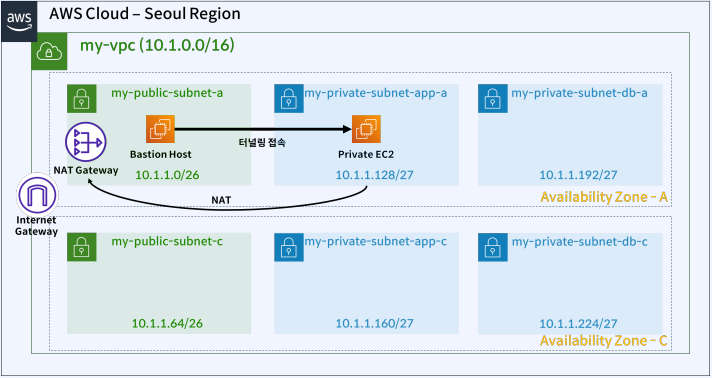

# VPC 실습하기

## 목표 네트워크 아키텍처

 - 실습 내용
    - VPC 생성하기
        - VPC를 10.1.0.0/16 대역으로 생성
    - Bastion 호스트 및 NAT 구축 실습
        - Public 서브넷에 Bastion Host 생성
        - Private 서브넷에 Private EC2 생성
        - Bastion Host에서 Private EC2로 터널링으로 접속
    - OpenVPN 및 NAT 구축 실습
        - Bastion Host 대신에 OpenVPN 용 EC2를 퍼블릭 서브넷에 생성하여 OpenVPN으로 Private EC2로 접속
    - VPN peering 실습
        - 서울과 도쿄 리전에 EC2를 생성하고, VPC Peering으로 묶고, 두 서버간 통신이 되는지 확인

<div align="center">
    
</div>
<br/>

## VPC 생성하기

 - VPC 생성
```
1. VPC 대시보드 접속
2. VPC 생성
 - 이름 태그: my-vpc
 - IPv4 CIDR: 10.1.0.0/16
```

 - 서브넷 생성
```
1. 서브넷 생성
 - VPC ID: 생성한 VPC
 - 서브넷 설정
    - 서브넷 1
        - 서브넷 이름: my-public-subnet-a
        - 가용 영역: 아시아 태평양(서울)
        - IPv4 CIDR 블록: 10.1.1.0/26
    - 서브넷 2
        - 서브넷 이름: my-public-subnet-c
        - 가용 영역: 아시아 태평양(서울)
        - IPv4 CIDR 블록: 10.1.1.64/26
    - 서브넷 3
        - 서브넷 이름: my-private-subnet-app-a
        - 가용 영역: 아시아 태평양(서울)
        - IPv4 CIDR 블록: 10.1.1.128/27
    - 서브넷 4
        - 서브넷 이름: my-private-subnet-app-c
        - 가용 영역: 아시아 태평양(서울)
        - IPv4 CIDR 블록: 10.1.1.160/27
    - 서브넷 5
        - 서브넷 이름: my-private-subnet-db-a
        - 가용 영역: 아시아 태평양(서울)
        - IPv4 CIDR 블록: 10.1.1.192/27
    - 서브넷 6
        - 서브넷 이름: my-private-subnet-db-c
        - 가용 영역: 아시아 태평양(서울)
        - IPv4 CIDR 블록: 10.1.1.224/27
```

 - 인터넷 게이트웨이 생성
```
1. 인터넷 게이트웨이 생성
 - 이름 태그: my-igw

2. 생성된 인터넷 게이트웨이 VPC 연결
 - 작업 > VPC에 연결 > 생성한 VPC로 연결
```

 - 라우팅 테이블 생성
```
1. 라우팅 테이블 생성
 - 라우팅 테이블 1
    - 이름: my-public-route
    - VPC: 생성한 VPC
 - 라우팅 테이블 2
    - 이름: my-private-route
    - VPC: 생성한 VPC

2. 라우팅 테이블 설정
 - VPC로 필터링 > my-vpc

 - my-public-route > 라우팅 > 라우팅 편집
    - 라우팅 추가: 0.0.0.0/0 (대상: 인터넷 게이트웨이)
```

 - NAT 게이트웨이 생성
```
1. NAT 게이트웨이 생성
 - 이름: my-natgateway
 - 서브넷: my-public-subnet-a
 - 연결 유형: 퍼블릭
 - 탄력적 IP 할당

2. 라우팅 테이블 설정
 - my-private-route > 라우팅 > 라우팅 편집
    - 라우팅 추가: 0.0.0.0/0 (대상: NAT 게이트웨이)
```

 - 라우팅 테이블에 서브넷 연결
```
my-public-route > 서브넷 연결 > 서브넷 연결 편집
 - my-public-subnet-a, my-public-subnet-c

my-private-route > 서브넷 연결 > 서브넷 연결 편집
 - my-private-subnet-app-a, my-private-subnet-app-c, my-private-subnet-db-a, my-private-subnet-db-c
```

## Bastion Host 및 NAT 구축 실습

### Bastion Host 용 EC2

 - 보안 그룹 생성(Security Group)
```
1. EC2 대시보드 > 보안 그룹 생성
 - 보안 그룹 이름: my-bastion-host-sg
 - VPC: my-vpc
 - 인바운드 규칙
    - SSH, 내 IP
```

 - 인스턴스 생성
```
 - 이름: my-bastion-host
 - OS: Amazon Linux
 - 인스턴스 유형: t2.micro
 - 키 페어: 만들어놓은 키페어 사용
 - 네트워크 설정
    - VPC: my-vpc
    - 서브넷: my-public-subnet-a
    - 방화벽: 기존 보안 그룹 선택
        - my-bastion-host-sg
```

 - 탄력적 IP 생성
```
1. 탄력적 IP 주소 할당
 - 할당

2. 탄력적 IP 주소 연결
 - 인스턴스: my-bastion-host
```

### Private Subnet용 EC2

 - 보안 그룹 생성(Security Group)
    - bastion-host에서 private-ec2에 접속할 수 있도록 인바운드 규칙 추가
```
1. EC2 대시보드 > 보안 그룹 생성
 - 보안 그룹 이름: my-private-ec2-sg
 - VPC: my-vpc
 - 인바운드 규칙
    - SSH, my-bastion-host-sg
```

 - 인스턴스 생성
```
 - 이름: my-private-ec2
 - OS: Amazon Linux
 - 인스턴스 유형: t2.micro
 - 키 페어: 만들어놓은 키페어 사용
 - 네트워크 설정
    - VPC: my-vpc
    - 서브넷: my-private-subnet-app-a
    - 방화벽: 기존 보안 그룹 선택
        - my-private-ec2-sg
```

 - 접속 테스트
```bash
# Bastion Host에서 명령어 수행
ssh -i my-ec2-keypair.pem ec2-user@{private-subnet-ip}

# Private EC2에서 인터넷 통신 확인
curl -v www.naver.com
```

## OpenVPN 및 NAT 구축

### OpenVPN 용 EC2 생성

 - 인스턴스 생성
```
 - 이름: my-openvpn-ec2
 - OS: openvpn > OpenVPN Access Server
 - 인스턴스 유형: t2.micro
 - 키 페어: 만들어놓은 키페어 사용
 - 네트워크 설정
    - VPC: my-vpc
    - 서브넷: my-public-subnet-a
    - 방화벽: 보안 그룹 생성
        - 보안 그룹 규칙: 내 IP 허용
```

 - 탄력적 IP 할당
```
1. 탄력적 IP 주소 할당

2. 탄력적 IP 주소 연결
 - 인스턴스: my-openvpn-ec2
```

 - my-openvpn-ec2 접속
```
1. 접속 후 openvpn 기본 설정 모두 Enter

2. admin URL이 나오면 브라우저로 접속
 - user: openvpn
 - password: sudo passwd openvpn 명령어로 설정

3. USER MANAGEMENT > User Permissions
 - Username : my-private-ec2 (자동 로그인 허용, 비밀번호 설정)
```

## VPC peering 실습

### 도쿄 리전

 - VPC 생성
```
 - 생성할 리소스: VPC 등 (자동으로 서브넷, 라우팅 테이블 생성)
 - 이름 태그 자동 생성: my-tokyo
 - IPv4 CIDR 블록: 192.168.10.0/24
 - 가용 영역: 2
 - 퍼블릭 서브넷: 2
 - 프라이빗 서브넷: 2
 - NAT 게이트웨이 : 없음
 - VPC 엔드포인트: 없음
```

 - EC2 생성
```
1. EC2 생성
 - 이름: my-tokyo-private-ec2
 - 이미지: Amazon Linux
 - 인스턴스 유형: t2.micro
 - 네트워크 설정: my-tokyo-vpc
 - 서브넷: my-tokyo-subnet-private-1a

2. 보안 그룹 변경
 - 인바운드 규칙 편집
    - 모든 ICMP, 10.1.0.0/16 (서울 리전)
```

 - VPC 피어링 연결
    - VPC 대시보드 > 피어리 연결
```
1. 피어링 연결 생성
 - 이름: my-peer-tokyo-to-seoul
 - VPC: my-tokyo-vpc
 - 피어링할 다른 VPC 선택
    - 계정: 내 계정
    - 리전: 다른 리전 (ap-northeast-2)
    - VPC ID: 서울 리전의 VPC ID (my-vpc)
```

### 서울 리전

 - 피어링 수락
    - VPC 대시보드 > 피어리 연결
```
1. 수락 대기중 클릭 > 작업 > 요청 수락
2. 피어링 네임 변경: vpc-peer-tokyo-to-seoul
```

 - 라우팅 테이블
```
my-private-route > 라우팅 > 라우팅 편집
 - 대상: 192.168.10.0/24(도쿄리전 VPC) 


도쿄 리전
my-tokyo-private1 > 라우팅> 라우팅 편집
 - 대상: 10.1.0.0/16 (peer)
```

