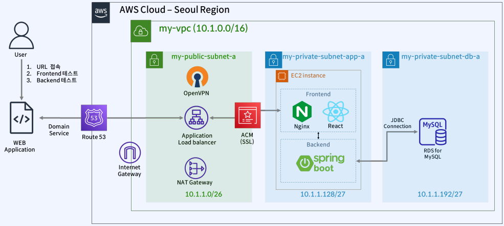

# 소규모 서비스 구축해보기

## 목표 아키텍처

 - 실습 내용
    - Route 53 및 ACM 생성
    - 보안그룹 생성
    - EC2/RDS/ALB 생성
    - Frontend 소스 수동 배포
    - Backend 소스 수동 배포
    - 서비스 테스트
    - CloudFront ALB 연동
    - CloudFront S3 연동
    - Ansible & Jenkins를 통한 배포 자동화
 - 개발 환경
    - OS: Amazon Linux 2
    - Frontend: Nodejs(React)16, Nginx
    - Backend: Spring boot (java 17)
    - Database: RDS for Mysql 8
<div align="center">
    
</div>
<br/>

## Route53 및 ACM 생성

Route 53에서 도메인을 생성하고, 해당 도메인에 ACM SSL 인증서를 등록

 - Route 53
```
1. 도메인 > 등록된 도메인 > 도메인 등록
 - 도메인 생성

```

 - ACM 대시보드(Certificate Manager)
```
1. 인증서 나열 > 요청
 - 도메인 이름
    - 생성한 도메인
    - *.생성한 도메인
 - 검증 방법
    - DNS 검증
 - 키 알고리즘
    - RSA 2048

2. 인증서 상세 접속
 - Route 53에서 DNS 레코드 생성
```

## 보안 그룹(Security Group) 생성하기 EC2, RDS, ALB

 - my-openvpn-sg
    - Inbound Rule
        - My-IP (443, 22, 1194, 943, 945)
    - Outbound Rule
        - 0.0.0.0/0 (All Traffic)
 - my-app-alb-sg
    - Inbound Rule
        - 0.0.0.0/0 (80, 443)
    - Outbound Rule
        - 0.0.0.0/0 (All Traffic)
 - my-app-ec2-sg
    - Inbound Rule
        - my-openvpn-sg (22, 3000, 8080)
        - my-app-alb-sg (8080, 80, 443)
    - Outbound Rule
        - 0.0.0.0/0 (All Traffic)
 - my-app-rds-sg
    - Inbound Rule
        - my-openvpn-sg (3306)
        - my-app-ec2-sg (3306)
    - Outbound Rule
        - 0.0.0.0/0 (All Traffic)
 - 보안 그룹 정리
    - DevOps 클라이언트에서 my-openvpn-sg로 접속
    - 외부 인터넷망(클라이언트)에서 my-app-alb-sg로 접속
    - my-openvpn-sg(VPN 서버)에서 my-app-ec2-sg(앱 서버)로 접속
    - my-app-alb-sg(클라이언트 ALB)에서 my-app-ec2-sg(앱 서버)로 접속
    - my-app-rds-sg에 my-openvpn-sg와 my-app-alb-sg가 접속

### 실습

 - alb 보안 그룹 생성
```
1. EC2 대시보드 > 보안 그룹 > 보안그룹 생성
 - 보안 그룹 이름: my-app-alb-sg
 - VPC: my-vpc
 - 인바운드 규칙
    - 0.0.0.0/0 (80, 443)
 - 아웃바운드 규칙
    - 0.0.0.0/0
 - 태그
    - Name: my-app-alb-sg
```

 - app 서버 보안 그룹 생성
```
1. EC2 대시보드 > 보안 그룹 > 보안그룹 생성
 - 보안 그룹 이름: my-app-ec2-sg
 - VPC: my-vpc
 - 인바운드 규칙
    - my-openvpn-sg (22, 3000, 8080)
    - my-app-alb-sg (8080, 80, 443)
 - 아웃바운드 규칙
    - 0.0.0.0/0
 - 태그
    - Name: my-app-ec2-sg
```

 - rds 보안 그룹 생성
```
1. EC2 대시보드 > 보안 그룹 > 보안그룹 생성
 - 보안 그룹 이름: my-app-rds-sg
 - VPC: my-vpc
 - 인바운드 규칙
    - my-openvpn-sg (3306)
    - my-app-ec2-sg (3306)
 - 아웃바운드 규칙
    - 0.0.0.0/0
 - 태그
    - Name: my-app-rds-sg
```

#### EC2, RDS, ELB 생성

 - EC2
```
1. EC2 인스턴스 생성
 - 이름: my-dragon-app-ec2
 - 이미지: amazon Linux
 - 네트워크: my-vpc
 - 서브넷: my-private-subnet-app-a
 - 방화벽
   - 기존 보안 그룹 선택: my-app-ec2-sg   
```

- RDS
```
1. 서브넷 그룹
 - 이름: my-dragon-app-sbg
 - VPC: my-vpc
 - 가용영역
   - ap-northeasy-2a
   - ap-northeasy-2c
 - 서브넷
   - DB 서브넷의 ID

2. RDS 생성
 - 엔진: MySQL
 - 템플릿: 개발/테스트
 - 배포 옵션: 단일 DB 인스턴스
 - DB 인스턴스 식별자: my-dragon-app-rds
 - 마스터 사용자: root
 - 마스터 암호: 1234
 - 인스턴스 구성
   - 버스터블 클래스(t 클래스 포함): t3.micro
```


 - 로드 밸런서
```
1. 대상 그룹 생성
 - 대상 그룹 이름: my-dragon-app-tg-80
 - VPC: my-vpc
 - 상태 검사
   - 고급 상태 검사
      - 재정의: 80
 - 사용 가능한 인스턴스
   - my-dragon-app-ec2

2. 대상 그룹 생성2
 - 대상 그룹 이름: my-dragon-app-tg-8080
 - VPC: my-vpc
 - 상태 검사
   - 고급 상태 검사
      - 재정의: 8080
 - 사용 가능한 인스턴스
   - my-dragon-app-ec2

3. 로드 밸런서 생성
 - 로드 밸런서 유형 : ALB
 - 로드 밸런서 이름: my-dragon-app-alb
 - 체계: 인터넷 경계
 - VPC: my-vpc
   - a존, c존 -> 퍼블릭 서브넷
 - 보안 그룹: my-app-alb-sg
 - 리스너 및 라우팅
   - HTTP: 80
   - HTTPS: 443
 - 보안 리스너 설정
   - 기본 SSL/TLS 인증서: ACM에서 생성한 인증서

4. 로드 밸런서 수정
 - 리스너 > HTTP 80 > 규칙 보기
   - 80 -> 443으로 리디렉션
 - 리스너 > HTTP 443 > 규칙 보기
   - 규칙 삽입
      - 호스트 헤더: api.fasycampus-dragon.net
      - 전달 대상: my-dragon-app-tg-8080
```

#### Frontend 소스 수동 배포

 - 소스 코드: https://github.com/kimdragon50/facam-frontend
```bash
# Nginx 설치
amazon-linux-extras install nginx1
rpm -qa | grep nginx

# Node 설치
curl -o- https://raw.githubusercontent.com/nvm-sh/nvm/v0.39.7/install.sh | bash
source ~/.bashrc
nvm install 16
node -e "console.log('Running Node.js ' + process.version)"

# Git 설치
yum install git

# 소스 클론 및 빌드
git clone {깃허브 주소}
cd frontend/
npm install
npm run build

nohup npm start &
netstat -ntlp # 3000 포트 확인
curl -v localhost:3000
```

 - Frontend 소스를 Nginx에 복사
```bash
cd conf/conf.d/
vi default.conf
cp default.conf /etc/nginx/conf.d/

# 빌드 결과 복사
cd ../..
cp -r build/* /usr/share/nginx/html/

# Nginx 시작
systemctl start nginx
systemctl status nginx
systemctl enable nginx

curl -v localhost:80
```

 - Nginx 설정
```conf
server {
    listen 80;

    add_header 'Access-Control-Allow-Origin' '*';
    add_header 'Access-Control-Allow-Methods' 'GET, POST, OPTIONS, PUT, PATCH, DELETE' always;
    add_header 'Access-Control-Allow-Headers' 'X-Requested-With,Accept,Content-Type, Origin' always;

    location / {
        root   /usr/share/nginx/html;
        add_header 'Access-Control-Allow-Origin' '*';
        add_header 'Access-Control-Allow-Methods' 'GET, POST, OPTIONS, PUT, PATCH, DELETE' always;
        add_header 'Access-Control-Allow-Headers' 'X-Requested-With,Accept,Content-Type, Origin' always;

        index  index.html index.htm;
        try_files $uri $uri/ /index.html;


    }

    error_page   500 502 503 504  /50x.html;

    location = /50x.html {
        root   /usr/share/nginx/html;
    }
}
```


#### Backend 소스 수동 배포

```bash
yum install java java-devel maven
mvn --version

yum install mysql
mysql --version

# 소스 클론 및 빌드
git clone {깃허브 주소}
cd backend
vi src/main/resources/config/application.properties

# 소스 코드 빌드
mvn clean package
cd target
nohup java -jar *.jar &

netstat -ntlp
curl -v localhost:8080
```

#### CloudFront에 ALB 연동하기

 - Cloud Front는 글로벌 서비스
   - 버지니아 리전으로 변경

 - ACM 생성(Cloud)
   - ACM(Certificate Manager) 생성
      - 인증서 나열 > 요청 > 도메인 이름 지정
   - ACM 수정
      - Route 53에서 레코드 생성


 - 서울 리전
   - Cloud Front
```
1. 배포 생성
 - alb 선택
 - 뷰어
   - 뷰어 프로토콜 정책
      - Redirect HTTP to HTTPS
```

### Jenkins를 사용한 CI/CD 자동화

