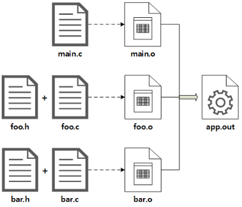

# Makefile

Makefile은 주로 C/C++와 같은 프로그래밍 언어로 작성된 프로젝트를 빌드하는 데 사용되는 파일입니다. Makefile은 빌드 과정에서 파일의 컴파일, 링크, 테스트 등을 자동으로 수행하도록 규칙과 명령어들을 정의하는 스크립트입니다. Makefile을 사용하면 수작업으로 일일이 컴파일하고 명령어를 실행하는 번거로움을 줄이고, 코드 변경 시 필요한 부분만 효율적으로 빌드할 수 있습니다.

 - make는 소프트웨어 개발을 위해 유닉스 계열 운영체제에서 사용되는 프로그램 빌드 도구를 말한다.
 - Makefile 은 프로그램을 빌드하기 위해 make 문법에 맞춰 작성하는 문서이다.
 - __Makefile의 장점__
    - 자동화: 프로젝트 관리 작업을 자동화하여 일관성을 유지할 수 있습니다.
    - 의존성 관리: 파일이 수정된 경우에만 필요한 작업을 수행하므로 효율적입니다.
    - 확장성: 필요한 만큼 타겟을 추가하여 프로젝트 관리 작업을 쉽게 확장할 수 있습니다.
 - __Makefile을 통한 작업 예시__
    - 컴파일 및 빌드: C/C++ 코드 컴파일, Docker 빌드 등
    - 테스트 실행: make test와 같은 명령을 통해 자동으로 테스트 실행
    - 배포 자동화: make deploy 등을 통해 배포 스크립트 실행

## 빌드 예제

세 개의 소스 파일(main.c, foo.c, bar.c)를 각각 컴파일해서 Object 파일(*.o)을 생성하고, 생성한 Object 파일을 하나로 묶는 링크 과정을 통해 실행 파일인 app.out 을 생성한다. 여기서 foo와 bar에 정의된 함수를 main에서 호출하는 의존성이 존재한다.

<div align="center">
    
</div>

 - `직접 빌드`
    - 소스 파일이 많아지고 복잡해지면 아래처럼 직접 빌드하는 것이 어려워진다. 이에 대한 대안으로 쉘 스크립트에 빌드 명령을 작성할 수도 있지만, Makefile이 제공하는 Incremental build를 사용할 수 없게 된다.
    - Incremental build 란 반복적인 빌드 과정에서 변경된 소스코드에 의존성(Dependency)이 있는 대상들만 추려서 다시 빌드하는 기능이다.
    - Makefile 에서 빌드 대상(Target)별로 의존성을 명시하면 자동으로 Incremental build 를 수행하므로 매우 편리하다. 
```bash
# 오브젝트 파일 생성
gcc -c main.c foo.c bar.c

# 실행 파일 생성
gcc -o app.out main.o foo.o bar.o
```

 - `Makefile 빌드`
    - 소스 코드가 위치하는 디렉토리에 위와 같은 Makefile 을 작성하고 다음 명령어를 실행하면 한번에 실행파일(app.out)을 만든다. 이 때, 실행 파일을 만들기 위해 거치는 단계에서 생성되는 오브젝트 파일들(main.o, foo.o, bar.o)도 함께 생성된다.
```makefile
app.out: main.o foo.o bar.o
    gcc -o app.out main.o foo.o bar.o
 
main.o: foo.h bar.h main.c
    gcc -c -o main.o main.c
 
foo.o: foo.h foo.c
    gcc -c -o foo.o foo.c
 
bar.o: bar.h bar.c
    gcc -c -o bar.o bar.c
```

 - `make 명령어 수행`
    - make 명령 뒤에 Target 을 명시하면 해당 Target 만 빌드한다.
```bash
# 
make

# 특정 타겟만 빌드
make foo.o
```

## Makefile 기본 개념

 - `Makefile`
    - target: 생성하려는 파일이나 작업의 이름입니다. 보통은 바이너리 파일, 객체 파일, 또는 사용자 정의 작업을 의미합니다.
    - dependencies: 타겟을 생성하기 위해 먼저 생성되어야 하는 파일들의 목록입니다. 타겟이 갱신되기 전에 이 파일들이 존재하고 최신 상태여야 합니다.
    - command: 타겟을 생성하기 위해 실행되어야 하는 쉘 명령어입니다. 이 명령어는 항상 탭(Tab)으로 시작해야 합니다.
```makefile
target: dependencies
    command
```

### Makefile 내장 규칙(Built-in Rule)

Make 에서 자주 사용되는 빌드 규칙들은 내장되어 있다. 대표적으로 소스 파일(*.c) 을 컴파일해서 오브젝트 파일(*.o)로 만드는 규칙이 있다. 

```makefile
app.out : main.o foo.o bar.o
	gcc -o app.out main.o foo.o bar.o
```

하지만 위와 같이 작성할 경우 Incremental build 를 위한 의존성 검사에서 헤더 파일의 변경을 감지하지 못하는 문제가 발생한다. Make 는 소스 파일의 마지막 변경 시점만 확인하지, 소스 코드 내부의 변경 사항을 하나씩 대조하지 않기 때문이다.

따라서 다음과 같이 각 Target 에 대한 Dependencies 까지 명시해주는 것이 바람직하다.

```makefile
app.out : main.o foo.o bar.o
	gcc -o gcc.out main.o foo.o bar.o

main.o : foo.h bar.h main.c
	foo.o : foo.h foo.c
	bar.o : bar.h bar.c
```

위와 같이 작성하면 헤더 파일만 변경되어도 의존성이 올바르게 탐지된다. 마지막 세 줄에 있는 Target 의 Recipe 는 모두 생략되었지만, Make 내부 규칙에 의해 컴파일이 수행된다.

### 변수

 - `Recursively expanded variable`
    - '=' 기호를 사용해서 변수에 값을 할당하는 방법이다. 변수에 다른 변수를 참조하고 있다면, 다른 변수가 참조하고 있는 값을 참조한다. 
    - 장점: 여러 변수를 사용해서 의도한 대로 make 를 작동시킬 수 있다.
    - 단점: 변수 뒤에 다른 것을 추가할 수 없다. 이는 무한 반복에 빠지기 때문이다. 
```makefile
foo = $(bar)
bar = $(ugh)
ugh = Huh?

all:;echo $(foo)
```

 - `Simply expanded variable`
    - 재귀적 확장 변수의 단점을 보완하기 위한 변수이다. := 기호를 이용해서 변수에 값을 할당한다. = 와는 달리 재귀적으로 작동하지 않으며, 변수에 대입된 값을 그대로 출력한다.
    - 변수를 참조하는 시점에 저장된 값이 아무 것도 없었기 때문에 변수 대신 어떠한 값도 들어가지 않았다. 또한, foo 변수를 스스로 참조하는 무한 반복에 빠지지 않았다. 이러한 특징 덕분에 변수 뒤에 다른 값을 추가할 수 있는 장점이 있다.
```makefile
foo := $(foo) bar

all:;echo $(foo)
```

 - `자동 변수(Automatic variables)`
    - $@ : Target 을 지칭한다.
    - $< : 첫 번째 Dependency 이름을 지칭한다.
    - $^ : 현재 Target이 의존하는 Dependencies 의 전체 목록 (공백으로 구분)
    - $? : 현재 Target이 의존하는 대상들 중 Target 보다 새롭게 변경된 Dependencies 의 전체 목록

 - `내장 변수`
    - $(CC) : 컴파일러
    - $(CFLAGS) : 컴파일 옵션

### 함수

 - `기본 문법`
```makefile
$(function arguments)
```

 - `치환 함수`
```makefile
$(subst ee,EE,feet on the street)
```

 - `변수를 활용한 치환`
    - 선언된 변수를 활용해서 문자열을 치환할 수도 있다.
```makefile
$(변수명:pattern=replacement)

SRCS := first.c second.c third.c
OBJS := $(SRCS:.c=.o)

# 치환 결과
# OBJS = first.o second.o third.o
```

 - `파일 이름 관련 함수`
    - 접미사를 names 앞에 추가하는 함수이다.
```makefile
$(addprefix prefix,names...)

# 실행 예제
$(addprefix src/,foo bar)

# 실행 결과
src/foo src/bar
```

### 가짜 목표 파일 .PHONY

.PHONY 는 Target 위치에 작성하지만, 레시피 실행을 위한 이름일 뿐, 실제 파일 이름이 아니라는 것을 알려주기 위해 사용한다. 참고로 phony 는 사전적으로 ‘가짜’라는 의미이다. 맨 윗줄에 작성하는 것이 편하다.

## Makefile 활용 예시

 - `Makefile 구조 예시`
    - .PHONY: 특정 타겟이 실제 파일이 아님을 선언합니다. 예를 들어, build, clean, run은 파일명이 아니라 작업이므로 .PHONY로 지정해줍니다.
    - build: 빌드 과정을 수행합니다. 이 타겟에서 컴파일 명령어가 수행됩니다.
    - clean: 빌드 결과물 등을 지우는 정리 작업을 수행합니다.
    - run: build 타겟을 의존성으로 가지므로, make run을 실행하면 build가 먼저 실행된 후에 run 명령이 실행됩니다.
```makefile
.PHONY: build clean run

build:
	echo "Building project..."
	# 컴파일 명령어 등이 들어갈 수 있습니다.

clean:
	echo "Cleaning up files..."
	rm -rf *.o

run: build
	echo "Running project..."
	./my_program
```

 - `NPM 환경 예시`
```makefile
.PHONY: install build start deploy

install:
    npm install

build:
    npm run build

start:
    npm start

deploy:
    npm run deploy
```

 - `Docker 환경 예시`
```makefile
.PHONY: build run stop

build:
    docker build -t myapp .

run:
    docker run -d -p 8080:80 myapp

stop:
    docker stop $$(docker ps -q --filter ancestor=myapp)
```

 - `Python 환경 예시`
```makefile
.PHONY: setup install test lint

setup:
    python -m venv venv

install:
    venv/bin/pip install -r requirements.txt

test:
    venv/bin/pytest

lint:
    venv/bin/flake8 .
```

### 여러 명령어를 수행하는 예시

 - `Docker 빌드 + 테스트 + 배포`
    - setup: .env.example 파일을 .env로 복사하여 환경 변수를 설정합니다. 이 과정은 배포 시점마다 수행됩니다.
    - build: setup 명령이 완료된 후 Docker 이미지를 빌드합니다.
    - test: 빌드가 완료된 Docker 이미지를 사용해 애플리케이션의 테스트를 실행합니다. 테스트가 실패하면 deploy 단계로 넘어가지 않습니다.
    - deploy: 테스트가 성공하면 Docker Compose를 통해 애플리케이션을 배포합니다.
    - clean: 사용하지 않는 Docker 이미지를 정리하여 공간을 확보합니다.
```makefile
.PHONY: setup build test deploy clean

# 1. 초기 설정 (예: .env 파일 복사)
setup:
	@echo "Setting up environment variables..."
	cp .env.example .env

# 2. Docker 이미지 빌드
build: setup
	@echo "Building Docker image..."
	docker build -t myapp:latest .

# 3. 애플리케이션 테스트
test: build
	@echo "Running tests in Docker container..."
	docker run --rm myapp:latest npm test

# 4. 배포 (Docker Compose로 컨테이너 시작)
deploy: test
	@echo "Deploying application..."
	docker-compose up -d

# 5. 클린업 (불필요한 Docker 이미지와 컨테이너 정리)
clean:
	@echo "Cleaning up dangling Docker images and containers..."
	docker system prune -f
```

 - `실행 예시`
    - 각 단계를 순서대로 실행하려면 make deploy 명령을 입력합니다. 이때, deploy 타겟의 의존성에 의해 setup → build → test → deploy 순으로 자동으로 실행됩니다.
    - make clean 명령을 따로 실행하여 Docker 시스템 정리를 수행할 수도 있습니다.
```bash
make deploy
```

 - `Spring 프로젝트 예시`
    - clean: 기존 빌드 파일을 삭제합니다.
    - build: 프로젝트를 빌드하고 컴파일합니다. clean이 선행되어 이전 빌드 파일을 지우고 새로 빌드합니다.
    - test: 프로젝트의 테스트를 실행하여 코드가 정상적으로 작동하는지 확인합니다.
    - run: 애플리케이션을 로컬 환경에서 실행합니다. (./gradlew bootRun으로 Spring Boot 애플리케이션을 시작합니다.)
    - package: JAR 파일을 생성하여 배포 준비를 완료합니다.
    - docker: Docker 이미지를 빌드합니다. package 작업이 선행되어 JAR 파일을 먼저 생성합니다.
    - deploy: docker-compose up -d 명령어로 애플리케이션을 Docker Compose를 통해 배포합니다.
    - docker-clean: 필요 없는 Docker 이미지와 컨테이너를 정리하여 공간을 확보합니다.
```makefile
.PHONY: clean build test run package docker deploy

# 1. 클린업 (기존 빌드 파일 삭제)
clean:
	@echo "Cleaning up previous builds..."
	./gradlew clean

# 2. 빌드 (프로젝트 컴파일 및 빌드)
build: clean
	@echo "Building the project..."
	./gradlew build

# 3. 테스트 실행
test:
	@echo "Running tests..."
	./gradlew test

# 4. 애플리케이션 실행 (로컬 서버에서 실행)
run:
	@echo "Running the Spring Boot application..."
	./gradlew bootRun

# 5. 패키징 (JAR 파일 생성)
package: build
	@echo "Packaging the application..."
	./gradlew bootJar

# 6. Docker 이미지 빌드 (Docker가 설치된 환경에서 실행)
docker: package
	@echo "Building Docker image for the application..."
	docker build -t myapp:latest .

# 7. 배포 (Docker Compose로 컨테이너 시작)
deploy: docker
	@echo "Deploying the application with Docker Compose..."
	docker-compose up -d

# 8. 클린업 (Docker 이미지와 컨테이너 정리)
docker-clean:
	@echo "Cleaning up Docker images and containers..."
	docker system prune -f
```

## 참고

 - https://www.tuwlab.com/ece/27193
 - https://80000coding.oopy.io/b553047b-42f6-4066-9f30-f4aef0b0503d