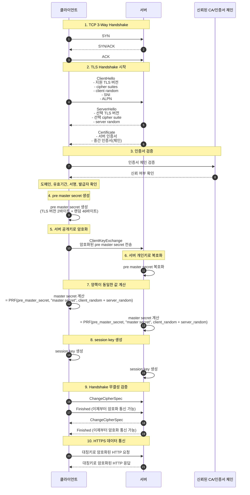
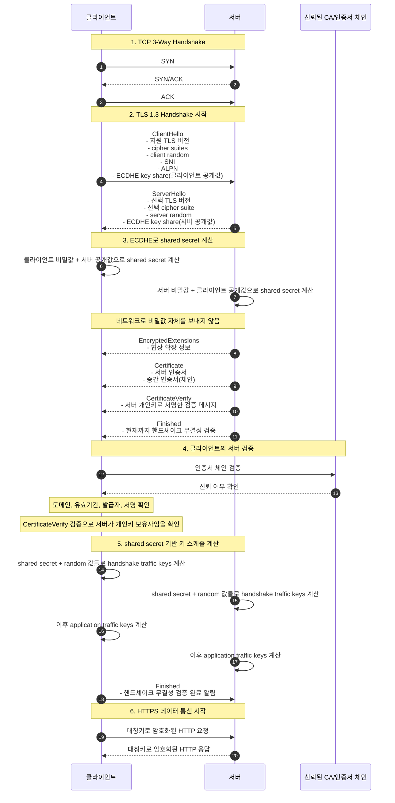

# HTTPS 통신 (TLS Handshake) 과정

## 1. HTTPS 통신

SSL 방식을 이용해서 통신을 하는 브라우저와 서버는 Handshake를 하는데, 이때 SSL 인증서를 주고 받는다. 이 과정에서 공개키 방식만 사용하지 않고 대칭키 방식도 같이 사용한다.

- **Handshake 단계**
  - 인증서 확인
  - 키 교환
  - 대칭키 생성
- **실제 데이터 통신 단계**
  - HTTP 요청/응답을 대칭키로 암호화해서 주고받는다.

### 1-1. 대칭키를 만드는 이유

공개키는 이상적인 통신 방법이다. 복호화를 할 때 사용하는 키가 서로 다르기 때문에 메시지를 전송하는 쪽이 공개키로 데이터를 암호화하고, 수신받는 쪽이 비공개키로 데이터를 복호화하면 되기 때문이다.

공개키 방식의 암호화는 매우 많은 컴퓨터 자원을 사용한다. 반면에 암/복호화가 동일한 대칭키 방식은 적은 컴퓨터 자원으로 암호화를 수행할 수 있기 때문에 효율적이지만 송/수신측이 동일한 키를 공유해야 하는 문제가 발생한다. 때문에, SSL은 공개키와 대칭키의 장점을 혼합한 방법을 사용한다.

- 공개키/서명: 신원 확인, 안전한 키 교환
- 대칭키: 실제 데이터 암호화

### 1-2. 대칭키(세션키)

세션 키는 절대 네트워크로 전송되지 않는다.

- 양쪽이 각각 계산해서 동일한 키 생성해서 보관한다.
- 송신자는 내부에 존재하는 키로 암호화해서 전송하며, 수신자는 내부의 존재하는 키로 복호화해서 읽는다.
  - 스누핑 공격자는 암호화된 패킷만 확인 가능하다.
  - 세션키가 없는 이상 실제 데이터 복호화할 수 없다.

<br/>

## 2. TLS Handshake

- `전체 그림`



### 2-1. TCP 연결

HTTPS도 TCP 위에서 동작한다. 때문에, 3-Way Handshake 과정을 진행한다.

```
SYN → SYN/ACK → ACK
```

### 2-2. Client Hello

- 지원 TLS 버전
- 지원 가능한 cipher suites (암호화 방식들)
  - 클라이언트와 서버가 지원하는 암호화 방식이 서로 다룰 수 있다.
  - 상호간에 어떤 암호화 방식을 사용할 것인지에 대한 협상을 해야한다.
  - 이 협상을 위해서 클라이언트 측에서 자신이 사용할 수 있는 암호화 방식을 전송한다.
- client random
- SNI(Server Name Indication, 어느 도메인 접속인지)
  - 한 서버에 여러 도메인이 있을 수 있다.
  - 클라이언트가 필요한 도메인에 대한 인증서를 요청한다.
- ALPN(HTTP/1.1, HTTP/2 같은 프로토콜 협상)

```
안녕하세요. 저는 TLS 통신 원해요.
제가 지원하는 TLS 버전은 이거고,
암호화 알고리즘은 이걸 쓸 수 있어요.
랜덤값도 하나 보낼게요.
```

### 2-3. Server Hello

서버는 Client Hello에 대한 응답으로 Server Hello를 응답한다.

- 선택된 TLS 버전
- 선택된 cipher suite (암호화 방식)
- server random
- Certification (인증서)
  - 인증서 안에는 서버 도메인 정보, 서버 공개키, 발급자(CA) 정보, 서명 정보, 유효기간이 들어있다.

```
좋아요. 그럼 TLS 버전은 이걸로 하고,
암호화 방식은 이걸로 할게요.
저도 랜덤값 보낼게요.
```

### 2-4. 인증서 검증

클라이언트는 서버의 인증서가 CA에 의해서 발급된 것인지 확인하기 위해 클라이언트에 내장된 CA 리스트를 확인한다. CA 리스트에 인증서가 없다면 사용자에게 경고 메시지를 출력한다. 인증서가 CA에 의해서 발급된 것인지 확인하기 위해 클라이언트에 내장된 CA의 공개키를 이용해서 인증서를 복호화한다. 복호화에 성공했다면 인증서는 CA의 개인키로 암호화된 문서임이 암시적으로 보증된 것이다.

### 2-5. Pre Master Secret 생성

클라이언트는 서버로부터 전달받은 랜덤 데이터와 클라이언트가 생성한 랜덤 데이터를 조합해서 `pre master secret`라는 키를 생성한다. 해당 키는 세션 단계에서 데이터를 주고받을 때 암호화하기 위해서 사용된다. 이때 사용할 암호화 기법은 `대칭키`이기 때문에 `pre master secret` 값은 제 3자에게 절대로 노출되어서는 안된다.

- pre master secret = TLS_version + 클라이언트 random + 서버 random

### 2-6. Pre Master Secret 암호화 및 서버 전송

`서버의 공개키`로 `pre master secret` 값을 암호화해서 서버로 전송하면 서버는 자신의 비공개키로 안전하게 복호화할 수 있다. 공개키는 서버로부터 받은 인증서 안에 들어있다.

```
이 값은 서버만 풀어볼 수 있도록 서버 공개키로 잠가서 보내겠습니다.
```

### 2-7. 서버 복호화 및 Session Key 생성

서버는 클라이언트가 전송한 `pre master secret` 값을 자신의 `비공개키로 복호화`한다. 이후 서버와 클라이언트는 모두 일련의 과정을 거쳐 `pre master secret` 값을 `master secret` 값으로 만든다. `master secret`은 `session key`를 생성하는데 이 `session key` 값을 이용해서 서버의 클라이언트는 대칭키 방식으로 암호화한 후에 주고 받는다.

- master secret = PRF 함수(pre master secret + client_random + server_random)

### 2-8. Finished

클라이언트와 서버는 핸드셰이크 단계의 종료를 서로에게 알린다.

## 2-9. 세션

세션은 실제로 서버와 클라이언트가 데이터를 주고 받는 단계이다. 이 단계에서 핵심은 정보를 상대방에게 전송하기 전에 session key 값을 이용해서 대칭키 방식으로 암호화한다는 점이다. 암호화된 정보는 상대방에게 전송되며, 상대방은 session key 값으로 복호화한다.

## 2-10. 세션 종료

데이터의 전송이 끝나면 SSL 통신이 끝났음을 서로에게 알려준다. 이떄 통신에서 사용한 대칭키인 session key를 폐기한다.

## 3. TLS 흐름 요약

- `TLS 1.2 (RSA 방식)`

```
1. 클라이언트가 pre_master_secret 생성
2. 서버 공개키로 암호화해서 보냄
3. 서버가 개인키로 복호화
4. 둘 다 동일한 pre_master_secret 확보
5. 같은 방식으로 master_secret 계산
6. session key 각각 생성
```

- `TLS 1.3 (ECDHE)`

```
1. 클라이언트 → 공개값 보냄
2. 서버 → 공개값 보냄
3. 양쪽이 shared secret 계산
4. master secret 생성
5. session key 생성
```

- `프로세스`


