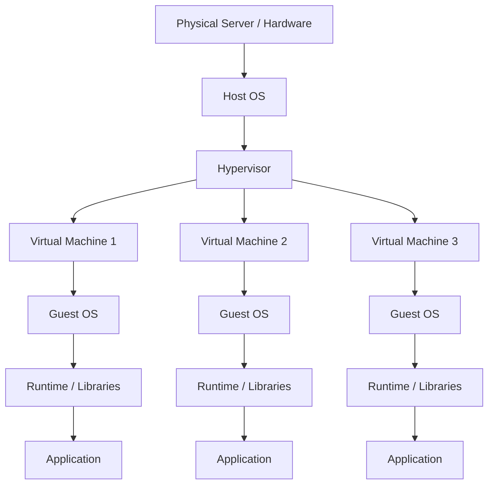
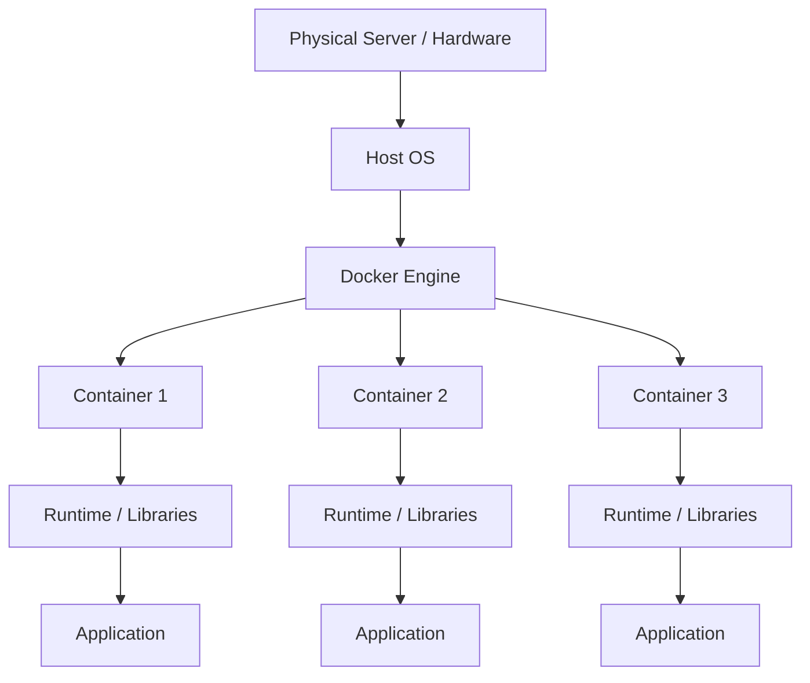
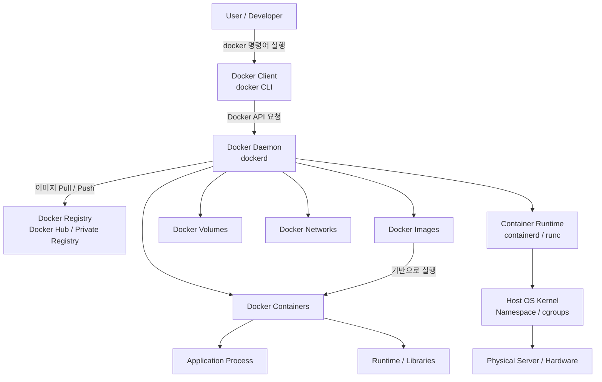
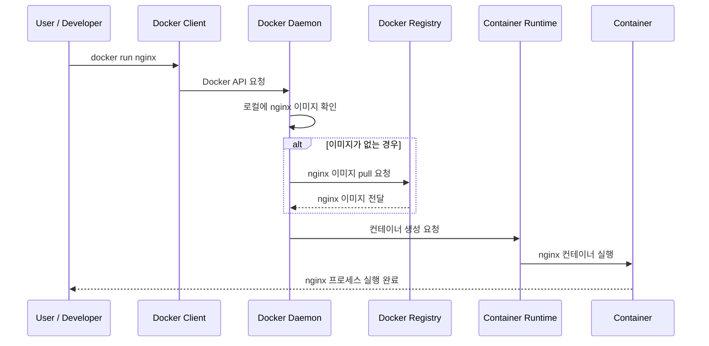

# Docker 소개 및 환경설정

## 1. Docker의 탄생 배경, 가상 머신과의 차이, 아키텍처

기존 개발/배포 환경에서는 애플리케이션 실행에 필요한 요소가 많았다. 개발자 PC, 테스트 서버, 운영 서버의 환경이 조금만 달라도 문제가 생겼다.

```
개발 PC: Java 17
운영 서버: Java 11

개발 PC: MySQL 8
운영 서버: MySQL 5.7

개발 PC: 특정 라이브러리 설치됨
운영 서버: 해당 라이브러리 없음
```

Docker는 애플리케이션과 실행 환경을 하나로 묶어서 이미지로 만들고, 어디서든 같은 방식으로 실행할 수 있게 해주는 플랫폼이다.

### 1-1. 가상 머신 구조와 컨테이너 구조

- `가상머신 구조`



- `컨테이너 구조`



### 1-2. 아키텍처



### 1-3. 구성 요소

- `Docker Client`
  - 사용자가 직접 사용하는 명령어 도구
  - 역할은 사용자의 명령을 Docker Daemon에게 전달하는 것

```bash
docker build -t my-app .
docker run nginx
docker ps
docker stop container_name
docker pull mysql:8
```

- `Docker Daemon`
  - Docker의 핵심 백그라운드 프로세스
  - Docker Daemon은 실제로 Docker 객체들을 관리한다.
  - Docker Client가 Docker Daemon에게 요청을 보내고, Docker Daemon이 nginx 이미지를 확인한 뒤 컨테이너를 생성하고 실행합니다.

```
이미지 관리
컨테이너 생성/실행/중지/삭제
네트워크 관리
볼륨 관리
Registry와 통신
```

- `Docker Registry`
  - Docker 이미지를 저장하는 저장소
  - 이미지를 가져올 때는 pull, 업로드할 때는 push를 사용

```bash
# Docker Daemon → Registry에서 이미지 다운로드
docker pull nginx

# Docker Daemon → Registry에 이미지 업로드
docker push my-repository/my-app:1.0
```

- `Docker Image`
  - 컨테이너 실행에 필요한 파일 묶음

```
애플리케이션 코드
런타임
라이브러리
환경 설정
실행 명령어
```

- `Docker Container`
  - Docker Image를 실제로 실행한 것
  - 컨테이너 안에서는 하나 이상의 프로세스가 실행된다.
  - 컨테이너는 독립된 환경처럼 동작하지만, 실제로는 Host OS의 커널을 공유한다.

```
Container
 ├── Application
 ├── Runtime
 └── Libraries
```

- `Docker Volume`
  - 컨테이너의 데이터를 영구 저장하기 위한 기능
  - 컨테이너는 삭제될 수 있기 때문에, DB 데이터 같은 중요한 데이터는 컨테이너 내부에만 두면 위험하다.

```
docker run -v mysql-data:/var/lib/mysql mysql:8
```

- `Docker Network`
  - 컨테이너끼리 통신하거나 외부와 연결하기 위한 기능
  - 같은 Docker Network에 있으면 컨테이너 이름으로 서로 통신할 수 있다.

```
spring-app-container → mysql-container
jdbc:mysql://mysql-container:3306/app_db
```

- `Container Runtime`
  - 컨테이너를 실제로 실행하는 저수준 구성 요소 (containerd, runc)
  - Docker Daemon이 전체 관리를 담당한다면, Runtime은 실제 컨테이너 프로세스를 실행하는 역할을 한다.

### 1-4. Docker 실행 흐름

- 1. 사용자가 docker 명령어 실행
- 2. Docker Client가 명령을 받음
- 3. Docker Client가 Docker Daemon에게 API 요청
- 4. Docker Daemon이 이미지, 컨테이너, 볼륨, 네트워크를 관리
- 5. 필요한 이미지가 없으면 Docker Registry에서 pull
- 6. Docker Daemon이 Container Runtime을 통해 컨테이너 실행
- 7. 컨테이너는 Host OS Kernel을 공유하면서 격리된 프로세스로 동작



- `구성요소`

```
Docker Client
= 사용자가 입력하는 docker 명령어 도구

Docker Daemon
= Docker의 실제 관리자, 컨테이너/이미지/네트워크/볼륨 제어

Docker Registry
= Docker Image 저장소

Docker Image
= 컨테이너 실행 템플릿

Docker Container
= 이미지를 실행한 실제 인스턴스

Docker Volume
= 컨테이너 데이터를 영구 저장하는 공간

Docker Network
= 컨테이너 간 통신 및 외부 연결 관리

Container Runtime
= 실제 컨테이너 프로세스를 실행하는 저수준 실행기
```

<br/>

## 2. Docker 가장 기본적인 명령어 맛보기

- `컨테이너 확인`

```bash
# 실행중인 컨테이너 목록 확인
docker ps

# 전체 컨테이너 목록 확인
docker ps -a

# 컨테이너 로그 확인
docker logs {컨테이너명}

# 컨테이너 상세 정보 확인
docker inspect {컨테이너명}
```

- `컨테이너 제어`

```bash
# 컨테이너 중지
docker stop {컨테이너명}

# 중지된 컨테이너 시작
docker start {컨테이너명}

# 컨테이너 재시작
docker restart {컨테이너명}

# 컨테이너 삭제
docker rm {컨테이너명}
```

- `파일/볼륨`

```bash
# 폴더 마운트
docker run -v /host/path:/container/path {이미지명}

# 볼륨 목록
docker volume ls

# 볼륨 삭제
docker volume rm {볼륨명}
```

- `네트워크`

```bash
# 네트워크 목록
docker network ls

# 네트워크 생성
docker network create {네트워크명}

# 네트워크 삭제
docker network rm {네트워크명}
```

- `정리/삭제`

```bash
# 모든 컨테이너 삭제
docker rm $(docker ps -aq)

# 모든 이미지 삭제
docker rmi $(docker images -q)

# 사용하지 않는 컨테이너/이미지/네트워크 정리
docker system prune

# 안 쓰는 이미지까지 강하게 정리
docker system prune -a
```

<br/>

## 3. Docker의 기본 개념들 (Image, Container, Layer)

### 3-1. Image

Image는 컨테이너를 만들기 위한 실행 템플릿이다.

- **Image 포함 내용**
  - OS 파일 일부: Ubuntu, Alpine 등
  - 실행 파일: Nginx, MySQL, Node 등
  - 라이브러리: 필요한 패키지들
  - 설정 파일: 기본 Config
  - 실행 명령: 컨테이너 시작 시 실행할 명령

### 3-2. Container

컨테이너는 독립된 실행 환경을 가진다.

- 파일 시스템: 컨테이너 전용 공간
- 프로세스: 컨테이너 안에서 실행
- 네트워크: 별도 IP/포트 사용 가능
- 환경 변수: 컨테이너별 설정 가능

### 3-3. Layer

Layer는 Image를 구성하는 파일 변경 이력 단위다. Docker 이미지는 한 덩어리 파일이 아니라 여러 Layer가 쌓인 구조이다.

- Image = Layer + Layer + Layer + Layer
  - 이미지는 여러 Layer가 합쳐진 결과이다.
  - 2개의 이미지가 Ubuntu:22.04를 기반으로 한다면, Ubuntu Layer는 한 번만 저장하고 같이 사용한다.

```dockerfile
# Ubuntu 기본 Layer
FROM ubuntu:22.04

# 패키지 목록 업데이트 Layer
RUN apt update

# nginx 설치 Layer
RUN apt install -y nginx

# 파일 복사 Layer
COPY index.html /var/www/html/index.html

# 실행 명령 설정
CMD ["nginx", "-g", "daemon off;"]
```

### 3-4. Container와 Layer 관계

이미지의 Layer들은 기본적으로 읽기 전용이다.

컨테이너를 실행하면 그 위에 쓰기 가능한 Container Layer가 하나 추가된다.

컨테이너 안에서 파일을 만들거나 수정하면 Image가 바뀌는 게 아니라, 컨테이너 전용 쓰기 Layer에 저장된다. 컨테이너 안에서 파일을 수정해도 원본 이미지는 그대로다. 컨테이너를 삭제하면 그 컨테이너의 쓰기 Layer도 같이 사라진다.

### 3-5. 한 줄 정리

- Image: 컨테이너를 만들기 위한 읽기 전용 템플릿
- Container: Image를 실행한 실제 프로세스/환경
- Layer: Image를 구성하는 파일 변경 단위
- Container Layer: 컨테이너 실행 시 추가되는 쓰기 가능한 영역
- Volumne: 컨테이너가 삭제돼도 데이터를 유지하기 위한 저장소

```
Dockerfile로 Image를 만들고,
Image로 Container를 실행하고,
Image는 Layer들이 쌓여 만들어지고,
Container는 Image 위에 쓰기 Layer를 얹어서 동작한다.
```
