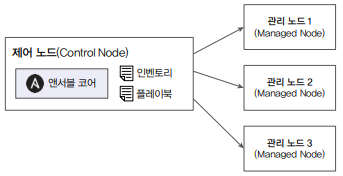

# 앤서블 소개

## 1. 앤서블이란

앤서블은 마이클 데한에 의해 앤서블웍스라는 이름으로 2014년 03월 04일에 처음 소개되어, 2015년 10월 레드햇이 인수하여 개발, 관리하고 있다.

 - 앤서블 공식 깃허브: https://github.com/ansible
 - 앤서블 공식 문서: https://docs.ansible.com/ansible/latest/index.html
 - 앤서블 공식 블로그: https://www.ansible.com/blog/2013/03/04/introducing-ansibleworks

### 1-1. 앤서블의 특징

 - `에이전트레스(Agentless)`

기존 자동화 도구인 퍼펫이나 셰프는 자동화 관리 대상 서버에 별도의 에이전트를 설치하고 이를 통해서 자동화 업무를 수행한다. 이러한 데몬 형식의 에이전트에 기반한 자동화 도구는 관리를 위한 복잡한 추가 작업이나 운영체제 버전에 따라 추가 패키지나 모듈을 설치하는 등의 작업이 발생한다. 그러나 __앤서블은 설치 없이 SSH로 접속하여 쉽게 대상 서버들을 관리할 수 있다.__

 - `멱등성`

멱등성은 동일한 연산을 여러 번 적용하더라도 결과가 달라지지 않는 성질로, 멱등법칙의 개념은 추상대수학과 함수형 프로그래밍의 여러 부분에서 사용하고 있다. __앤서블은 이러한 멱등성과 함께 시스템을 원하는 상태로 표현하여 유지하도록 설계되어 있어, 동일한 운영 작업을 여러 번 실행해도 같은 결과를 낸다.__

 - `쉬운 사용법과 다양한 모듈 제공`

__앤서블은 YAML 형식의 플레이북(Playbook)을 사용하여 작업을 정의하며, 이는 사람이 읽고 쓰기 쉬운 문법을 제공한다.__ 또한, 파일 복사와 같은 일반 시스템 관리 모듈부터 다양한 환경의 퍼블릭 클라우드 관련 모듈 및 컬렉션까지 제공하므로, 쉽게 플레이북 예제를 찾아보고 자동화를 수행할 수 있다.

## 2. 앤서블을 언제 사용하는가?

앤서블은 시스템 환경을 설정하거나 애플리케이션을 설치할 때 퍼블릭이나 프라이빗 클라우드 시스템의 가상 서버 등을 생성할 때, 혹은 매일 점검해야 하는 시스템의 상태를 체크할 떄도 사용할 수 있다. 뿐만 아니라 특정 시스템을 구축할 떄도 앤서블을 사용하는 것을 종종 볼 수 있다. 즉, __사용 빈도가 많고 여러 시스템에 동일한 작업을 해야하는 상황에서 앤서블을 활용할 수 있다.__

## 3. 앤서블은 어디에서 사용할 수 있는가?

앤서블은 리눅스, MacOS, BSD계열 유닉스, WSL을 지원하는 윈도우 환경에서 __파이썬과 앤서블 코어만 설치하면 어디에서나 플레이북을 작성하고 이를 실행시킬 수 있다.__

앤서블은 코어가 설치되고 플레이북을 작성하여 실행할 수 있는 제어 노드와 플레이북이 실행되어 애플리케이션 설치나 클라우드 시스템의 가상 서버 생성과 같은 작업이 수행되는 관리 노드로 구성된다. 앤서블은 제어 노드에만 설치되고 관리 노드에는 설치되지 않는다. 제어 노드에는 앤서블 코어가 설치되며, 사용자에 의해 정의된 플레이북과 관리 노드를 정의해놓은 인벤토리 파일에 의해 SSH 프로토콜을 사용하여 다양한 환경의 관리 노드 업무 자동화를 수행한다.

 - 제어 노드(Control Node): Ansible 명령을 실행하는 주체로, 관리 노드에 명령을 전달합니다. 
 - 관리 노드(Managed Node): Ansible이 관리하는 대상 시스템으로, 실제로 작업이 수행되는 곳입니다. 
 - 인벤토리(Inventory): 관리 노드의 목록과 관련 변수를 정의한 파일로, 제어 노드와 관리 노드의 정보를 담고 있습니다. 
 - 플레이북(Playbook): YAML 형식으로 작성된 파일로, 관리 노드에서 수행할 작업들을 정의합니다. 

    

