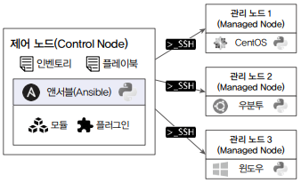

# 앤서블 아키텍처

앤서블은 크게 커뮤니티 앤서블과 레드햇 앤서블 오토메이션 플랫폼으로 나누어 설명할 수 있다. 커뮤니티 앤서블은 오픈소스 형태로 운영체제가 리눅스라면 어디에나 설치하여 사용할 수 있으며, 레드햇 앤서블 오토메이션 플랫폼은 레드햇 서브스크립션을 통해 사용할 수 있다.

## 1. 커뮤니티 앤서블

앤서블 아키텍처는 제어 노드와 관리 노드라는 두 가지 유형의 시스템으로 구성된다. 앤서블은 제어 노드에 설치되어 실행되며, 앤서블이 실행되기 위해서는 파이썬이 기본적으로 설치되어 있어야 한다. 또한 앤서블 안에는 다양한 모듈과 플러그인이 함께 설치되어 있으며, 앤서블이 관리하는 노드 정보를 저장하고 있는 인벤토리와 관리 노드에서 수행될 작업 절차가 작성되어 있는 플레이북이 존재한다.

<div align="center">
    
</div>

 - __제어 노드__: 제어 노드는 앤서블이 설치되는 노드로 운영체제가 리눅스라면 제어 노드가 될 수 있다. 앤서블은 파이썬 모듈을 이용하므로 앤서블을 설치하고 실행하려면 파이썬이 함꼐 설치되어야 한다.
 - __관리 노드__: 관리 노드는 앤서블이 제어하는 원격 시스템 또는 호스트를 의미한다. 관리 노드는 리눅스, 윈도우, 퍼블릭 클라우드나 프라이빗 클라우드 시스템에서 생성한 가상 서버 어디든 될 수 있다. 앤서블은 별도의 에이전트를 설치하지 않으므로 관리 노드는 제어 노드와 SSH 통신이 가능해야 하며, 파이썬이 설치되어 있어야 한다.
 - __인벤토리__: 인벤토리는 제어 노드가 제어하는 관리 노드의 목록을 나열해놓은 파일이다. 앤서블은 인벤토리에 사전에 정의되어 있는 관리 노드에만 접근할 수 있다. 또한, 인벤토리 목록은 관리 노드의 성격별로 그룹핑할 수 있다.
```
[WebServer]
web1.example.com
web2.example.ocm

[DBServer]
db1.example.com
db2.example.com
```

 - __모듈__: 앤서블은 관리 노드의 작업을 수행할 떄 SSH를 통해 연결한 후 앤서블 모듈이라는 스크립트를 푸시하여 작동한다. 대부분의 모듈은 원하는 시스템 상태를 설명하는 매개 변수를 허용하며, 모듈 실행이 완료되면 제거된다.
 - __플러그인__: 플러그인은 앤서블의 핵심 기능을 강화한다. 모듈이 대상 시스템에서 별도의 프로세스로 실행되는 동안 플러그인은 제어 노드에서 실행된다. 플러그인은 핵심 기능(데이터 변환, 로그 출력, 인벤토리 연결 등)에 대한 옵션 및 확장 기능을 제공한다.
 - __플레이북__: 플레이북은 관리 노드에서 수행할 작업들을 YAML 문법을 이용해 순서대로 작성해놓은 파일이다. 앤서블은 작성된 플레이북을 활용하여 관리 노드에 SSH로 접근해 작업을 수행한다. 플레이북은 자동화를 완성하는 가장 중요한 파일이며 사용자가 직접 작성한다.
```yml
---
- hosts: webservers
  serial: 5
  roles:
  - common
  - webapp

- hosts: content_servers
  roles:
  - common
  - content
```

## 2. 앤서블 오토메이션 플랫폼

커뮤니티 앤서블과 레드햇 앤서블 오토메이션 플랫폼의 주요 컴포넌트는 동일하다. 다만, 앤서블 오토메이션 플랫폼에서는 커뮤니티 앤서블과 다르게 인벤토리, 제어 노드에 대한 인증 정보, 실행 환경 등을 관리하는 CMDB가 존재한다. 또한 이런 자원들을 관리하는 관리 웹 UI가 존재하며, REST API를 제공한다.

 - __컴포넌트 구성 요소__
    - 오토메이션 컨트롤러: 앤서블 타워로 불리던 앤서블 관리 웹 UI
    - 실행 환경: 앤서블 모듈과 플러그인이 존재하는 컨테이너 기반의 실행 환경
    - PostgreSQL: 인벤토리, 인증 정보, 실행 환경 등의 메타데이터를 관리하는 CMDB
    - 오토메이션 허브(옵션): 레드햇에서 기술지원을 받을 수 있는 컬렉션 제공 서비스
 - __앤서블 구성 아키텍처 종류__
    - All in One: 가장 기본적인 구성 아키텍처로 오토메이션 컨트롤러, 실행 환경, PostgreSQL이 모두 한 노드에 구성된다.
    - AAP using External DB: PostgreSQL이 별도의 노드로, 오토메이션 컨트롤러와 실행 환경이 같은 노드로 구성된다. 오토메이션 컨트롤러는 별도로 구성된 PostgreSQL과 연동되어 앤서블 관리 웹 UI 서비스를 제공한다.
    - Private Automation Hub: AAP using External DB와 같은 아키텍처에 오토메이션 허브를 내부에서 사용할 수 있도록 별도의 노드로 구성한다. 주로 인터넷이 되지 않는 경우에 구성하는 방식이다.

## 3. 마무리

 - 제어 노드와 관리 노드로 구성된다.
 - 인벤토리는 관리 노드의 집합이다. (제어 노드에는 관리 노드를 정의하고 관리할 수 있는 인벤토리가 존재한다.)
 - 플레이북은 작업을 정의해놓은 파일이다. (플레이북은 인벤토리를 참조하여 인벤토리에 정의되어 있는 관리 노드에서 작업을 수행한다.)
 - 에이전트 없이 SSH를 통해 작업을 수행한다.
