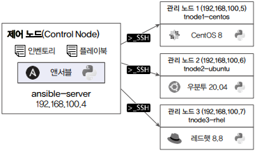

# 앤서블 실습 환경 준비하기

## 1. VM을 활용한 실습 환경 준비하기

리눅스 환경에서는 버추얼 머신 매니저를 사용하고, 윈도우와 Mac 환경에서는 오라클 버추얼박스를 이용하여 실습 환경을 구성한다.

 - ansible-server
    - OS: CentOS Stream 8
    - CPU: 2
    - Memory: 4GB
    - Disk: 100GB
    - NIC: 192.168.100.4
 - tnode1-centos
    - OS: CentOS Stream 8
    - CPU: 2
    - Memory: 4GB
    - Disk: 50GB
    - NIC: 192.168.100.5
 - tnode2-ubuntu
    - OS: Ubuntu 20.04
    - CPU: 2
    - Memory: 4GB
    - Disk: 50GB
    - NIC: 192.168.100.6
 - tnode3-rhel
    - OS: RHEL 8.8
    - CPU: 2
    - Memory: 4GB
    - Disk: 50GB
    - NIC: 192.168.100.7

ansible-server는 앤서블이 설치되고 인벤토리와 플레이북이 위치할 제어 노드로, CentOS Stream8로 구성한다.

운영체제별로 앤서블 구성 테스트를 위해 tnode는 CentOS, 우분투, RHEL 3가지 운영체제를 준비한다.

 - CentOS: https://www.centos.org/centos-stream
 - Ubuntu: https://ubuntu.com/download/server#downloads
 - RHEL: https://access.redhat.com/downloads/content/rhel

<div align="center">
    
</div>
<br/>

### 1-1. 리눅스 환경에서 실습 환경 준비하기

 - __페도라 환경에서 KVM 및 virt-manager 설치__
   - 호스트에 구성되어 있는 CPU가 가상화를 지원하는지 확인하고 virtualization이라는 패키지 그룹을 확인한다.
   - KVM에 해당하는 virt-install, qemu-kvm 및 버추얼 머신 매니저에 해당하는 virt-manager를 확인할 수 있다.
   - dnf install 명령어로 virtualization이라는 패키지 그룹을 설치한다.
```bash
# CPU 가상화 여부 확인
cat /proc/cpuinfo | egrep "vmx|svm"

# 패키지 그룹 확인
sudo dnf groupinfo virtualization

# 패키지 설치 및 시작
sudo dnf install @virtualization
sudo systemctl start libvirtd
sudo systemctl enable libvirtd
```

 - __CentOS 및 레드햇 환경에서 KVM 및 virt-manager 설치__
   - CPU 가상화 여부를 확인하고 시스템 업데이트를 한 후 virt라는 패키지 그룹을 설치한다.
   - KVM이 설치되면 버추얼 머신 매니저와 관련된 유틸리티와 virt-manager를 설치한다.
```bash
# CPU 가상화 여부 확인
cat /proc/cpuinfo | egrep "vmx|svm"

# 시스템 업데이트
sudo dnf update

# kvm 설치 및 시작
sudo dnf install @virt
sudo systemctl enable --now libvirtd

# virt-manager 패키지 설치 및 시작
sudo dnf -y install libvirt-devel virt-top libguestfs-tools virt-manager
```

 - __우분투 및 데비안 환경에서 KVM 및 virt-manager 설치__
   - CPU 가상화 여부를 확인한 후 시스템을 업데이트한다.
   - KVM 관련 패키지와 버추얼 머신 매니저 관련 패키지를 설치한다.
```bash
# CPU 가상화 여부 확인
cat /proc/cpuinfo | egrep "vmx|svm"

# 시스템 업데이트
sudo apt update

# kvm 관련 패키지 설치
sudo apt install qemu-kvm libvirt-daemon-system libvirt-clients bridge-utils

# virt-manager 설치
sudo apt virt-manager
```

#### 가상 환경 생성 및 운영체제 설치

가상 서버를 생성하고 사전에 내려받아 놓은 운영체제 이미지로 서버를 설치한다.

설치가 완료되면 CentOS와 레드햇은 nmcli 명령어를 이용하여 IP를 설정하고, 우분투는 netplan 설정 파일과 명령어를 이용하여 IP를 설정한다.

```bash
# ansible-server(CentOS) IP 설정
nmcli con modify enp1s0 ipv4.method manual ipv4.address 192.168.100.4/24 ipv4.gateway 192.168.100.1 ipv4.dns 192.168.100.1
nmcli con up enp1s0

# tnode-1centos(CentOS) IP 설정
nmcli con modify enp1s0 ipv4.method manual ipv4.addresses 192.168.100.5/24 ipv4.gateway 192.168.100.1 ipv4.dns 192.168.100.1
nmcli con up enp1s0

# tnode2-ubuntu(우분투) IP 설정
sudo vi /etc/netplan/00-installer-config.yaml
network:
  ethernets:
    enp1s0:
      dhcp4: no
      dhcp6: no
      address: [192.168.100.6/24]
      gateway4: 192.168.100.1
      nameservers:
        addresses: [192.168.100.1]
   version: 2

sudo netplan apply

# tnode3-rhel(레드햇) IP 설정
nmcli con modify enp1s0 ipv4.method manual ipv4.addresses 192.168.100.7/24 ipv4.gateway 192.168.100.1 ipv4.dns 192.168.100.1
nmcli con up enp1s0
```

### 1-2. 윈도우 환경이나 Mac 환경에서 실습 환경 준비하기

버추얼박스 웹사이트에 바움나형 설치되어 있는 운영체제에 적합한 실행 파일을 다운로드받는다.

 - 버추얼박스: https://www.virtualbox.org/wiki/Downloads

#### CentOS 설치

 - `VirtualBox > 새로 만들기`
   - 이름 및 운영 체제
      - 이름: tnode1-centos
      - 폴더: 기본 폴더
   - 하드웨어
      - 기본메모리: 4GB
      - 프로세서: 1
   - 하드 디스크
      - 지금 새 가상 하드 디스크 파일 만들기
         - 25GB
<div align="center">
   
</div>

가상 머신이 생성되었고, 해당 기계에 CD-ROM에 CentOS를 넣고 부팅을 한다.

 - `가상 머신 > 설정`
   - 저장소
      - 컨트롤러 IDE > 비어있음 > 광학 드라이브 > iso 이미지 선택

 - `가상 머신 > 시작`
   - Install 진행
   - 언어: Korean
   - 설치 요약
      - 소프트웨어
         - 설치 소스: 로컬 미디어(기본 옵션)
         - 소프트웨어 선택: 최소 설치(기본 옵션)
      - 시스템
         - 설치 대상: 로컬 표준 디스크, 파티션을 자동으로 설정합니다. (기본 옵션)
         - KDUMP: 활성화 해제
         - 네트워크 및 호스트명
            - 이더넷 켬
            - 호스트 이름: it.linux.kr
   - 설정
      - ROOT 암호: 설정
      - 사용자 생성: 
         - 성명: test
         - 암호: test

 - `실행 후 기본 확인`
```bash
# 파티션 용량 확인
$ df -h

# 외부 네트워크 연결 확인
$ ping 8.8.8.8
```

### 2. 앤서블 설치하기

 - `Linux 환경별로 앤서블 설치`
```bash
# CentOS 환경 epel-rELEASE 설치 및 Ansible 설치
$ dnf install epel-release
$ dnf install ansible

# 페도라 환경에서 앤서블 설치
$ sudo dnf install ansible

# 우분투 환경에서 앤서블 설치
$ sudo apt update
$ sudo apt install software-properties-common
$ sudo add-apt-repository --yes --update ppa:ansible/ansible
$ sudo apt install ansible

# 데비안 환경에서 앤서블 설치
$ deb http://ppa.launchpad.net/ansible/ansible/ubuntu focal main
$ sudo apt-key adv --keyserver.ubuntu.com --recv-keys 93C4A3FD8BB9C367
$ sudo apt update
$ sudo apt install ansible
```

 - `앤서블 버전 확인`
```bash
ansible --version
```
