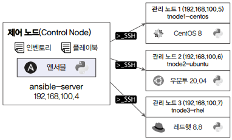
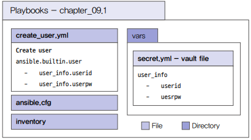
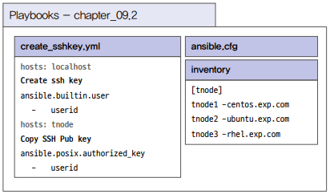
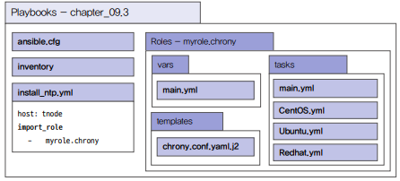
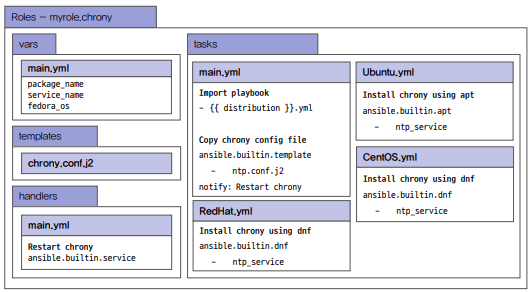

# 시스템 구축 자동화

<div align="center">
    <br/>
    실습 환경 아키텍처
</div>

## 1. 사용자 계정 생성학히

시스템을 구축할 때 가장 먼저 하는 일은 사용자 계정을 만드는 것이다. 사용자 계정은 목적에 따라 시스템에 접근하기 위해 생성할 수도 있고, 서비스를 설치하거나 구축하기 위해 생성할 수도 있다.

 - 사용자 계정과 패스워드는 Vault를 이용해 암호화 처리한다.
 - 사용자 계정 생성은 ansible.builtin.user 모듈을 이용한다.

### 플레이북 설계

플레이북을 설계할 떄는 생각하고 있는 플레이북의 파일 이름, 해당 플레이북을 구성할 태스크명, 태스크에서 사용할 모듈과 변수를 정의하고, 변수명과 변수를 선언할 위치를 함께 적어주는 것이 좋다.

<div align="center">
    <br/>
    플레이북 구성도
</div>

### 플레이북 개발

 - `인벤토리 생성(./inventory)`
```bash
$ vi inventory

tnode1-centos.exp.com 
tnode2-ubuntu.exp.com 
tnode3-rhel.exp.com 
```

 - `변수 파일 생성(./vars/secret.yml, ./vars/vault-pass)`
```bash
$ ansible-vault create vars/secret.yml
New Vault password: 패스워드 입력
Confirm New Vault password: 패스워드 입력

---
user_info:
  - userid: "ansible"
    userpw: "ansiblePw1!"
  - userid: "stack"
    userpw: "stackPw1!"
```

 - `플레이북 생성(./create_user.yml)`
```bash
$ vi create_user.yml

---
- hosts: all
  # vault로 사용자 계정 관련 변수가 정의된 파일을 임포트하여 사용
  vars_files:
    - vars/secret.yml
  tasks:
  # loop 문을 사용하여 user_info의 userid와 userpw 사용
  - name: Create user
    ansible.builtin.user:
      name: "{{ item.userid }}"
      password: "{{ item.userpw | password_hash('sha512', 'mysecret') }}"
      state: present
    loop: "{{ user_info }}"
```

 - `플레이북 실행`
```bash
# 플레이북 문법 체크
$ ansible-playbook --syntax-check create_user.yml

# 플레이북 실행
$ ansible-playbook --ask-vault-pass create_user.yml
Vault password: 비밀번호 입력

# 실행 후 > 관리 노드에 접속하여 /etc/passwd 파일에서 계정 확인
$ cat /etc/passwd | grep -E 'ansible|stack'
ansible:x:1000:1000::/home/ansible:/bin/bash
stack:x:1000:1000::/home/stack:/bin/bash
```

## 2. SSH 키 생성 및 복사하기

시스템을 구축하거나 애플리케이션을 설치하는 경우, 해당 애플리케이션을 사용하는 서버들간에 SSH 접속을 할 떄는 패스워드 대신 SSH 키를 주로 사용한다. 앤서블 역시 대상 노드에 접속하여 모듈을 실행할 경우 SSH 접근을 하는데, 이때 SSH 키를 사용하여 접근하면 쉽게 작업할 수 있다.

 - 사용자 아이디는 외부 변수로 받는다.
 - ansible-server에서 ansible 계정을 만들고 SSH 키를 생성한다.
 - ansible-server에 생성된 SSH 공개 키를 각 tnode에 복사한다.
 - 계정을 생성할 때는 ansible.builtin.user 모듈을, SSH 공개 키를 복사할 때는 ansible.posix.authorized_key 모듈을 이용한다.

### 플레이북 설계

앤서블 공식 문서의 콘텐츠 컬렉션에서 플레이북 개발에 필요한 SSH 키 생성 모듈과 SSH 키 복사 모듈을 찾고, 해당 모듈의 예제와 파라미터 정보를 이용해 플레이북을 설계한다.

플레이북명을 create_sshkey_yml로 설정하고, 'Create ssh key'와 'Copy SSH Pub key'라는 2개의 태스크를 정의한다. 이때, 'Create ssh key' 태스크는 localhost에서 실행하고, 'Copy SSH Pub key' 태스크는 tnode에서 실행한다.

<div align="center">
    
</div>
<br/>

### 플레이북 개발

 - `인벤토리 생성`
```bash
$ vi inventory

[tnode]
tnode1-centos.exp.com 
tnode2-ubuntu.exp.com 
tnode3-rhel.exp.com 
```

 - `플레이북 생성`
```bash
$ vi create_sshkey.yml

---
- hosts: localhost
  tasks:
  - name: Create ssh key
    ansible.builtin.user:
      name: "{{ userid }}"
      generate_ssh_key: true
      ssh_key_bits: 2048
      ssh_key_file: /home/{{ userid }}/.ssh/id_rsa

- hosts: tnode
  tasks:
  - name: Copy SSH Pub key
    ansible.posix.authorized_key:
      user: "{{ userid }}"
      state: present
      key: "{{ lookup('file', '/home/{{ userid }}/.ssh/id_rsa.pub') }}"
```

 - `플레이북 실행`
```bash
# 플레이북 문법 체크
$ ansible-playbook --syntax-check create_sshkey.yml

# 플레이북 실행: 외부 변수 전달
$ ansible-playbook -e userid=ansible create_user.yml

# 실행 후 > ansible-server에서 .ssh 디렉토리에 SSH 공개 키와 개인키 생성 확인
$ su - ansible
$ ll .ssh
id_rsa
id_rsa.pub

# 실행 후 > 각 제어 노드의 authorized_keys 파일 확인
$ ll /home/ansible/.ssh
authorized_keys

# ansible-server에서 각 제어노드에 SSH 접속 테스트
$ ssh tnode1-centos.exp.com
$ ssh tnode2-ubuntu.exp.com
```

## 3. NTP 서버 설치 및 설정하기

NTP는 Network Time Protocol의 약자로 여러 서버의 시간을 동기화하기 위한 애플리케이션이다. NTP를 사용하는 이유는 로드 밸런서를 사용하는 서버 간에 시간 동기화가 제대로 이루어지지 않으면 데이터가 생성되는 시간이 서로 맞지 않아 오류가 발생하기 때문이다.

NTP 애플리케이션 중 하나인 chrony를 설치하려면 패키지 리포지토리가 설정되어 있고 인터넷이 되는 환경이어야 한다. 만약 인터넷이 되지 않는다면 내부 로컬 리포지토리 설정이 되어 있어야 한다.

 - NTP 서버 주소는 메인 플레이북에서 정의한다.
 - 운영체제가 CentOS이거나 레드햇이면 dnf 모듈을 사용하여 chrony를 설치한다.
 - 운영체제가 우분투면 apt 모듈을 사용하여 chrony를 설치한다.
 - Jinja2 템플릿 방식의 chrony.conf 파일을 대상 호스트로 복사한다.
 - 설정 파일이 복사되면 chrony 서비스를 재시작한다.
 - 다음에도 사용할 수 있도록 롤을 이용하여 설계하고 작성한다.

### 플레이북 설계

chrony 서비스 설치를 위한 롤에서는 변수를 정의하는 vars, 환경 설정 템플릿을 위한 templates, 태스크를 정의한 tasks, 환경 설정 후 chrony 서비스를 재시작하기 위한 handlers를 사용한다.

<div align="center">
    <br/>
    chrony 설치 플레이북 구성도<br/>
    <br/>
    myrole.chrony 구성도
</div>

### 플레이북 개발

 - `앤서블 설정 파일 생성`
```bash
$ vi ansible.cfg

[defaults]
inventory = ./inventory
remote_user = ansible
ask_pass = false
roles_path = ./roles

[privilege_escalation]
become = true
become_method = sudo
become_user = root
become_ask_pass = false
```

 - `인벤토리 생성`
```bash
$ vi inventory

[tnode]
tnode1-centos.exp.com
tnode2-ubuntu.exp.com
tnode3-rhel.exp.com
```

 - `롤 생성`
```bash
# 롤 초기화
$ ansible-galaxy role init --init-path ./roles myrole.chrony

# 변수 정의
$ vi roles/myrole.chrony/vars/main.yml

---
package_name: chrony
service_name: chronyd

fedora_os:
  - RedHat
  - CentOS

# 템플릿 정의
$ vi roles/myrole.chrony/templates/chrony.conf.j2

pool {{ ntp_server }}
driftfile /var/lib/chrony/drift
makestep 1.0 3
rtcsync
allow 192.168.0.0/16
local stratum 10
keyfile /etc/chrony.keys
leapsectz right/UTC
logdir /var/log/chrony

# 핸들러 정의: chrony 서비스를 재시작하는 태스크 정의
$ vi roles/myrole.chrony/handlers/main.yml

---
- name: Restart chrony
  ansible.builtin.service:
    name: "{{ service_name }}"
    state: restarted

# 태스크 정의
# ansible_facts.distribution 팩트 변수를 이용해 다른 파일에서 태스크를 포함
# Ubuntu, CentOS, Redhat 운영체제가 종류가 다르므로 chrony 환경 설정 파일 위치도 다르다. when 문을 통해 운영체제 별로 분기
$ vi roles/myrole.chrony/tasks/main.yml

---
- name: Import playbook
  ansible.builtin.include_tasks:
    file: "{{ ansible_facts.distribution }}.yml"

- name: Copy chrony config file when Ubuntu
  ansible.builtin.template:
    src: chrony.conf.j2
    dest: /etc/chrony/chrony.conf
  notify: "Restart chrony"
  when: ansible_facts.distribution == "Ubuntu"

- name: Copy chrony config file when Other OS
  ansible.builtin.template:
    src: chrony.conf.j2
    dest: /etc/chrony.conf
  notify: "Restart chrony"
  when: ansible_facts.distribution in fedora_os  

# CentoOS 태스크
$ vi CentOS.yml
---
- name: Install chrony using dnf
  ansible.builtin.dnf:
    name: "{{ package_name }}"
    state: latest

# RedHat 태스크
$ vi RedHat.yml
---
- name: Install chrony using dnf
  ansible.builtin.dnf:
    name: "{{ package_name }}"
    state: latest

# Ubuntu 태스크
$ vi Ubuntu.yml
---
- name: Install chrony using apt
  ansible.builtin.apt:
    name: "{{ package_name }}"
    state: latest
```

 - `플레이북 생성 및 실행`
```bash
# 플레이북 생성
$ vi install_ntp.yml
---
- hosts: tnode
  roles:
    - role: myrole.chrony
      ntp_server: 0.kr.pool.ntp.org

# 사전 설정: 관리 노드의 ansible 계정에 패스워드 입력 없이 sudo 권한 설정
$ echo "ansible ALL=(root) NOPASSWD:ALL" | tee -a /etc/sudoers.d/ansible
$ chmod 0440 /etc/sudoers.d/ansible

# 문법 체크
$ ansible-playbook --syntax-check install_ntp.yml

# 플레이북 실행
$ ansible-playbook install_ntp.yml
```

## 4. 패키지 리포지토리 환경 설정하기

패키지 리포지토리 환경은 패키지를 다운로드하는 일 외에도 패키지를 내려받을 디렉토리를 생성하고 아파치 웹 서버를 설치한 후 여러 가지 환경 설정을 해야 한다. 리포지토리로부터 패키지를 다운로드하는 건 셸 스크립트를 이용해도 되지만, 패키지 리포지토리 환경은 앤서블을 이용하면 매우 효율적으로 구성할 수 있다.

 - 본 프로젝트는 RHEL 호스트를 대상으로 한다.
 - httpd 서비스 설치와 관련된 모든 태스크는 롤을 이용해 구현한다.
 - 롤을 통해 리포지토리 환경 설정이 끝나면, 리포지토리 URL을 체크한다.
 - 롤에는 다음과 같은 절차를 갖는 태스크가 존재하낟.
    - repo 디렉토리를 생성한다.
        - httpd 서비스를 설치한다.
        - repo.conf라는 환경 설정 파일을 대상 노드로 복사한다.
        - Httpd 서비스를 재시작하고 sefcontext 설정을 한다.
        - http 서비스를 firewalld에 추가하고, firewalld 서비스를 reload 한다.

### 플레이북 설계

<div align="center">
    <br/>
    패키지 리포지토리 환경 설정 플레이북 구성도<br/>
    <br/>
    롤 플레이북 구성도
</div>
<br/>

### 플레이북 개발


 - `인벤토리 생성`
```bash
$ vi inventory
[tnode]
tnode1-centos.exp.com
tnode2-ubuntu.exp.com
tnode3-rhel.exp.com

[repo_node]
tnode3-rhel.exp.com
```

 - `롤 생성`
```bash
# 롤 초기화
$ ansible-galaxy role init --init-path ./roles myrole.httpd
$ cd roles/myrole.httpd

# 변수 정의
# httpd_service는 설치될 패키지 정의, repo_dir은 패키지를 다운로드할 리포지토리 경로
$ vi vars/main.yml
---
httpd_service: 
  - httpd
  - yum-utils
repo_dir: /repo

# 환경 설정 파일 정의
$ vi /files/repo.conf
<VirtualHost *:80>
  DocumentRoot /repo
  CustomLog "logs/http_repo.log" combined
  <Directory "/repo">
    Options Indexes FollowSymLinks
    AllowOverride None
    Require all granted
  </Directory>
</VirtualHost>

Alias /repo "/repo"

# 태스크 정의
$ vi tasks/main.yml
---
- name: Make repo directory
  ansible.builtin.file:
    path: "{{ repo_dir }}"
    state: directory

- name: Install httpd
  ansible.builtin.dnf:
    name: "{{ item }}"
    state: latest
  loop: "{{ httpd_service }}"

- name: Copy repo.conf file
  # repo.conf 파일이 복사된 후 notify 키워드를 이용해 2개 이사으이 핸들러 태스크를 호출
  ansible.builtin.copy:
    src: ../files/repo.conf
    dest: /etc/httpd/conf.d/
  notify: 
    - Restart httpd
    - Reconfigure sefcontext

- name: Add http to firewalld
  ansible.posix.firewalld:
    service: http
    permanent: true
    state: enabled
  notify: Reload firewalld

# 핸들러 정의
$ vi handlers/main.yml
---
- name: Restart httpd
  ansible.builtin.service:
    name: httpd
    state: restarted

- name: Reload firewalld
  ansible.builtin.systemd:
    name: firewalld
    state: reloaded

- name: Reconfigure sefcontext
  ansible.builtin.command: chcon -R -h -t httpd_sys_content_t /repo    
```

 - `플레이북 생성 및 실행`
    - 롤을 호출하는 메인 플레이북을 생성한다.
    - failed_when 키워드를 사용하여 ansible.builtin.uri 모듈을 통해 체크한 리포지토리 사이트 호출 결과가 200이 아니면 실패로 처리하도록 한다.
```bash
# 플레이북 생성
$ vi config_repo.yml
---

- hosts: repo_node
  vars:
    repo_url: http://192.168.100.7/repo

  roles:
    - role: myrole.httpd

  post_tasks:
    - name: Check http service
      ansible.builtin.uri:
        url: "{{ repo_url }}"
        return_content: true
      register: check_result
      failed_when: check_result.status != 200

    - name: Print result
      ansible.builtin.debug:
        var: check_result.status

# 플레이북 실행
$ ansible-playbook --syntax-check config_repo.yml
$ ansible-playbook config_repo.yml
```
