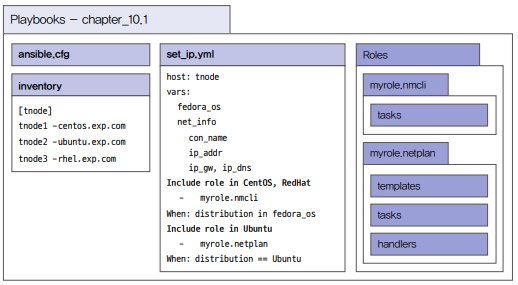
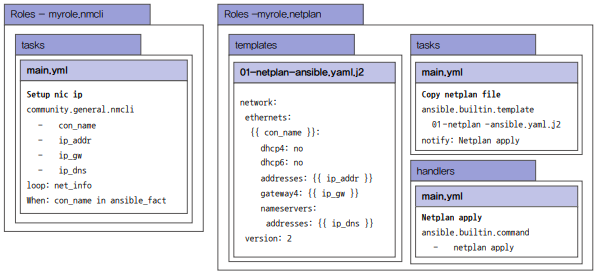
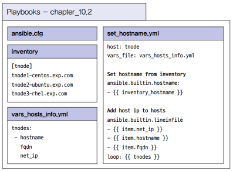
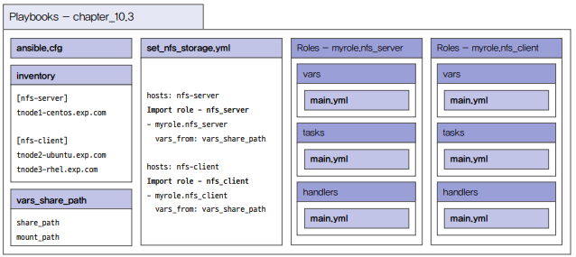
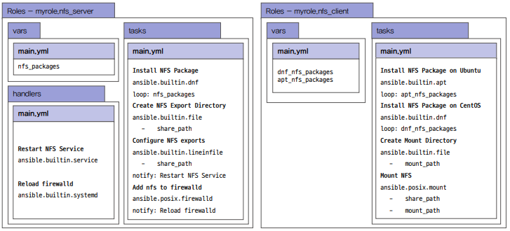
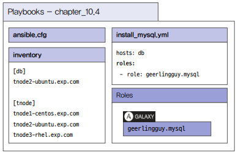

# 환경 설정 자동화

서버에 운영체제나 다양한 애플리케이션을 설치하려면 네트워크와 호스트명을 설정해야 한다. 이렇게 설정된 서버에서는 각종 설정 파일을 관리하고 NFS 스토리지와 연결한다. 그리고 애플리케이션을 설치하고 사용하기 위한 환경 설정을 수행한다.

## 1. 네트워크 IP 설정하기

네트워크 정보를 확인하고 네트워크 IP를 설정하려면 페도라 계열의 운영체제에서는 nmcli라는 명령어를 이용하여 설정하고, 데비안 계열의 운영체제는 netplan이라는 파일을 통해 설정한다.

 - nmcli 명령어는 community.general.nmcli라는 모듈을 제공한다.
 - netplan은 파일이므로 사전에 netplan 파일 구조를 확인하고 jinja2 템플릿으로 작성한다.
 - 운영체제가 레드햇이면서 앤서블 오토메이션 플랫폼을 사용할 경우에는 redhat.rhel_system_roles.network라는 콜을 사용할 수 있다.
 - 예제에서는 ethernet 타입의 네트워크 IP를 설정한다.
 - IP 설정 관련 정보는 메인 플레이북에서 변수로 정의한다.
 - 변수로 정의한 네트워크 인터페이스가 실제 호스트에 존재하는지 앤서블 팩트를 통해 확인한다.
 - 운영체제가 CentOS이거나 레드햇일 경우에는 nmcli 모듈을 사용하여 IP를 설정한다.
 - 운영체제가 우분투일 경우에는 NETPLAN 파일을 이용하여 IP를 설정한다.

### 플레이북 설계

인벤토리에 구성된 호스트 그룹과 호스트를 정의한다. 운영체제가 CentOS이거나 레드햇일 때 NMCLI 모듈을 사용하는 롤과 우분투일 경우 NETPLAN을 사용하는 롤로 구성한다. 운영체제의 종류에 따라 해당 롤을 호출하는 방식으로 메인 플레이북을 설계한다.

<div align="center">
    
</div>
<br/>

대략적인 설계가 끝나면 롤 설계를 진행한다. 롤은 2개를 생성할 예정이며 myrole.nmcli 롤에는 태스크만, myrole.netplan 롤에는 템플릿, 태스크, 핸들러를 구성한다.

nmcli 롤은 community.general.mncli 모듈을 이용하여 구현하는데, 이때 ansible_facts를 이용하여 외부로부터 입력받은 인터페이스명이 대상 호스트에 존재하는지 확인한다. netplan 롤은 netplan 파일이 핵심이기 떄문에 사전에 netplan 파일을 분석하여 어떤 식으로 작성할 것인지 대략적으로 적어두면 플레이북 개발 시 도움이 된다.

<div align="center">
    
</div>
<br/>

### 플레이북 개발

 - `인벤토리 생성`
```bash
$ vi inventory
[tnode]
tnode1-centos.exp.com
tnode2-ubuntu.exp.com
tnode3-rhel.exp.com
```

 - `롤 생성`
```bash
$ ansible-galaxy role init --init-path ./roles myrole.nmcli
$ ansible-galaxy role init --init-path ./roles myrole.netplan
```

 - `myrole.nmcli 롤`
```bash
# myrole.nmcli - 태스크 정의
# nmcli 모듈을 이용하여 외부로부터 받은 변수로 네트워크 IP를 설정
vi roles/myrole.nmcli/tasks/main.yml
---
- name: Setup nic ip
  community.general.nmcli:
    type: ethernet
    conn_name: "{{ item.con_name }}"
    ip4: "{{ item.ip_addr }}"
    gw4: "{{ item.ip_gw }}"
    dns4: "{{ item.ip_dns }}"
    state: present
  loop: "{{ net_info }}"
  when: net_info[0].con_name in ansible_facts.interfaces
```

 - `myrole.netplan 롤`
```bash
# myrole.netplan - 템플릿 정의
$ vi roles/myrole.netplan/templates/01-netplan-ansible.yaml.j2
network:
  version: 2
  ethernets:

    {{ item.con_name }}:
      dhcp4: no
      dhcp6: no
      addresses: [{{ item.ip_addr }}]
      gateway4: {{ item.ip_gw }}
      nameservers:
        addresses: [{{ item.ip_dns }}]


# myrole.netplan - 태스크 정의
# 템플릿 파일을 대상 호스트에 복사.
# when 구문을 이용하여 외부로부터 받은 인터페이스가 앤서블 팩트에 존재하는지 확인
# 복사가 잘 되면 notify 키워드로 핸들러를 호출
$ vi roles/myrole.netplan/tasks/main.yml
---
- name: Copy netplan file
  ansible.builtin.template:
    src: 01-netplan-ansible.yaml.j2
    dest: /etc/netplan/01-netplan-ansible.yaml
  when: net_info[0].con_name in ansible_facts.interfaces
  notify: Netplan apply

# myrole.netplan - 핸들러 정의
$ vi roles/myrole.netplan/handlers/main.yml
---
- name: Netplan apply
  ansible.builtin.command: netplan apply 
```

 - `플레이북 생성`
    - 롤을 호출하는 메인 플레이북을 작성한다.
    - 메인 플레이북에는 롤에 전달할 변수들을 vars 섹션에 선언하고 tasks 섹션에 롤을 추가한다.
    - ansible.builtin.include_role 모듈을 이용하여 롤을 호출하면 when 구문을 함께 사용할 수 있다. 이 방법으로 앤서블 팩트에서 수집한 운영체제 버전에 따라 해당 롤을 호출할 수 있다.
```bash
# 메인 플레이북 생성
$ vi set_ip.yml
---

- hosts: tnode1-centos.exp.com
  vars:
    fedora_os: 
      - CentOS
      - RedHat
    net_info:
      - con_name: enp7s0
        ip_addr: 192.168.20.5/24
        ip_gw: 192.168.20.1
        ip_dns: 192.168.20.1

  tasks:
  - name: Include role in CentOS and RedHat
    ansible.builtin.include_role:
      name: myrole.nmcli
    when: ansible_facts.distribution in fedora_os

  - name: Include role in Ubuntu
    ansible.builtin.include_role:
      name: myrole.netplan
    when: ansible_facts.distribution == "Utuntu" 

# 운영체제별 플레이북 생성 - redhat
$ vi set_ip_redhat.yml
---

- hosts: tnode3-rhel.exp.com
  vars:
    fedora_os: 
      - CentOS
      - RedHat
    net_info:
      - con_name: enp7s0
        ip_addr: 192.168.20.7/24
        ip_gw: 192.168.20.1
        ip_dns: 192.168.20.1

  tasks:
  - name: Include role in CentOS and RedHat
    ansible.builtin.include_role:
      name: myrole.nmcli
    when: ansible_facts.distribution in fedora_os

  - name: Include role in Ubuntu
    ansible.builtin.include_role:
      name: myrole.netplan
    when: ansible_facts.distribution == "Utuntu" 

# 운영체제별 플레이북 생성 - ubuntu
$ vi set_ip_ubuntu.yml
---

- hosts: tnode2-ubuntu.exp.com
  vars:
    fedora_os: 
      - CentOS
      - RedHat
    net_info:
      - con_name: enp7s0
        ip_addr: 192.168.20.6/24
        ip_gw: 192.168.20.1
        ip_dns: 192.168.20.1

  tasks:
  - name: Include role in CentOS and RedHat
    ansible.builtin.include_role:
      name: myrole.nmcli
    when: ansible_facts.distribution in fedora_os

  - name: Include role in Ubuntu
    ansible.builtin.include_role:
      name: myrole.netplan
    when: ansible_facts.distribution == "Ubuntu" 
```

 - `플레이북 실행`
```bash
# 문법 검사
$ ansible-playbook --syntax-check set_ip.yml

# 플레이북 실행
$ ansible-playbook set_ip.yml

# 실행 후 > 노드에 접속하여 ip address show 명령어로 IP가 잘 설정되었는지 확인
$ ip address show enp7s0 # redhat
$ ip addr show enp7s0 # ubuntu
```

## 2. 호스트명 설정하기

시스템을 구성하다 보면 여러 서버의 호스트명을 설정하고 hosts 파일에 호스트명을 추가하는 작업들을 종종 하게 된다. 호스트명 추가 정도는 서버에서 직접 해도 매우 쉬운 일이지만 작업해야 하는 서버 대수가 많아진다면 번거롭게 된다. 이때 앤서블을 이용해 호스트명을 설정하고 hosts 파일에 해당 호스트 정보까지 추가하는 작업을 하면 매우 효율적이다.

호스트명을 설정할 때는 단순히 이름만 설정할 때가 있고, FQDN 형식의 호스트명을 설정할 때가 있다. 시스템을 구성할 때는 단순 이름보다는 FQDN 형식의 이름을 호스트명으로 주로 사용한다.

 - 앤서블로 접근하기 위한 대상 서버들은 이미 제어 노드의 인벤토리에 등록되어 있다.
 - 호스트명 설정을 하기 위해 ansible.builtin.hostname 모듈을 사용한다.
 - /etc/hosts에 tnode 정보들을 등록하기 위해 필요한 정보들을 변수로 정의한다.
 - 호스트명을 hosts 파일에 추가할 때는 ansible.builtin.lineinfile 모듈을 사용한다.

### 플레이북 설계

<div align="center">
    
</div>
<br/>

### 플레이북 개발

 - `인벤토리 생성`
```bash
$ vi inventory
[default]
localhost

[tnode]
tnode1-centos.exp.com
tnode2-ubuntu.exp.com
tnode3-rhel.exp.com
```

 - `변수 파일 생성`
    - hosts 파일에 추가할 호스트 정보들을 vars_hosts_info.yml 파일로 생성한다.
```yml
tnodes:
  - hostname: tnode1-centos
    fqdn: tnode1-centos.exp.com
    net_ip: 192.168.100.5
  - hostname: tnode2-ubuntu
    fqdn: tnode2-ubuntu.exp.com
    net_ip: 192.168.100.6
  - hostname: tnode3-rhel
    fqdn: tnode3-rhel.exp.com
    net_ip: 192.168.100.7
```

 - `플레이북 생성`
    - 변수를 외부 파일로부터 읽어와 사용한다.
    - vars_files 키워드를 사용하여 변수가 정의된 파일명을 입력하면 해당 파일로부터 변수를 가져와 사용할 수 있다.
```yml
---

- hosts: tnode
  tasks: 
  - name: Set hostname from inventory
    ansible.builtin.hostname:
      name: "{{ inventory_hostname }}"


- hosts: all
  vars_files: vars_hosts_info.yml 
  tasks: 
  - name: Add host ip to hosts
    ansible.builtin.lineinfile:
      path: /etc/hosts
      line: "{{ item.net_ip }}  {{ item.hostname }} {{ item.fqdn }}"
      regexp: "^{{ item.net_ip }}"
    loop: "{{ tnodes }}"
```

 - `플레이북 실행`
```bash
# 문법 체크 및 실행
$ ansible-playbook --syntax-check set_hostname.yml
$ ansible-playbook set_hostname.yml

# 실행 후 > 각 관리노드에서 호스트명 확인
$ hostname
$ cat /etc/hosts
```

## 3. NFS 서버 설치 및 NFS 스토리지 마운트하기

NFS는 Network File Storage의 약자로, 네트워크를 통해 스토리지 저장 공간을 사용할 수 있는 공유 스토리지이다. 사용 환경에서는 주로 벤더사에서 제공하는 NFS 스토리지 제품을 사용하지만, 개발 환경이나 테스트 시에는 리눅스에서 제공하는 NFS 서버에 스토리지를 마운트해서 사용한다.

 - NFS 서버를 CentOS에 구성한다.
 - NFS 서버가 구성되면 나머지 두 노드에는 NFS 스토리지를 마운트한다.
 - 플레이북 재사용을 위한 NFS 서버 및 클라이언트는 롤로 구성한다.

### 플레이북 설계

프로젝트 디렉토리에는 환경 설정 파일인 ansible.cfg 외에 호스트 정보를 포함하는 inventory, 변수를 정의하는 vars_share_path 파일이 존재하며, 롤을 호출하는 메인 플레이북인 set_nfs_storage.yml이 존재한다.

NFS 서버 설치를 위한 myrole.nfs_server 롤과 NFS 스토리지 마운트를 위한 myrole.nfs_client 롤이 있다.

<div align="center">
    
</div>
<br/>

NFS 서버 설치를 위한 myrole.nfs_server 롤에는 변수 정의를 위한 vars, 메인 태스크를 포함하는 tasks, 핸들러를 위한 handlers가 있다.

NFS 스토리지를 마운트할 myrole.nfs_client에는 변수 정의를 위한 vars, 태스크가 포함된 tasks가 있다. tasks/main.yml은 NFS 프로토콜 사용을 위한 NFS 패키지를 운영체제 버전에 맞게 설치하고, 패키지 설치가 끝나면 마운트할 디렉토리를 생성하고 설치한 NFS 서버의 공유 디렉토리로 마운트한다.

<div align="center">
    
</div>
<br/>

### 플레이북 개발

 - `인벤토리 생성`
```bash
$ vi inventory
[nfs_server]
tnode1-centos.exp.com

[nfs_client]
tnode2-ubuntu.exp.com
tnode3-rhel.exp.com
```

 - `롤 생성`
```bash
$ ansible-galaxy role init --init-path roles myrole.nfs_server
$ ansible-galaxy role init --init-path roles myrole.nfs_client
```

 - `myrole.nfs_server 롤 정의`
```bash
# 변수 정의
# 설치할 NFS 서버 관련 패키지
vi roles/myrole.nfs_server/vars/main.yml
---
nfs_packages: 
  - nfs-utils

# 태스크 정의
# NFS 서버를 설치
$ vi roles/myrole.nfs_server/tasks/main.yml
---
- name: Install NFS packages
  ansible.builtin.dnf:
    name: "{{ item }}"
    state: present
  loop: "{{ nfs_packages }}"

- name: Create NFS export directory
  ansible.builtin.file:
    path: "{{ share_path }}"
    state: directory
    owner: root
    group: root
    mode: "0755"

- name: Configure NFS exports
  ansible.builtin.lineinfile:
    path: "/etc/exports"
    line: "{{ share_path }}    *(rw,sync)"
    regexp: "^{{ share_path }}"
    state: present
    create: true
  notify: Restart NFS Service

- name: Add nfs to firewalld
  ansible.posix.firewalld:
    service: "{{ item }}"
    permanent: true
    state: enabled
  loop:
    - nfs
    - rpc-bind
    - mountd 
  notify: Reload firewalld

# 핸들러 정의
# /etc/exports 파일의 환경 설정이 완료되면 nfs-server 서비스를 재시작하는 태스크와 
# firewalld 포트 추가 후 firewalld 서비스 데몬을 다시 읽어들이는 태스크 작성
$ vi roles/myrole.nfs_server/handlers/main.yml
---
- name: Restart NFS Service
  ansible.builtin.service:
    name: nfs-server
    state: restarted

- name: Reload firewalld
  ansible.builtin.service:
    name: firewalld
    state: reloaded
```

 - `myrole.nfs_client 롤 정의`
```bash
# 변수 정의
# dnf 모듈로 설치할 nfs 패키지와 apt 모듈로 설치할 nfs 패키지 정의
$ vi roles/myrole.nfs_client/vars/main.yml
---
dnf_nfs_packages:
  - nfs-utils
apt_nfs_packages:
  - nfs-common

# 태스크 정의
# NFS 스토리지를 마운트하기 위한 태스크 정의
# 1. NFS 모듈 설치
# 2. 마운트할 디렉토리 생성
# 3. NFS 서버의 스토리지로 마운트
---
- name: Install NFS Packages on Ubuntu
  ansible.builtin.apt:
    name: "{{ item }}"
    update_cache: true
    state: present
  loop: "{{ apt_nfs_packages }}"
  when: ansible_facts.distribution == "Ubuntu"

- name: Install NFS Packages on Rhel
  ansible.builtin.dnf:
    name: "{{ item }}"
    state: present
  loop: "{{ dnf_nfs_packages }}"
  when: ansible_facts.distribution == "RedHat"

- name: Create Mount Directory
  ansible.builtin.file:
    path: "{{ mount_path }}"
    state: directory

- name: Mount NFS
  ansible.posix.mount:
    src: "{{ share_server }}:{{ share_path }}"
    path: "{{ mount_path }}"
    opts: rw,sync
    state: mounted
    fstype: nfs
```

 - `플레이북 생성`
```bash
# 메인 플레이북에서 사용할 변수 정의
$ vi vars_share_path.yml
---
share_server: tnode1-centos.exp.com
share_path: /mnt/nfs_shares
mount_path: /mnt/nfs_data

# 메인 플레이북 생성
$ vi set_nffs_storage.yml
---
- hosts: nfs_server
  vars_files: vars_share_path.yml
  roles:
    - role: myrole.nfs_server

- hosts: nfs_client
  vars_files: vars_share_path.yml
  roles:
    - role: myrole.nfs_client
```

 - `플레이북 실행`
```bash
# 점검 후 실행
$ ansible-playbook --check set_nfs_storage_yml
$ ansible-playbook set_nfs_storage.yml

# 실행 후 > nfs-server가 잘 설치되고 서비스되는지 확인
$ systemctl status nfs-server

# 실행 후 > 공유 스토리지 설정이 잘 되었는지 확인
$ df -h | grep nfs
```

## 4. DB 애플리케이션 설치하기

데이터베이스 설치는 운영체제 환경, 데이터베이스 종류에 따라 설치 방법이 다르다. 앤서블 갤럭시에는 유저들이 운영체제에 따라 데이터베이스 종류별로 개발한 롤이 공유되어 있다.

 - 앤서블 갤럭시: https://galaxy.ansible.com
 - 테스트 환경에서 가장 많이 설치하는 데이터베이스인 MySQL을 tnode2-ubuntu 노드에 설치한다.
 - 앤서블 갤럭시에서 우분투에 설치할 수 있는 MySQL 롤을 검색하여 해당 롤을 이용한다.
 - 검색된 롤은 레드햇과 데비안 계열 운영체제에서 MySQL을 설치할 수 있다.

### 플레이북 설계

<div align="center">
    
</div>
<br/>

### 플레이북 개발

앤서블 갤럭시에서 찾은 롤을 프로젝트 디렉토리에 설치하고, 인벤토리와 메인 플레이북 작성 후 바로 실행 테스트를 한다.

```bash
$ ansible-galaxy role install -p ./roles geerlingguy.mysql
$ cd roles/
$ tree geerlingguy.mysql/
```

 - `tasks/main.yml`
    - 팩트 변수를 이용하여 ansible_os_family의 값에 따라 MySQL 설치 태스크를 호출한다.
    - ansible.builtin.set_fact 모듈과 조건문을 이용하여 MySQL 설치 여부를 확인한다.
    - MySQL이 설치된 후에는 데이터베이스 환경 설정을 위한 태스크들을 차례대로 호출한다.
```yml
---
# Variable configuration.
- ansible.builtin.include_tasks: variables.yml

# Setup/install tasks.
- ansible.builtin.include_tasks: setup-RedHat.yml
  when: ansible_os_family == 'RedHat'

- ansible.builtin.include_tasks: setup-Debian.yml
  when: ansible_os_family == 'Debian'

- ansible.builtin.include_tasks: setup-Archlinux.yml
  when: ansible_os_family == 'Archlinux'

- name: Check if MySQL packages were installed.
  ansible.builtin.set_fact:
    mysql_install_packages: "{{ (rh_mysql_install_packages is defined and rh_mysql_install_packages.changed)
      or (deb_mysql_install_packages is defined and deb_mysql_install_packages.changed)
      or (arch_mysql_install_packages is defined and arch_mysql_install_packages.changed) }}"
 
- name: Print mysql_install_packages
  ansible.builtin.debug:
    var: mysql_install_packages

# Configure MySQL.
- ansible.builtin.include_tasks: configure.yml
- ansible.builtin.include_tasks: secure-installation.yml
- ansible.builtin.include_tasks: databases.yml
- ansible.builtin.include_tasks: users.yml
- ansible.builtin.include_tasks: replication.yml
```

 - `인벤토리 수정`
```bash
$ vi inventory
[db]
tnode2-ubuntu.exp.com

[tnode]
tnode1-centos.exp.com
tnode2-ubuntu.exp.com
tnode3-rhel.exp.com
```

 - `플레이북 생성 및 실행`
```bash
# 플레이북 생성
$ vi install_mysql.yml
---

- hosts: db
  roles:
    - role: geerlingguy.mysql 

# 플레이북 문법 체크 및 실행 리뷰
$ ansible-playbook --check install_mysql.yml

# 플레이북 실행
$ ansible-playbook install_mysql.yml

# 실행 후 > 노드에서 MySQL 서비스 확인
$ systemctl status mysql.service
$ mysql
mysql> show databases;
```
