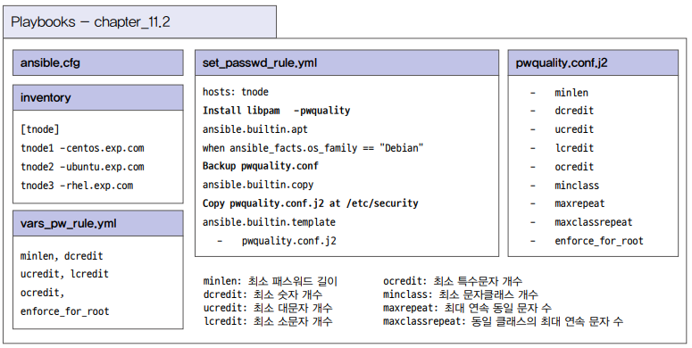
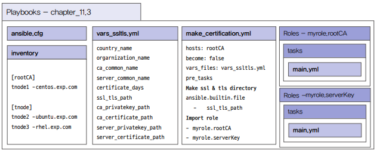

# 보안 설정 자동화

## 1. 패스워드 변경 주기 설정하기

패스워드 변경 주기는 보통 90일이다. 이를 관리하는 것은 어렵지 않지만 많은 서버를 동시에 작업해야 하는 경우 번거롭다.

사용자 계정의 패스워드 변경 주기는 ansible.builtin.user 모듈을 이용하여 최대 변경일과 최소 변경일을 설정할 수 있다.

 - 패스워드 변경 주기를 설정할 대상 호스트는 인벤토리를 통해 설정한다.
 - 패스워드 변경 주기를 설정할 사용자 계정 정보와 최대 변경일은 변수를 통해 별도의 파일로 정의한다.
 - 패스워드 변경 주기 설정은 ansible.builtin.user 모듈을 이용한다.

### 플레이북 설계

인벤토리에 모든 관리 노드를 대상 호스트로 설정한다. 사용자 계정과 최대 변경일을 변수로 설정하기 위해 vars_maxdays.yml 파일을 생성한다. 메인 플레이북인 set_change_password.yml 파일에는 변경 주기를 설정할 태스크가 포함된다.

 - inventory: 관리 노드 대상 호스트
 - vars_maxdays.yml: 사용자 계정과 최대 변경일 변수
 - set_change_password.yml: 변경 주기를 설정하는 태스크

### 플레이북 개발

 - `인벤토리`
```bash
[tnode]
tnode1-centos.exp.com
tnode2-ubuntu.exp.com
tnode3-rhel.exp.com
```

 - `변수 정의`
```bash
---

Userinfo:
  - username: ansible
    maxdays: 90
  - username: stack
    maxdays: 90
```

 - `플레이북 작성`
```yml
---

- hosts: tnode
  vars_files: vars_maxdays.yml
  
  tasks:
    - name: Change Password Maxdays
      ansible.builtin.user:
        name: "{{ item.username }}"
        password_expire_max: "{{ item.maxdays }}"
      loop: "{{ Userinfo }}"
```

 - `플레이북 실행`
```bash
# 문법 체크
$ ansible-playbook --synctax-check set_change_password.yml

# 실행 리뷰
$ ansible-playbook --check set_change_password.yml

# 실행
$ ansible-playbook set_change_password.yml

# 실행 후 > 변경 확인: 관리 노드에 접속하지 않고 for 문을 이용
$ for i in tnode1-centos tnode2-ubuntu tnode3-rhel; do echo "####> $i"; ssh ansible@$i.exp.com sudo change -l ansible; done
```

## 2. 패스워드 생성 법칙 적용하기

패스워드 변경 주기와 함께 반드시 설정해야 하는 보안 설정은 바로 패스워드 생성 법칙 적용이다. 이를 위해 pwquality.conf라는 pam 설정 파일을 이용해야 하며, 리눅스 서버에 libpam-pwquality 패키지가 설치되어 있어야 한다. 패스워드 생성 법칙에는 다양한 옵션이 존재하는데, 이 옵션들의 의미도 모두 알아야 한다.

 - 데비안 계열의 우분투에는 libpam-pwquality 패키지를 설치한다.
 - 패스워드 변경 주기는 /etc/security/pwquality.conf 파일로 설정한다.
 - /etc/security/pwquality.conf 파일을 설정하기 전에 원본 파일을 백업받는다.
 - pwquality.conf 파일은 사용자가 커스텀으로 설정하는 파라미터들로 구성되어 있으며, Jinja2 템플릿 방식으로 구현한다.
 - 파라미터들은 별도의 변수 설정 파일에서 정의한 파라미터 값으로 사용하고, 파라미터 정의 여부를 체크하여 pwquality.conf 파일의 내용을 구성한다.

### 플레이북 설계

변수는 vars_pw_rule.yml 라는 파일에 최소 패스워드 길이 설정을 위한 minlen, 최소 숫자 개수 설정을 위한 dcredit, 최소 대문자 개수 설정을 위한 ucredit, 최소 소문자 개수 설정을 위한 lcredit, 최소 특수문자 개수 설정을 위한 ocredit, root 계정에서도 해당 패스워드 룰을 설정할 수 있는 enforce_for_root를 정의한다.

pwquality.conf.j2 라는 Jinja2 방식의 템플릿 파일에는 minlen, dcredit, ucredit, lcredit, ocredit, minclass, maxrepeat, maxclassrepeat, encofrce_for_root 내용을 모두 포함한다. 마지막으로 set_passwd_rule.yml 이라는 메인 플레이북은 libpam-pwauality 패키지를 설치하는 태스크와 pwquality.conf 파일의 백업을 수행하는 태스크, pwquality.conf.j2 템플릿 파일을 복사하는 태스크로 이루어진다.

 - vars_pw_rule.yml: 변수 정의
 - pwquality.conf.j2: Jinja2 방식 템플릿 파일
 - set_passwd_rule.yml: libpam-pwauality 패키지 설치 태스크, pwquality.conf 파일 백업 태스크, pwquality.conf.j2 템플릿 파일 복사 태스크

<div align="center">
    
</div>
<br/>

### 플레이북 개발

 - `인벤토리`
```bash
[tnode]
tnode1-centos.exp.com
tnode2-ubuntu.exp.com
tnode3-rhel.exp.com
```

 - `변수 정의`
    - minlen: 패스워드 최소 길이
    - dcredit: 최소 숫자 개수
    - ucredit: 최소 대문자 개수
    - lcredit: 최소 소문자 개수
    - ocredit: 최소 특수문자 개수
    - enforce_for_root: root 계정에도 룰 적용
```yml
---

minlen: 8
dcredit: -1
ucredit: -1
lcredit: -1
ocredit: -1
enforce_for_root: true
```

 - `Jinja2 템플릿 정의`
    -  사이에 제어문 구문이 들어간다.
```bash
# Created by ansible


# Minimum acceptable size for the new password
minlen = {{ minlen }}



# The maximum credit for having digits in the new password
dcredit = {{ dcredit }}



# The maximum credit for having uppercase characters in the new password
ucredit = {{ ucredit }}



# The maximum credit for having lowercase characters in the new password
lcredit = {{ lcredit }}



# The maximum credit for having other characters in the new password
ocredit = {{ ocredit }}



# The minimum number of required classes of characters for the new password
minclass = {{ minclass }}



# The maximum number of allowed consecutive same characters in the new password
maxrepeat = {{ maxrepeat}}



# The maximum number of allowed consecutive characters of the same class in the new password
maxclassrepeat = {{ maxclassreapt }}



# Prompt user at most N times before returning with error
retry = {{ retry }}



# Enforces pwquality checks on the root user password.
enforce_for_root

```

 - `플레이북 작성`
```yml
---

- hosts: tnode
  vars_files: vars_pw_rule.yml

  tasks:
    # 데비안 계열 OS에서 모듈 설치
    - name: Install libpam-pwquality
      ansible.builtin.apt:
        name: libpam-pwquality
        state: present
      when: ansible_facts.os_family == "Debian"

    # pwquality.conf 파일 백업
    - name: Backup pwquality.conf
      ansible.builtin.copy:
        src: /etc/security/pwquality.conf
        dest: /etc/security/pwquality.conf.bak

    # 템플릿 파일 복사
    - name: Copy pwquality.conf.j2 at /etc/security
      ansible.builtin.template:
        src: pwquality.conf.j2
        dest: /etc/security/pwquality.conf
        mode: '0644'
```

 - `플레이북 실행`
```bash
# 문법 체크 및 실행
$ ansible-playbook --syntax-check set_password_rule.yml
$ ansible-playbook set_password_rule.yml

# 실행 후 > 백업 및 내용 확인
$ ll pwquality.conf*
$ cat pwquality.conf

# 실행 후 > 패스워드 변경 테스트
$ passwd ansible
New password: qwer
BAD PASSWORD: The password contains less than 1 digits
New password: qwer1234
BAD PASSWORD: The password contains less than 1 uppercase letters
New password: Qwer1234
BAD PASSWORD: The password contains less than 1 non-alphanumeric characters
New password: Qwer1234!
Retype new password: Qwer1234!
passwd: password updated successfully
```

## 3. 디렉토리 및 파일 접근 권한 변경하기

리눅스 보안 중에 꼭 확인해야 하는 항목이 바로 Sticky bit 설정 파일과 World Writable 설정 파일이다. Sticky bit 설정 파일은 리눅스에서 파일 소유자나 그룹 쇼유자만 해당 파일을 읽고 쓰고 삭제할 수 있도록 권한을 부여한 것을 의미한다. 파일 소유자에게 권한을 부여하면 SUID, 파일 그룹에게 권한을 부여하면 SGID, 다른 사람에게 권한을 부여하면 Sticky bit라고 한다.

Sticky bit가 적용된 파일 목록 중 보안을 위해 이를 적용하면 안 되는 파일 목록들이 있다. Sticky bit이 적용된 파일의 권한을 수정할 때는 적용되면 안 되는 파일인지 반드시 먼저 확인해야 한다. 이런 목록들은 KISA(한국인터넷진흥원)와 같은 보안 전문기관에서 발행하는 보안 관련 문서를 참조하는 것이 좋다.

 - Sticky bit 파일 검색어 명령어: find / -xdev -perm -04000 -o -perm -02000 -o -perm -01000
 - World Writable 파일 검색 명령어: find / -xdev -type f -perm -2
 - ansible.builtin.shell 모듈을 이용하여 Sticky bit 파일과 World Writable 파일을 찾는다.
 - 찾은 파일 목록은 ansible.builtin.file 모듈을 이용하여 파일의 접속 권한을 설정한다.
 - Sticky bit 파일은 u-s, g-s, o-s로 설정하고, Wordl Writable 파일은 o-w로 설정한다.

### 플레이북 설계

Sticky bit 설정 파일 검색과 World Writable 파일 검색은 ansible.builtin.shell 모듈을 이용해 find 명령어를 실행하고 결과를 출력한다. 파일 권한은 ansible.builtin.file 모듈을 이용하여 수정한다.

 - inventory: 관리 노드 대상 호스트 정의
 - set_sticky_writable_files: Sticky bit 파일, World Writable 파일을 찾고 접속 권한을 변경한다.

### 플레이북 개발

 - `인벤토리`
```bash
[tnode]
tnode1-centos.exp.com
tnode2-ubuntu.exp.com
tnode3-rhel.exp.com
```

 - `플레이북 작성`
```yml
---

- hosts: tnode

  tasks:
  # Sticky bit 파일 목록 검색
  - name: Find Sticky bit files
    ansible.builtin.shell: |
      find / -xdev -perm -04000 -o -perm -02000 -o -perm 01000 \
      | grep -e 'dump$' \
             -e 'lp*-lpd$' \ 
             -e 'newgrp$' \
             -e 'restore$' \
             -e 'at$' \
             -e 'traceroute$' | xargs ls
    register: sfile_list

  # World Writable 파일 목록 검색
  - name: Find World Writable files
    ansible.builtin.shell: |
      find / -xdev -perm -2 -ls \
      | grep -v 'l..........' | awk '{print $NF}'
    register: wfile_list

  # Sticky bit 파일 목록 출력
  - name: Print Sticky bit files
    ansible.builtin.debug:
      msg: "{{ sfile_list.stdout_lines }}"

  # World Writable 파일 목록 출력
  - name: Print World Writable files
    ansible.builtin.debug:
      msg: "{{ wfile_list.stdout_lines }}"

  # Sticky bit 파일 목록 권한 변경
  - name: Set Sticky bit files
    ansible.builtin.file:
      path: "{{ item }}"
      mode: "u-s,g-s,o-s"
    loop: "{{ sfile_list.stdout_lines }}"

    # World Writable 파일 목록 권한 변경
  - name: Set World Writable files
    ansible.builtin.file:
      path: "{{ item }}"
      mode: "o-w"
    loop: "{{ wfile_list.stdout_lines }}"
```

 - `플레이북 실행`
```bash
# 문법 검사 및 실행
$ ansible-playbook --syntax-check set_sticky_writable_files.yml
$ ansible-playbook setsticky_writable_files.yml
```

## 4. 사설 인증서 생성하기

시스템을 구성하다 보면 사설 인증서를 사용하는 경우가 많다. 웹 애플리케이션을 설치할 때 웹 애플리케이션의 http를 https로 설정하기 위해 사설 인증서를 생성하여 적용하기도 한다.

 - How to Create Self-signed certificates: https://docs.ansible.com/ansible/latest/collections/community/crypto/docsite/guide_selfsigned.html
 - 사설 인증서에는 자체 서명된 인증 기관용 인증서와 해당 인증서를 이용해 만든 클라이언트 인증 키가 있다.
 - 인증서를 만들 때는 CSR이라는 인증 서명 요청을 한다.
 - CSR을 통해 인증 기관용 인증서와 클라이언트 인증 키를 생성한다.
 - 앤서블에서 개인 키를 만들때는 community.crypto.openssl_privatekey 모듈을 사용한다.
 - CSR을 만들 때는 community.crypto.openssl_csr_pipe 모듈을 사용한다.
 - CSR을 이용하여 인증서를 생성할 때는 community.crypto.x509_certificate 모듈을 사용한다.

### 플레이북 설계

tnode1-centos.exp.com에 사설 인증서를 생성하기 위해 inventory에 rootCA 호스트 그룹을 만들고 그룹 멤버로 tnode1-centos.exp.com 노드를 추가한다.

 - vars_ssltls.yml: 인증서 생성에 필요한 값들을 외부 변수로 정의
 - make_certification.yml: become을 false로 설정하여 root 계정이 아닌 ansible 계정으로 실행되도록 한다. pre_tasks에는 인증서 생성을 위한 디렉토리 생성 태스크 추가
 - 인증서 생성은 rootCA 인증서와 serverKey로 나뉘며, 해당 인증서 생성은 각각 롤을 생성하여 처리한다.

<div align="center">
    
</div>
<br/>

### 플레이북 개발

 - `인벤토리`
```bash
[rootCA]
tnode1-centos.exp.com

[tnode]
tnode1-centos.exp.com
tnode2-ubuntu.exp.com
tnode3-rhel.exp.com
```

 - `myrole.rootCA 롤 정의`
    - 플레이북은 community.rypto라는 컨텐츠 컬렉션을 사용하고, 개인 키는 openssl_privatekey 모듈을 이용하고, CSR 생성은 openssl_csr_pipe 모듈, 인증서 생성은 x509_certificate 모듈을 사용한다.
```bash
# 롤 초기화
$ bash ansible-galaxy role init --init-path roles myrole.rootCA

# 태스크 정의
$ vi role/myrole.rootCA/tasks/main.yml
---
# tasks file for myrole.rootCA

# 1. 개인키 생성: OpenSSL을 사용하여 RSA/ECC 개인 키를 생성
# ca_privatekey_path 변수: 개인 키 파일이 저장될 경로를 지정
- name: Create new private key for rootCA
  community.crypto.openssl_privatekey:
    path: "{{ ca_privatekey_path }}"

# 2. 새로운 인증서를 위한 CSR (Certificate Signing Request)을 생성
# CSR을 생성하고, 개인 키와 함께 사용하여 인증서를 발급 요청
# privatekey_path: 이전 태스크에서 생성된 개인 키의 경로입니다.
# country_name: CSR에 포함될 국가 코드 정보 (예: US, KR).
# organization_name: 조직 이름 정보.
# common_name: 인증서의 Common Name (도메인 이름이나 서비스 이름 등).
# register: csr 변수에 생성된 CSR 내용을 저장
- name: Create CSR for new certificate rootCA
  community.crypto.openssl_csr_pipe:
    privatekey_path: "{{ ca_privatekey_path }}"
    country_name: "{{ country_name }}"
    organization_name: "{{ orgarnization_name }}"
    common_name: "{{ ca_common_name }}"
  register: csr

# 3. CSR을 사용하여 자기 서명된 루트 인증서를 생성
# path: 생성된 인증서를 저장할 경로입니다.
# privatekey_path: 개인 키의 경로.
# csr_content: 이전 태스크에서 생성한 CSR 내용 ({{ csr.csr }}).
# selfsigned_not_after: 인증서의 유효기간을 설정 ({{ certificate_days }}).
# provider: selfsigned로 설정하여 자기 서명 인증서를 생성합니다.
# state: present로 설정하여 인증서를 생성합니다.
- name: Create Self-signed new certificate rootCA
  community.crypto.x509_certificate:
    path: "{{ ca_certificate_path }}"
    privatekey_path: "{{ ca_privatekey_path }}"
    csr_content: "{{ csr.csr }}"
    selfsigned_not_after: "{{ certificate_days }}"
    provider: selfsigned
    state: present
```

 - `myrole.serverKey 롤 정의`
    - 이 프로세스는 서버가 rootCA로부터 신뢰받는 인증서를 가지게 하여, TLS 통신 시 보안성을 보장할 수 있도록 합니다. rootCA는 신뢰의 체계를 제공하며, 이 서버 인증서는 클라이언트가 신뢰할 수 있는 상태로 동작합니다.
    - 서버 개인 키 생성: 서버를 위한 개인 키를 생성합니다.
    - CSR 생성: 개인 키를 사용하여 인증서 발급을 요청하는 CSR을 생성합니다.
    - rootCA 서명된 인증서 생성: rootCA와 그 개인 키를 사용하여 서버 인증서를 서명하고 생성합니다.
```bash
# 롤 초기화
$ bash ansible-galaxy role init --init-path roles myrole.serverKey

# 태스크 정의
$ vi role/myrole.serverKey/tasks/main.yml
---
# tasks file for myrole.serverKey

# 1. 개인키 생성: OpenSSL을 사용하여 RSA/ECC 개인 키를 생성
# server_privatekey_path: 서버 개인 키를 저장할 파일 경로.
- name: Create new private key for server key
  community.crypto.openssl_privatekey:
    path: "{{ server_privatekey_path }}"

# 2. 서버의 인증서 서명 요청(CSR, Certificate Signing Request)을 생성
# privatekey_path: 이전 태스크에서 생성된 서버 개인 키의 경로.
# country_name: CSR에 포함될 국가 코드 (예: US, KR).
# organization_name: CSR에 포함될 조직 이름.
# common_name: 서버 인증서의 Common Name (주로 서버의 도메인 이름).
# register: csr 변수에 생성된 CSR 내용을 저장합니다.
- name: Create CSR for new server key
  community.crypto.openssl_csr_pipe:
    privatekey_path: "{{ server_privatekey_path }}"
    country_name: "{{ country_name }}"
    organization_name: "{{ orgarnization_name }}"
    common_name: "{{ server_common_name }}"
  register: csr

# 3. Root Certificate Authority (rootCA)로 서명된 서버 인증서를 생성
# path: 생성된 서버 인증서를 저장할 파일 경로.
# privatekey_path: 서버 개인 키의 경로.
# csr_content: 이전 태스크에서 생성한 CSR의 내용 ({{ csr.csr }}).
# ownca_path: 루트 인증서(rootCA)의 경로.
# ownca_privatekey_path: rootCA의 개인 키 경로.
# ownca_not_after: 서버 인증서의 만료일을 설정 ({{ certificate_days }}).
# provider: ownca로 설정하여 rootCA를 사용해 서명된 인증서를 생성.
# state: present로 설정하여 인증서를 생성.
- name: Create Self-signed server key from rootCA
  community.crypto.x509_certificate:
    path: "{{ server_certificate_path }}"
    privatekey_path: "{{ server_privatekey_path }}"
    csr_content: "{{ csr.csr }}"
    ownca_path: "{{ ca_certificate_path }}"
    ownca_privatekey_path: "{{ ca_privatekey_path }}"
    ownca_not_after: "{{ certificate_days }}"
    provider: ownca
    state: present
```

 - `변수 정의`
```bash
$ vi vars_ssltls.yml
---

country_name: KR
orgarnization_name: SamSung
ca_common_name: Ansible-CA
server_common_name: exp.com
certificate_days: "+3650d"
ssl_tls_path: /home/ansible/tls
ca_privatekey_path: /home/ansible/tls/ca_priv.key
ca_certificate_path: /home/ansible/tls/ca_cert.crt
server_privatekey_path: /home/ansible/tls/server_priv.key
server_certificate_path: /home/ansible/tls/server_cert.crt
```

 - `메인 플레이북 작성`
```bash
$ vi make_certification.yml
---

- hosts: rootCA
  become: false
  vars_files: vars_ssltls.yml

  # 롤이 실행되기 전에 인증서를 생성하고 보관할 디렉토리 생성
  pre_tasks:
    - name: Make ssl & tls directory
      ansible.builtin.file:
        path: "{{ ssl_tls_path }}"
        state: directory

  roles:
    - role: myrole.rootCA
    - role: myrole.serverKey
```

 - `플레이북 실행`
```bash
# 문법 검사 및 실행
$ ansible-playbook --syntax-check make_certification.yml
$ ansible-playbook make_certification.yml

# Cantnot detect the required Python library cryptography 에러 발생시
$ dnf install python3-cryptography
$ ansible-playbook make_certification.yml

# 실행 후 > 인증서가 잘 생성되었는지 확인
$ ll
$ ll tls
```
