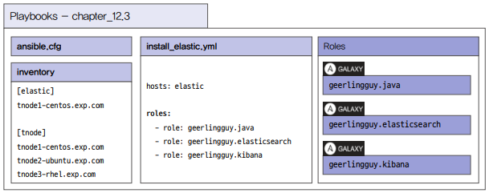

# 모니터링 자동화

앤서블은 시스템 정보를 수집하는 팩트 기능을 제공한다. 팩트 기능을 이용하면 시스템의 기본 정보를 모니터링하고 CPU나 메모리 사용률, 네트워크 사용률 등을 다른 모니터링 도구에서 활용할 수 있도록 로그를 저장할 수 있다.

## 1. 팩트를 이용한 시스템 모니터링

앤서블 팩트는 관리 노드에서 시스템과 관련된 정보들을 자동으로 찾아 변수로 제공한다. 이를 이용하면 실행 중인 관리 노드의 인프라 정보를 파악하거나 이를 로그로 저장할 수 있고, 저장된 로그는 연동되어 있는 모니터링 도구에서 활용 가능하다.

 - 팩트를 이용하여 다음과 같은 정보를 추출한다.
    - 호스트 이름
    - 커널 버전
    - 네트워크 인터페이스 이름
    - 네트워크 인터페이스 IP 주소
    - 운영체제 버전
    - CPU 개수
    - 사용 가능한 메모리
    - 스토리지 장치의 크기 및 여유 공간
 - 추출한 내용은 ansible.builtin..shell 모듈을 이용하여 /var/log/daily_check 디렉토리에 저장한다.

### 플레이북 설계

앤서블 팩트를 활용하여 필요한 정보들을 로그 파일로 저장한다. 특별히 롤이 필요하지 않고, 외부에서 넘겨주어야 할 변수도 없다.
 - monitoring_facts.yml: 앤서블 팩트에서 추출한 시스템 관련 변수들을 출력하고, 해당 내용을 출력할 로그 디렉토리를 생성한 후 로그 파일을 남긴다.

### 플레이북 개발

 - `플레이북 작성`
```yml
---

- hosts: tnode
  vars:
    log_directory: /var/log/daily_check

  tasks:
    - name: Print system info
      ansible.builtin.debug:
        msg:
        - "################ Start #####################"
        - "Date: {{ ansible_facts.date_time.date }} {{ ansible_facts.date_time.time }}" 
        - "HostName: {{ ansible_facts.hostname }}"
        - "OS: {{ ansible_facts.distribution }}"
        - "OS Version: {{ ansible_facts.distribution_version }}"
        - "OS Kernel: {{ ansible_facts.kernel }}"
        - "CPU Cores: {{ ansible_facts.processor_vcpus }}"
        - "Memory: {{ ansible_facts.memory_mb.real }}"
        - "Interfaces: {{ ansible_facts.interfaces }}"
        - "IPv4: {{ ansible_facts.all_ipv4_addresses }}"
        - "Devices: {{ ansible_facts.mounts }}"
        - "################# End #######################" 
      register: result

    - name: Create log directory
      ansible.builtin.file:
        path: "{{ log_directory }}"
        state: directory

    - name: Print logs to log file
      ansible.builtin.shell: |
        echo "{{ item }}" >> "{{ log_directory }}"/system_info.logs
      loop: "{{ result.msg }}"
```

## 2. CPU, 메모리, 태스크 사용률 모니터링

CPU, 메모리, 디스크 사용률을 좀 더 자세하게 살펴볼 수 잇는 dstat, iostat, vmstat 같은 명령어를 이용해 관리 노드의 CPU, 메모리, 디스크 사용률을 모니터링한다.

dstat와 iostat를 실행하려면 dstat, sysstat 이라는 패키지를 설치해야 한다.

 - dstat, sysstat 패키지를 설치한다. 운영체제가 레드햇 계열이면 ansible.builtin.dnf 모듈을 이용하고, 데비안 계열이면 ansible.builtin.apt 모듈을 이용한다.
 - 각각의 명령어 실행은 ansible.builtin.shell을 이용해 실행하고, loop 키워드를 이용하여 모니터링 명령어 별로 여러 옵션을 추가하여 명령어를 실행한다.
 - 실행된 명령어 결과는 로그 디렉토리에 저장한다.

### 플레이북 설계

 - vars_packages.yml: 로그 저장 디렉토리와 설치할 패키지 목록을 변수로 정의
 - monitoring_system.yml: 패키지 설치와 모니터링 로그를 저장하는 태스크 정의

### 플레이북 개발

 - `변수 정의`
```yml
---

log_directory: /home/ansible/logs
packages:
  - dstat
  - sysstat
```

 - `플레이북 작성`
    - 실행시 /home/ansible/logs/ 경로에 로그가 저장된다.
```yml
---

- hosts: tnode
  vars_files: vars_packages.yml

  tasks:
    # RedHat 계열인 경우 패키지 설치
    - name: Install packages on RedHat
      ansible.builtin.dnf:
        name: "{{ item }}"
        state: present
      loop: "{{ packages }}"
      when: ansible_facts.os_family == "RedHat"

    # Debian 계열인 경우 패키지 설치
    - name: Install packages on Ubuntu
      ansible.builtin.apt:
        name: "{{ item }}"
        state: present
      loop: "{{ packages }}"
      when: ansible_facts.os_family == "Debian"

    # dstat 명령어 로그 저장
    - name: Monitoring dstat
      ansible.builtin.shell: |
        {{ item }} >> {{ log_directory }}/dstat.log
      loop:
        - dstat 2 10
        - dstat -cmdlt -D vda 2 10

    # iostat 명령어 로그 저장
    - name: Monitoring iostat
      ansible.builtin.shell: |
        {{ item }} >> {{ log_directory }}/iostat.log
      loop:
        - iostat
        - echo "==============="
        - iostat -t -c -dp vda
        - echo "==============="

    # vmstat 명령어 로그 저장
    - name: Monitoring vmstat
      ansible.builtin.shell: |
        {{ item }} >> {{ log_directory }}/vmstat.log
      loop:
        - vmstat
        - echo "==============="
        - vmstat -dt
        - echo "==============="
        - vmstat -D
        - echo "==============="

    # df 명령어 로그 저장
    - name: Monitoring df
      ansible.builtin.shell: |
        df -h >> {{ log_directory }}/df.log
```

## 3. 모니터링 환경 구축

앤서블을 활용하여 로그를 수집하는 일은 생각보다 효율적이지 못하다. 그러나 모니터링 환경을 구축하는 일은 매우 매력적이다. 모니터링 환경을 구축하기 위해서는 복잡한 절차와 해야할 일이 많지만, 누군가가 이미 앤서블 롤을 이용해 모니터링 환경을 구축할 수 있는 플레이북을 공유했다면 손쉽게 이를 이용할 수 있다.

 - 앤서블 갤럭시: https://galaxy.ansible.com
 - 롤: https://galaxy.ansible.com/ui/standalone/roles/geerlingguy/elasticsearch/
 - 테스트 환경에서 가장 많이 설치하는 엘라스틱서치(ElasticSearch)와 키바나(Kibana)를 tnode1-centos 노드에 설치한다.
 - 앤서블 갤럭시에서 엘라스틱서치와 키바나를 설치할 수 있는 롤을 검색하여 해당 롤을 이용한다.
 - 검색된 롤은 레드햇, 데비안 계열 운영체제 모두 설치 가능하다.

### 플레이북 설계

<div align="center">
    
</div>
<br/>

### 플레이북 개발

 - `롤 설치 및 플레이북 작성`
```bash
# 롤 설치
$ ansible-galaxy role install -p ./roles/geerlingguy.java
$ ansible-galaxy role install -p ./roles/geerlingguy.elasticsearch
$ ansible-galaxy role install -p ./roles/geerlingguy.kibana

# 롤 구조 확인
$ cd roles/
$ ll
$ tree geerlingguy.java/
$ tree geerlingguy.elasticsearch/
$ tree geerlingguy.kibana/

# 플레이북 작성
$ cd ..
$ vi install_elastic.yml
---

- hosts: elastic

  roles:
    - role: geerlingguy.java
    - role: geerlingguy.elasticsearch
    - role: geerlingguy.kibana
```

 - `플레이북 실행`
```bash
# 문법 검사 및 실행
$ ansible-playbook --syntax-check install_elastic.yml
$ ansible-playbook install_elastic.yml

# 실행 후 > 엘라스틱서치 실행 확인
$ systemctl status elasticsearch.service
$ systemctl status kibana.service

# VM에 설치된 키바나 서비스는 호스트 노드에서 접근할 수 없으므로 관리 노드에서 firewall-cmd 명령어로 키바나 포트인 5601을 추가한다.
$ firewall-cmd --add-port=5601/tcp --permanent
```
