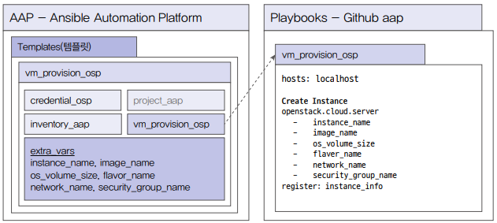

# 클라우드 시스템 자동화

## 1. 오픈스택 인스턴스 생성하기

앤서블 오토메이션 플랫폼을 이용해 오픈스택 인스턴스를 생성하려면 오픈스택과 관련된 모듈이 필요하다. 따라서 작업 템플릿을 하나 생성해 해당 모듈을 앤서블 오토메이션 플랫폼이 설치된 서버에 설치하고 사용할 수 있도록 설정해주어야 한다.

 - __오픈스택 콘텐츠 컬렉션 설정하기__
    - 앤서블 공식 문서에서 openstack.cloud 관련 모듈 확인
    - 앤서블 오토메이션 플랫폼이 설치된 서버에 접속하고, openstack.cloud 설치
    - 설치가 끝나면 Web UI에 접속하여 설정을 추가한다.
        - Web UI > 설정 > 작업 설정 > 분리된 작업에 노출된 경로
        - 'usr/share/ansible/collections/:/home/runner/.ansible/collections:0'
```bash
# openstack.cloud 설치
$ ansible-galaxy collection install openstak.cloud:1.10.0 -p /usr/share/ansible/collections
$ ansible-galaxy collection list
```

 - __오픈스택 인증 정보 확인__
    - 오픈스택과 관련된 콘텐츠 컬렉션을 설치하고 설정했다면 이제 연동할 오픈스택 인증 정보를 확인할 차례이다.
    - Web UI > 리소스 > 인증 정보> 추가
    - 인증 정보 이름: credential_osp
    - 인증 정보 유형: OpenStack
    - 오픈스택 인증 URL: https://overcloud.exp.com:13000
    - 프로젝트: admin
    - 사용자 ID: admin
    - 패스워드: P@ssw0rd1!
    - 도메인: Default
    - 지역 이름: regionOne

<br/>

 - `플레이북 개발`
    - 앤서블 오토메이션 플랫폼에서 플레이북을 개발할 때는 생성할 템플릿과 해당 템플릿에서 사용될 인증정보, 인벤토리, 프로젝트와 함께 해당 프로젝트에서 불러올 플레이북과 플레이북의 내요을 사전에 설계하면 좀 더 쉽게 작업 템플릿을 생성할 수 있다.
<div align="center">
    
</div>
<br/>

```bash
# 플레이북 작성
$ vi vm_provision_osp.yml
---

- hosts: localhost

  tasks:
    - name: Lanuch an instance
      openstack.cloud.server:
        state: present
        name: "{{ instance_name }}"
        image: "{{ image_name }}"
        boot_from_volume: true
        volume_size: "{{ os_volume_size }}"
        terminate_volume: true
        flavor: "{{ flavor_name }}"
        network: "{{ network_name }}"
        security_groups: ["{{ security_group_name }}"]
        timeout: 200
        wait: yes
        userdata: |
          #cloud-config
          chpasswd:
            list: |
              root:password
              expire: false
      register: instance_info

# 깃허브에 플레이북 업로드
$ git add .
$ git commit -m "openstack_vm_provision"
$ git push
```

 - __작업 템플릿 생성하기__
    - Web UI > 리소스 > 프로젝트 > 추가 > 작업 템플릿 추가
    - 이름: vm_provision_osp
    - 인벤토리: inventory_app
    - Playbook: vm_provision_osp.yml
    - 변수 설정(instance_name, image_name, os_volumn_size, flavor_name, network_name, security_group_name)

## 2. VMWare 가상머신 생성하기

앤서블은 VMWare vCenter와 연동하여 VM을 생성할 수 있다. 앤서블 공식 문서에 방문하면 VMWare vCenter에서 VM을 생성하기 위해 어떤 모듈을 사용했는지, 필요한 정보들을 조회하기 위해서 사용할 수 있는 모듈이 무엇인지 등을 확인할 수 있다.

 - VMWare Rest 사용 가이드: https://docs.ansible.com/ansible/latest/collections/vmware/vmware_rest/docsite/guide_vmware_rest.html
 - `vCenter 인증 정보 추가`
    - 인증 정보 이름: credential_vmware
    - 인증 정보 유형: VMware vCenter
    - vCenter 호스트 주소: vmware.exp.com
    - 사용자 ID: 아이디
    - 사용자 패스워드: 패스워드
```bash
# 플레이북 작성
$ vi vm_provision_vmware.yml
---

- hosts: all

  tasks:

    - name: Get cluster
      vmware.vmware_rest.vcenter_cluster_info:
      register: cluster

    - name: Get datacenter
      vmware.vmware_rest.vcenter_datacenter_info:
      register: datacenter

    - name: Get datastores
      vmware.vmware_rest.vcenter_datastore_info:
      register: datastores

    - name: Get folders
      vmware.vmware_rest.vcenter_folder_info:
      register: folder

    - name: Get Resource pool
      vmware.vmware_rest.vcenter_resourcepool_info:
      register: resource

    - name: Get Network
      vmware.vmware_rest.vcenter_network_info:
        types: "DISTRIBUTED_PORTGROUP"
        names: "{{ network_name }}"
      register: network

    - name : Create a VM
      vmware.vmware_rest.vcenter_vm:
        placement:
          cluster: "{{ cluster.value[0].cluster }}"
          datastore: "{{ datastores.value[0].datastore }}"
          folder: "{{ folder.value[15].folder }}"
          resource_pool: "{{ resource.value[2].resource_pool }}"
        name: "{{ vm_name }}"
        guest_OS: "{{ os_name }}"
        hardware_version: VMX_19
        power_on: true
        cpu:
          count: "{{ cpu_cnt }}"
        memory:
          hot_add_enabled: true
          size_MiB: "{{ memory_mib }}"
        disks:
        - type: SATA
          new_vmdk:
            name: "{{ disk_name }}"
            capacity: "{{ disk_size }}"
        nics:
        - backing:
            type: "{{ network.value[0].type }}"
            network: "{{ network.value[0].network }}"
      register: my_vm
```

## 3. 쿠버네티스에 애플리케이션 파드 생성하기

앤서블을 이용하여 쿠버네티스에 애플리케이션을 설치하려면 쿠버네티스 API를 사용해야 한다. 쿠버네티스 API는 인증 정보가 필요한데, 쿠버네티스에서 서비스 어카운트를 생성하고 권한을 할당해주어야 한다.

 - 서비스 어카운트 생성: https://kubernetes.io/docs/tasks/configure-pod-container/configure-service-account
 - 서비스 어카운트 관리: https://kubernetes.io/ko/docs/reference/access-authn-authz/service-accounts-admin
 - `인증 정보 확인 및 추가`
    - 쿠버네티스에 서비스 어카운트를 생성하고 토큰을 발행했다면 앤서블 오토메이션 플랫폼에 인증 정보를 추가한다.
    - 인증 정보 이름: credential_kubernetes
    - 인증 정보 유형: OpenShift 또는 Kubernetes API 전용 토큰
    - 쿠버네티스 API 엔드포인트: https://k8x.exp.com:6443
    - API 접속 토큰: 토큰
```bash
# 플레이북 작성
$ vi deployment_provision_k8s.yml
---

- hosts: localhost

  tasks:
  - name: Create a Deployment Nginx
    kubernetes.core.k8s:
      # Deployment가 존재하지 않으면 생성하고, 이미 존재하면 정의와 일치하도록 업데이트한다.
      state: present
      # k8s 리소스의 YAML 정의를 제공
      definition:
        # Deployment 리소스의 API 버전
        apiVersion: apps/v1
        # 생성하려는 리소스의 종류
        kind: Deployment
        # Deployment 이름, 네임스페이스, 리소스 식별 라벨
        metadata:
          name: "{{ deployment_name }}"
          namespace: "{{ namespace }}"
          labels:
            app: "{{ application_label }}"
        # Deployment 스팩: 복제본 갯수, 파드 라벨, 파드 템플릿
        spec:
          replicas: "{{ replica_cnt }}"
          selector:
            matchLabels:
              app: "{{ application_label }}"
          template:
            metadata:
              labels:
                app: "{{ application_label }}"
            spec:
              containers:
              - name: "{{ container_name }}"
                image: "{{ container_image }}"
                ports:
                - containerPort: "{{ container_port }}"
    register: my_deployment

  - name: Print deployment information
    ansible.builtin.debug:
      vars: my_deployment 
```

## 4. AWS EC2에 인스턴스 생성하기

앤서블은 프라이빗 클라우드뿐만 아니라 퍼블릭 클라우드의 가상 자원도 생성할 수 있다. 또한 생성된 가상 서버에 접속하여 다양한 시스템 환경 설정을 할 수 있다.

 - `인증 정보 추가`
    - 앤서블이 AWS에 접근하여 인스턴스를 생성하기 위해서는 인증 정보가 필요하다. AWS에서 Root 사용자가 사용자 그룹을 생성하고 사용자를 추가하여, 외부에서 AWS API를 사용하기 위한 액세스 키와 시크릿 키를 생성한다. 앤서블에서 이 키를 이용하여 AWS API를 사용할 수 있다.
    - 인증 정보 이름: credential_aws
    - 인증 정보 유형: Amazon Web Services
    - 액세스 키: 액세스 키
    - 시크릿 키: 시크릿 키
```bash
$ vi vm_provision_aws.yml
---

- hosts: localhost

  tasks:
    # 새로운 AWS EC2 인스턴스를 생성
    - name: Create ec2 vm
      amazon.aws.ec2_instance:
        # 인스턴스 이름, AMI ID, 유형, SSH 키 페어 이름, 보안 그룹, 네트워크, 리전
        name: "{{ vm_name }}"
        image_id: "{{ image_id }}"
        instance_type: "{{ instance_type }}"
        key_name: "{{ key_name }}"
        security_group: "{{ security_group }}"
        network:
          assign_public_ip: true
        region: "{{ region_name }}"
      register: vm_info

    - name: Print vm information
      ansible.builtin.debug:
        var: vm_info
```
