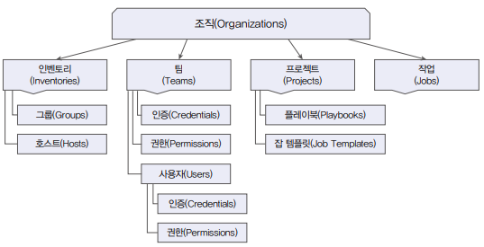

# RBAC 적용하기

앤서블 오토메이션 플랫폼에서 역할 기반 액세스 제어(RBAC) 기능을 사용하여 부서와 사용자 권한을 설정할 수 있다.

## 1. RBAC 설계하기

앤서블 오토메이션 플랫폼은 조직 또는 부서를 기준으로 인벤토리, 팀, 프로젝트를 구성하고 관리할 수 있다.

 - __팀을 위한 조직 역할__
    - 앤서블 오토메이션 플랫폼은 팀 자체에 역할을 할당할 수 있는데, 그중에서도 조직 자체에 줄 수 있는 역할이 존재한다.
    - 실행: 조직에서 실행 가능한 리소스를 모두 실행할 수 있음
    - 프로젝트 관리자: 조직의 모든 프로젝트를 관리
    - 인벤토리 관리자: 조직의 모든 인벤토리를 관리
    - 인증 정보 관리자: 조직의 모든 자격 증명 관리
    - 워크플로 관리자: 조직의 모든 워크플로 관리
    - 관리자에게 알림: 조직의 모든 알림 관리
    - 작업 템플릿 관리자: 조직의 모든 작업 템플릿 관리
    - 실행 환경 관리자: 조직의 모든 실행 환경 관리
    - 감시자: 조직의 모든 측면 볼 수 있음
    - 읽기: 조직의 설정 볼 수 있음
    - 승인: 워크플로 승인 노드를 승인하거나 거부할 수 있음
 - __개인을 위한 조직 역할__
    - 팀에 소속된 사용자들은 팀의 모든 설정 권한을 갖는다. 그러나 팀에서 설정하지 않은 권한도 개인이나 사용자별로 할당할 수 있다.
    - 관리자: 조직의 모든 측면을 관리
    - 실행: 조직에서 실행 가능한 리소르르 모두 실행할 수 있음
    - 프로젝트 관리자: 조직의 모든 프로젝트를 관리
    - 인벤토리 관리자: 조직의 모든 인벤토리를 관리
    - 인증 정보 관리자: 조직의 모든 자격 증명 관리
    - 워크플로 관리자: 조직의 모든 워크플로 관리
    - 관리자에게 알림: 조직의 모든 알림 관리
    - 작업 템플릿 관리자: 조직의 모든 작업 템플릿 관리
    - 실행 환경 관리자: 조직의 모든 실행 환경 관리
    - 감시자: 조직의 모든 측면 볼 수 있음
    - 읽기: 조직의 설정 볼 수 있음
    - 승인: 워크플로 승인 노드를 승인하거나 거부할 수 있음
 - __기타 역할__
    - 시스템 관리자가 생성한 작업 템플릿, 워크플로 작업 템플릿, 프로젝트 등을 사용할 수 있는 기타 역할을 추가할 수 있음
    - 작업 템플릿: 템플릿의 접근 권한을 조/팀/개인에게 부여
    - 워크플로 작업 템플릿: 워크플로 템플릿의 접근 권한을 조/팀/개인에게 부여
    - 프로젝트: 시스템 관리자가 만든 공통 플레이북 저장소를 프로젝트로 등록하고 다른 사용자가 접근할 수 있도록 권한 부여

<div align="center">
    
</div>
<br/>

### 설계

 - __조직/팀 역할 설계__
    - 조직을 부서 또는 특정 서비스로 설정하고, 팀에는 관리자 권한을 갖는 그룹과 일반 사용자 권한을 갖는 그룹을 구분한다.
    - 관리자 그룹에는 해당 서비스 자원을 관리할 수 있는 권한 모두를 할당하고, 사용자 그룹에는 실행 권한과 읽기 권한만 할당한다.
```
조직: IT-Service
    - 팀: IT-Service-Managerment(IT 서비스 관리 그룹)
        - 실행, 프로젝트 관리자, 인증 정보 관리자, 워크플로 관리자, 관리자에게 알림
        - 작업 템플릿 관리자, 읽기, 승인
    - 팀: IT-Service-Users(IT 서비스 사용자 그룹)
        - 실행, 읽기
```

 - __사용자별 역할 설계__
    - 팀을 생성하고 사용자를 추가할 때는 사용자의 팀 내 권한을 설정할 수 있다.
    - 관리자 그룹 팀에 추가되는 사용자는 Admin 권한으로 설정하고, 사용자 그룹 팀으로 추가되는 사용자는 Member 권한으로 설정
```
팀: IT-Service-Managerment(IT 서비스 관리 그룹)
    - itservice-admin1 사용자 -> Admin 권한
    - itservice-admin2 사용자 -> Admin 권한
팀: IT-Service-Users(IT 서비스 사용자 그룹)
    - itservice-user1 -> Member 권한
    - itservice-user2 -> Member 권한
    - itservice-user3 -> Member 권한
```

## 2. 조직, 팀 그리고 사용자 생성하기

 - __조직 만들기__
    - Web UI > 액세스 > 조직 > 조직 편집
 - __팀 만들기__
    - Web UI > 액세스 > 팀 > 추가
    - 생성시에 연결할 조직을 선택한다.
 - __사용자 추가하기__
    - Web UI > 액세스 > 사용자 > 추가
    - 상세 정보에서 '팀' 탭에서 팀을 연결한다.

## 3. 팀 그리고 사용자에 권한 설정하기

 - __관리자 그룹에 권한 설정하기__
    - Web UI > 액세스 > 팀 > 상세 화면 > 역할 탭 > 추가
    - 감사자를 제외한 모든 권한을 선택 후 저장
 - __사용자 그룹에 권한 설정하기__
    - Web UI > 액세스 > 팀 > 상세 화면 > 역할 탭 > 추가
    - '실행', '읽기' 권한 선택 후 저장
