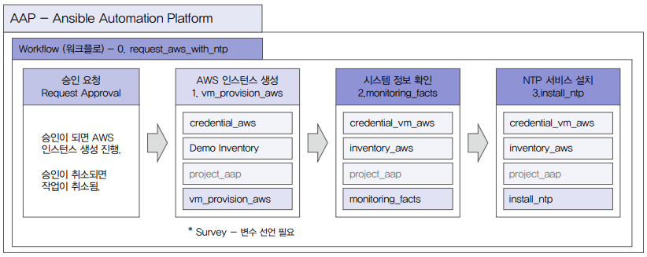

# 워크플로와 RBAC를 이용한 승인 프로세스 구현

## 1. 워크플로 설계하기

워크플로는 여러 작업 템플릿을 조합하여 또 다른 프로세스를 자동화할 수 있다.

기존에 작성한 AWS에 인스턴를 생성하는 플레이북인 vm_provision_aws와 시스템 정보를 확인하는 플레이북인 monitoring_facts, NTP 서비스를 설치할 수 있는 install_ntp 플레이북을 선택하여 워크플로를 만든다. 시작 시 승인 요청 프로세스를 넣어 해당 서비스 허용 여부를 관리자 그룹에서 확인할 수 있게 한다.

 - 9.3(NTP 서비스 설치), 12.1(시스템 정보 확인), 18.4(AWS 인스턴스 생성)
 - 승인 요청 > AWS 인스턴스 생성(vm_provision_aws) > 시스템 정보 확인(monitoring_facts) > NTP 서비스 설치(install_ntp)

<div align="center">
    
</div>
<br/>

## 2. 워크플로 생성하기

플레이북에서 사용할 추가 모듈 중 설치해야 할 것이 있다면 사전에 설치한다. AWS 인스턴스 생성 플레이북에서는 다음 프로세스 실행을 위해 인벤토리에 호스트를 진행하고, tnode라는 호스트 그룹 앞에서 추가한 호스트를 추가하는 절차를 추가한다. 이때 호스트 그룹과 호스트를 추가하기 위해 awx.awx 모듈을 사용한다.

```bash
# awx.awx 모듈 설치
$ ansible-galaxy collection install awx.awx -p /usr/share/ansible/collections
```

### 워크플로 템플릿 생성

 - `인증 정보`
    - 인증 정보 이름: credential_aws
    - 인증 정보 유형: Machine
    - 사용자 이름: ec2-user
    - SSH 개인 키: pem 파일
 - `인벤토리`
    - 인벤토리 이름: inventory_aws
 - `작업 템플릿`
    - 템플릿1 이름: 1. vm_provision_aws
    - 템플릿2 이름: 2. Monitoring_facts
    - 템플릿3 이름: 3. install_ntp

