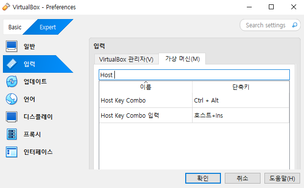
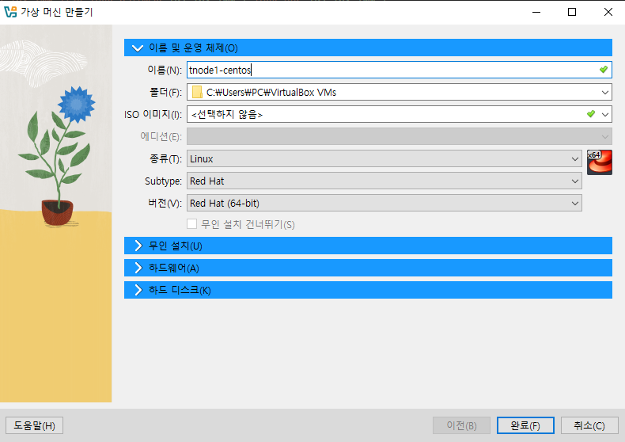

# 앤서블 치트시트

## Virtualbox 가상머신 등록 및 환경 설정

 - `Virtualbox 가상머신 참고`
    - https://www.youtube.com/watch?v=Un4_Sx4lTjg&t=638s
    - https://www.youtube.com/watch?v=WUtNyOuWjOQ

 - `가상머신 마우스 탈출 설정`
    - 파일 > 환경 설정 > Expert > 입력 > 가상 머신 > 호스트 키 조합(Host Key Combo) > 단축키 설정(Ctrl + Alt)

<div align="center">
    
</div>

 - `가상머신 등록`
    - Linux OS Mirror 사이트
        - DVD는 GUI를 포함한 버전, Minimal은 순수 터미널 버전
        - 네이버 CentOS Mirror: https://mirror.navercorp.com/centos/
        - 카이스트 Mirror: https://ftp.kaist.ac.kr/
        - 카카오 Mirror: https://mirror.kakao.com/
        - CentOS: https://vault.centos.org/7.9.2009/isos/x86_64/
        - Ubuntu: https://ubuntu.com/download/server#manual-install
    - 가상머신을 먼저 생성하고, 이후에 만들어진 가상 머신 설정으로 저장소에 iso 이미지 파일을 설정하고 실행해준다.
        - 기계가 준비되고, CD-Rom에 운영체제 CD를 넣어준 것과 같다.
<div align="center">
   
</div>

 - `네트워크 설정`
    - [참고 블로그](https://inpa.tistory.com/entry/VM-%F0%9F%92%BF-NAT-Bridge-Adapter-%EA%B0%9C%EB%85%90-%EB%B0%8F-%EC%84%A4%EC%A0%95)
    - NAT은 버추얼박스가 설치되어 있는 호스트 PC가 공유기 역할을 하여 가상 머신에 IP 주소를 할당하는 방식이라면, Bridged Adapter는 실제 공유기로부터 가상 머신에 IP 주소를 할당받아 호스트 PC와 네트워크 대역의 IP 주소를 받는다. 따라서 외부와 연결되는 네트워크를 구축할 땐 NAT보다 Bridged Adapter가 더 간편하다. Bridged Adapter는 가상 머신 차원에서의 별도의 포트 포워딩 작업이 필요 없으며 고급 기능도 지원한다.
    - NAT
        - 가상머신 내에서 할당해주는 자유로운 IP로 10.0.0.x로 시작한다. 클라이언트 기능은 해주지만 서버로서는 불가능하다.
        - VM들이 외부 연결이 가능하지만, VM들끼리 접속은 불가능하다. 호스트의 게스트로써 가상의 게스트의 NIC를 이용하여 연결하는 것이므로 그 호스트만 접근이 가능하다.
        - NAT를 쓰는 이유는 여러 대의 호스트가 하나의 공인 IP를 사용하여 인터넷에 접속하기 위한 경우가 대부분으로 예를 들어, 인터넷 회선을 하나 개통하고 인터넷 공유기를 달아 여러 PC를 연결하여 사용하는데, 이것이 가능한 이유가 인터넷 공유기에 NAT 기능이 탑재되어 있기 때문이다.
        - NAT로 구축할 경우 SSH, PUTTY 등으로 외부에서 접속이 필요한 경우에 포트포워딩을 해주어야 한다.
            - 호스트와 게스트 포트포워딩을 해주어야 한다.
    - 어댑터에 브리지(Bridge Adapter)
        - 어댑터에 브리지는 호스트와 IP 대역대가 같은 고정적인 IP로 클라이언트와 서버 기능이 가능하다.
        - 브리지 어댑터는 게스트 OS가 브리지에 연결된 것처럼 동작하게 해준다. 즉, 별도의 PC가 또 하나 생겨서 네트워크에 연결된 것과 같은 효과를 낸다. 호스트 PC와 동일한 네트워크를 사용하며, 공유기가 있을 경우 공유기에서 호스트와 동일한 대역의 IP를 할당해준다. MAC 제한이 걸린 환경일 경우 IP가 할당되지 않을 수 있다.
        - 해당 방식은 공유기가 VM에게 IP를 주는 방식으로 VM에게 있어 A는 단지 다리 역할만 할 뿐 공유기는 VM도 하나의 PC로 보기 때문에 개별적으로 IP를 할당 받는다.
```
1. 어댑터 2 활성화
 - 파일 > 도구 > 네트워크 관리자 > 호스트 전용 네트워크 > 만들기


```