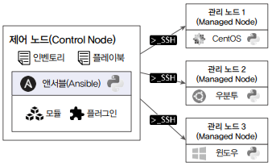

# 앤서블 정리

## 앤서블 도메인 용어

 - __제어 노드__: 제어 노드는 앤서블이 설치되는 노드로 운영체제가 리눅스라면 제어 노드가 될 수 있다. 앤서블은 파이썬 모듈을 이용하므로 앤서블을 설치하고 실행하려면 파이썬이 함꼐 설치되어야 한다.
 - __관리 노드__: 관리 노드는 앤서블이 제어하는 원격 시스템 또는 호스트를 의미한다. 관리 노드는 리눅스, 윈도우, 퍼블릭 클라우드나 프라이빗 클라우드 시스템에서 생성한 가상 서버 어디든 될 수 있다. 앤서블은 별도의 에이전트를 설치하지 않으므로 관리 노드는 제어 노드와 SSH 통신이 가능해야 하며, 파이썬이 설치되어 있어야 한다.
 - __인벤토리__: 인벤토리는 제어 노드가 제어하는 관리 노드의 목록을 나열해놓은 파일이다. 앤서블은 인벤토리에 사전에 정의되어 있는 관리 노드에만 접근할 수 있다. 또한, 인벤토리 목록은 관리 노드의 성격별로 그룹핑할 수 있다.
 - __모듈__: 앤서블은 관리 노드의 작업을 수행할 떄 SSH를 통해 연결한 후 앤서블 모듈이라는 스크립트를 푸시하여 작동한다. 대부분의 모듈은 원하는 시스템 상태를 설명하는 매개 변수를 허용하며, 모듈 실행이 완료되면 제거된다.
 - __플러그인__: 플러그인은 앤서블의 핵심 기능을 강화한다. 모듈이 대상 시스템에서 별도의 프로세스로 실행되는 동안 플러그인은 제어 노드에서 실행된다. 플러그인은 핵심 기능(데이터 변환, 로그 출력, 인벤토리 연결 등)에 대한 옵션 및 확장 기능을 제공한다.
 - __플레이북__: 플레이북은 관리 노드에서 수행할 작업들을 YAML 문법을 이용해 순서대로 작성해놓은 파일이다. 앤서블은 작성된 플레이북을 활용하여 관리 노드에 SSH로 접근해 작업을 수행한다. 플레이북은 자동화를 완성하는 가장 중요한 파일이며 사용자가 직접 작성한다.

<div align="center">
    
</div>

## 앤서블 사용법

### 인벤토리

인벤토리 파일은 앤서블이 자동화 대상으로 하는 관리 호스트를 지정한다. 해당 파일을 INI 스타일 형식(이름=값) 또는 YAML을 포함한 다양한 형식을 사용하여 작성할 수 있다.

 - __그룹별 호스트 설정__
    - 그룹별로 호스트를 설정하여 사용하면 앤서블 플레이북 실행 시 그룹별로 작업을 처리할 수 있다.
```ini
[webservers]
web1.exmaple.com
web2.example.com
192.0.2.42

[db-servers]
db01.example.com
db02.example.com
```

 - __중첩 그룹 정의__
    - 앤서블 인벤토리는 호스트 그룹에 기존에 정의한 호스트 그룹을 포함할 수도 있다.
    - 이 경우 호스트 그룹 이름 생성 시 :children 이라는 접미사를 추가하면 된다.
```ini
[webservers]
web1.example.com
web2.example.com

[db-servers]
db01.example.com
db02.example.com

[datacenter:children]
webservers
dbservers
```

 - __범위를 사용한 호스트 사양 간소화__
    - 인벤토리의 호스트 이름 또는 IP 주소를 설정할 때 범위를 지정하여 호스트 인벤토리를 간소화할 수 있다.
    - 숫자 또는 영문자로 범위를 지정할 수 있으며, 대괄호 사이에 시작 구문과 종료 구문을 포함할 수 있다.
```ini
[webservers]
web[1:2].example.com

[db-servers]
db[01:02].example.com
```

### 플레이북

인벤토리를 이용하여 대상 호스트를 정의하고, 플레이북을 이용하여 대상 호스트에 수행될 작업들을 정의한다.

플레이북을 작성하고 실행하려면 여러 가지 설정을 미리 해주어야 한다. 예를 들어 어떤 호스트에서 플레이북을 실행할 것인지, 플레이북을 루트 권한으로 실행할 것인지, 대상 호스트에 접근할 때는 SSH 키를 이용할 것인지 패스워드를 이용할 것인지 등을 설정해주어야 한다.

#### 플레이북 작업 준비

 - __앤서블 환경 설정 파일(ansible.cfg)__
```
[defaults]
inventory = ./inventory
remote_user = user
ask_pass = false

[privilege_excalation]
becom = true
become_method = sudo
becom_user = root
becom_ask_pass = false
```

 - __접근을 위한 SSH 인증 구성__
```bash
$ ssh-keygen
$ ssh-copy-id root@192.168.100.4
```

 - __통신 테스트__
```bash
$ ansible -m ping web
```

#### 플레이북 사용 예시

 - __inventory 파일__
```ini
[web]
tnode1-centos.exp.com
tnode2-ubuntu.exp.com

[db]
tnode3-rhel-exp.com

[all:children]
web
db
```

 - __playbook.yml 파일__
```yml
---
- hosts: all
  tasks:
    - name: Print message
      debug:
        msg: Hello Ansible World
```

 - __플레이북 실행__
```bash
$ ansible-playbook --syntax-check playbook.yml
$ ansible-playbook playbook.yml
$ ansible-playbook -i inventory
```

### 변수와 팩트

앤서블 플레이북에서도 변수를 정의하고 사용할 수 있다. 변수를 어디에 정의하는지에 따라 그룹 변수, 호스트 변수, 플레이 변수가 될 수 있다. 변수에는 일반적인 내용을 저장하는 일반 변수와 패스워드와 같이 암호화가 필요한 정보들을 저장하는 변수가 있다. 또한 시스템에서 수집한 값들을 저장하는 변수도 있다.

 - __그룹 변수__
    - 인벤토리에 정의된 호스트 그룹에 적용하는 변수
```ini
[web]
tnode1-centos.exp.com
tnode2-ubuntu.exp.com

[db]
tnode3-rhel.exp.com

[all:children]
web
db

[all:vars]
user=ansible
```

 - __호스트 변수__
    - 변수를 해당 호스트에서만 사용할 수 있다.
    - 그룹 변수보다 우선 순위가 높다.
```ini
[web]
tnode1-centos.exp.com
tnode2-ubuntu.exp.com

[db]
tnode3-rhel.exp.com user=ansible1

[all:children]
web
db

[all:vars]
user=ansible
```

 - __플레이 변수__
    - 플레이북 내에서 선언되는 변수
    - 호스트 변수보다 우선 순위가 높다.
    - 플레이 변수를 별도의 파일로 분리하는 경우 vars_files 옵션을 이용한다.
```yml
- hosts: all
  vars:
    user: ansible2

  tasks:
  - name: Create User {{ user }}
    ansible.builtin.user:
      name: "{{ user }}"
      state: present
```

 - __추가 변수__
    - 외부에서 플레이북을 실행할 떄 함께 파라미터로 넘겨주는 변수
    - 추가 변수는 제일 우선순위가 높다.
```bash
$ ansible-playbook -e user=ansible3 create-user.yml
```

 - __암호화 변수(Ansible Vault)__
    - 앤서블은 사용되는 모든 데이터 파일을 암호화하고 파일의 내용을 해독할 수 있는 Ansible Vault라는 기능을 제공한다.
```bash
# 암호화된 파일 생성
$ ansible-vault create mysecret.yml

# 암호화된 파일 확인: 비밀번호를 직접 입력
$ ansible-vault view mysecret.yml

# 암호화된 파일 확인: 비밀번호가 저장된 파일 입력
$ ansible-vault view --vault-pass-file ./vault-pass mysecret.yml

# 플레이북에 암호화 변수 사용하기: vars_files
---
- hosts: db
  vars_files:
    - vars/mysecret.yml

  tasks:
  - name: Create User {{ user }}
    ansible.builtin.user:
      name: "{{ user }}"
      state: present

# 플레이북 실행: --vault-password-file로 비밀번호 파일 지정
$ ansible-playbook --vault-password-file=./vault-pass paybook.yml
```

 - __자동 예약 변수 - 팩트__
    - 팩트는 앤서블이 관리 호스트에서 자동으로 검색한 변수다.
    - 예시: 호스트 이름, 커널 버전, 네트워크 인터페이스 이름, 운영체제 버전, CPU 개수, 사용 가능한 메모리, 스토리지 장치의 크기 및 여유 공간
```
ansible_facts.hostname: 호스트명
ansible_facts.fqdn: 도메인 기반 호스트명
ansible_facts.default_ipv4.address: 기본 IPv4 주소
..
```
