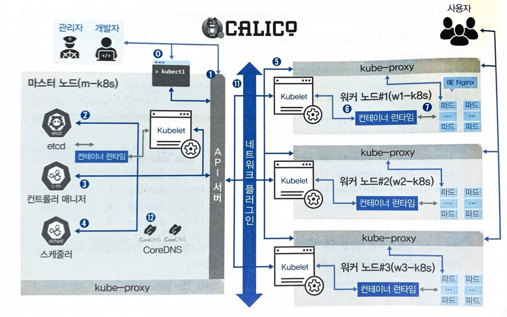
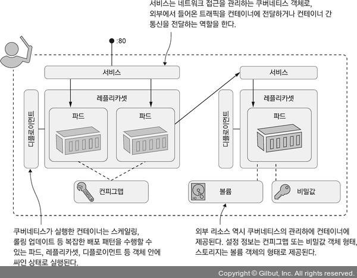
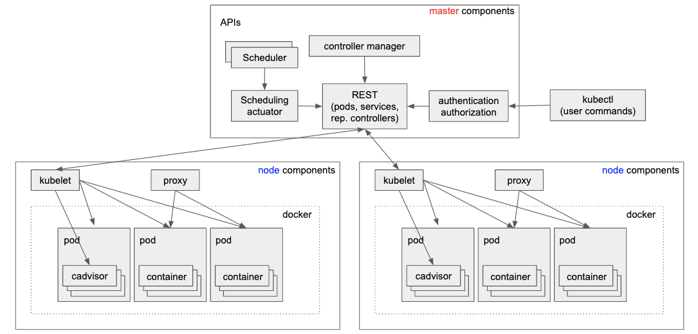

# 쿠버네티스 동작 원리

## 1. 쿠버네티스 컴포넌트

쿠버네티스 컴포넌트를 크게 분류를 하자면, 쿠버네티스 기능 제어를 전체적으로 담당하는 컨트롤 플레인(Control Plane) 컴포넌트와 컨트롤 플레인 컴포넌트의 요청을 받아 각 노드에서 동작을 담당하는 노드(Node) 컴포넌트로 나누어볼 수 있다.

 - https://kubernetes.io/ko/docs/concepts/overview/components/
 - https://www.samsungsds.com/kr/insights/kubernetes-3.html

<div align="center">
    
</div>
<br/>

### 1-1. 컨트롤 플레인(Control Plane) 컴포넌트

Control plane 컴포넌트는 일반적으로 하나의 노드에서 동작하지만, 고가용성 환경이나 대규모 클러스터에서는 여러 노드에 분산된 형태도 가능하다.

 - __kube-apiserver__
    - 쿠버네티스 클러스터로 들어오는 요청을 가장 앞에서 접수하는 역할을 한다.
    - 예를 들어 쿠버네티스 CLI 도구인 kubectl을 사용해 각종 명령을 수행할 경우 이 명령은 kube-apiserver로 전송된다. 이렇게 전달된 요청에 대하여 kube-apiserver는 이 요청의 처리 흐름에 따라 적절한 컴포넌트로 요청을 전달하는 역할을 맡고 있다.
 - __etcd__
    - __쿠버네티스 클러스터가 동작하기 위해서는 클러스터 및 리소스의 구성 정보, 상태 정보 및 명세 정보 등이 필요하다. etcd는 이를 키-값 형태로 저장하는 저장소이다.__
    - 규모가 작고 일시적인 클러스터의 경우에는 etcd 단일 인스턴스가 다른 마스터 컴포넌트와 함께 동일한 노드에서 동작할 수 있다. 하지만, 대규모 클러스터의 경우 일반적으로 이중화와 고가용성을 위해 3개에서 많으면 5개 노드의 etcd 클러스터를 갖기도 한다.
 - __kube-scheduler__
    - 쿠버네티스 클러스터는 여러 노드로 구성되어 있다. 그리고, 기본 작업 단위인 파드는 여러 노드 중 특정 노드에 배치되어 동작하게 된다. 이때, __새로 생성된 파드를 감지하여 어떤 노드로 배치할지 결정하는 작업을 스케줄링이라고 한다.__
    - 스케줄링을 위해 노드 및 파드의 각종 요구사항과 제약사항을 종합적으로 판단할 필요가 있는데, 이러한 판단 또한 kube-scheduler의 역할이다.
 - __kube-controller-manager__
    - kube-controller-manager는 다운된 노드가 없는지, 파드가 의도한 복제(Replicas) 숫자를 유지하고 있는지, 서비스와 파드는 적절하게 연결되어 있는지, 네임스페이스에 대한 기본 계정괴 토큰이 생성되어 있는지를 확인하고 적절하지 않다면 적절한 수준을 유지하기 위해 조치하는 역할을 한다.
    - __클러스터의 상태를 감시하고, 클러스터를 원하는 상태로 조정한다.__

### 1-2. 워커 노드 컴포넌트

 - __kubelet__
    - __쿠블릿은 노드에서 컨테이너가 동작하도록 관리해주는 핵심 요소이다.__
    - 각 노드에서 파드를 생성하고 정상적으로 동작하는지 관리하는 역할을 담당하고 있으며, 실제로 쿠버네티스의 워크로드를 관리하기 위해 내려지는 명령은 kubelet을 통해 수행된다.
    - 예를 들어, 쿠버네티스 파드 관리를 위해 YAML을 작성하고 kubectl 명령을 사용할 때, 이 YAML이 kube-apiserver로 전송된 후 kubelet으로 전달된다. kubelet은 이 YAML을 통해 전달된 파드를 생성 혹은 변경하고, 이후 이 YAML에 명시된 컨테이너가 정상적으로 실행되고 있는지 확인한다.
 - __container runtime__
    - __컨테이너 런타임은 파드에 포함된 컨테이너 실행을 실질적으로 담당하는 애플리케이션을 말한다.__
    - 쿠버네티스 구성 요소에 기본적으로 포함되어 있거나, 특정 소프트웨어를 지칭하는 것은 아닏나.
    - 쿠버네티스가 컨테이너를 제어하기 위해 제공하는 표준 규약인 컨테이너 런타임 인터페이스(CRI)를 준수하여 쿠버네티스와 함께 사용할 수 있는 외부 애플리케이션들을 의미한다. (특정 애플리케이션 사용 강제 X, 단지 k8s가 제공하는 규약 연계 요구)
    - 이러한 규약을 따르는 대표적인 컨테이너 런타임은 컨테이너디(containerd), 크라이오(CRI-O) 등이 있다.
 - __kube-proxy__
    - __쿠버네티스 클러스터 내부에서 네트워크 요청을 전달하는 역할__
    - 각 노드에서 저 수준의 네트워크 관리 업무를 수행한다. 쿠버네티스 서비스를 지역적으로 반영하고 TCP와 UDP 포워딩을 수행하며 환경 변수나 DNS를 통해 클러스터 IP를 찾는다.

### 1-3. 쿠버네티스 구조

<div align="center">
    
    
    
</div>
<br/>

## 2. k8s cluster 1.30 설치

 - https://kubernetes.io/docs/setup/production-environment/tools/kubeadm/install-kubeadm/

### 2-1. 구성 정보 확인 및 설정

```bash
sudo -i

# 설치된 OS 정보 확인
cat /etc/os-release

# 2 GB or more of RAM per machine (any less will leave little room for your apps).
# 2 CPUs or more.
lscpu
free -h

# Full network connectivity between all machines in the cluster (public or private network is fine).
# Unique hostname, MAC address, and product_uuid for every node. See here for more details.
hostname
ip addr show dev ens32 | grep inet
cat /etc/hosts
...
10.0.2.10   k8s-control-plane
10.0.2.11   k8s-worker1


# Certain ports are open on your machines. See here for more details.
# ufw status
# systemctl disable ufw.service 
# systemctl stop ufw.service 
# systemctl status ufw

# Swap disabled. You MUST disable swap in order for the kubelet to work properly
swapoff -a && sed -i '/swap/s/^/#/' /etc/fstab
swapon -s
```

 - `IPv4 포워딩하여 iptables가 bridge된 traffic 보게 하기`
```bash
# br_netfilter 모듈을 로드
cat <<EOF | sudo tee /etc/modules-load.d/k8s.conf
overlay
br_netfilter
EOF

modprobe overlay
modprobe br_netfilter

# bridge taffic 보게 커널 파라메터 수정
# 필요한 sysctl 파라미터를 /etc/sysctl.d/conf 파일에 설정하면, 재부팅 후에도 값이 유지된다.
cat <<EOF | sudo tee /etc/sysctl.d/k8s.conf
net.bridge.bridge-nf-call-iptables  = 1
net.bridge.bridge-nf-call-ip6tables = 1
net.ipv4.ip_forward                 = 1
EOF

# 재부팅하지 않고 sysctl 파라미터 적용하기
sysctl --system
```

### 2-2. 컨테이너 런타임 설치

```bash
# HTTPS를 활용해 패키지 저장소에 접근하기 위해 패키지를 설치
apt update
apt install apt-transport-https ca-certificates curl gnupg lsb-release -y

# Docker의 공식 GPG키를 시스템에 추가.
curl -fsSL https://download.docker.com/linux/ubuntu/gpg | sudo gpg --dearmor -o /usr/share/keyrings/docker-archive-keyring.gpg

# Docker를 repository URL 등록 
echo "deb [arch=amd64 signed-by=/usr/share/keyrings/docker-archive-keyring.gpg] https://download.docker.com/linux/ubuntu $(lsb_release -cs) stable" | sudo tee /etc/apt/sources.list.d/docker.list > /dev/null

# 새로운 저장소가 추가되었으므로, repository update
apt update

# docker, containerd.io 설치.
apt install docker-ce docker-ce-cli containerd.io docker-buildx-plugin docker-compose-plugin -y
docker version

# docker Group 에 ubuntu 사용자 등록
usermod -a -G docker ubuntu

# containerd 운영시 docker명령어로 컨테이너 관리 불가합니다.
# docker 명령을 대신해서 crictl 명령을 실행해야 합니다.
# crictl 명령 사용을 위한 환경구성 파일 생성(/etc/crictl.yaml)
# crictl 명령어 적용할 endpoint 설정. debug가 false일때 crictl명령 실행시 디버깅 메시지 출력되지 않음.
# 추가 정보: https://github.com/kubernetes-sigs/cri-tools/blob/master/docs/crictl.md
cat << END >> /etc/crictl.yaml
runtime-endpoint: unix:///run/containerd/containerd.sock
image-endpoint: unix:///run/containerd/containerd.sock
timeout: 10
debug: true
END

# containerd config file 구성
mkdir -p /etc/containerd
containerd config default | sudo tee /etc/containerd/config.toml

# 구성파일의 systemdCgroup = true로 수정.
vi /etc/containerd/config.toml
...
[plugins."io.containerd.grpc.v1.cri".containerd.runtimes.runc]
  ...
  [plugins."io.containerd.grpc.v1.cri".containerd.runtimes.runc.options]
    SystemdCgroup = true   #139라인

# crictl 명령어를 ubuntu 사용자가 실행할 수 있도록 uid, gid에 1000계정 할당
# 17 라인
[debug]
  gid = 1000
  uid = 1000

[grpc]
  gid = 1000
  uid = 1000

# 288 라인
[ttrpc]
  gid = 1000
  uid = 1000

# containerd 재시작 후 서비스 동작 상태 확인
systemctl restart containerd
systemctl status containerd
<Ctrl>+<c>

ls -l  /var/run/containerd/containerd.sock
srw-rw---- 1 ubuntu ubuntu 0 Feb 24 16:18 /var/run/containerd/containerd.sock
```

### 2-3. kubeadm 설치

 - `kubeadm`: 클러스터를 부트스트랩 하는 명령
 - `kubelet`: 클러스터의 모든 머신에서 실행되는 파드와 컨테이너 시작과 같은 작업을 수행하는 컴포넌트
 - `kubectl`: 클러스터와 통신하기 위한 커맨드 라인 유틸리티
```bash
# Update the apt package index and install packages needed to use the Kubernetes apt repository:
sudo apt-get update
sudo apt-get install -y apt-transport-https ca-certificates curl gpg

# Download the Google Cloud public signing key:
curl -fsSL https://pkgs.k8s.io/core:/stable:/v1.30/deb/Release.key | sudo gpg --dearmor -o /etc/apt/keyrings/kubernetes-apt-keyring.gpg

# Add the Kubernetes apt repository:
echo "deb [signed-by=/etc/apt/keyrings/kubernetes-apt-keyring.gpg] https://pkgs.k8s.io/core:/stable:/v1.30/deb/ /" | sudo tee /etc/apt/sources.list.d/kubernetes.list

# Update apt package index, install kubelet, kubeadm and kubectl, and pin their version:
apt-get update

# 설치가능한 버전 확인
sudo apt-cache madison kubeadm

# 1.30.0 버전 설치
apt-get install -y kubelet=1.30.0-1.1 kubeadm=1.30.0-1.1 kubectl=1.30.0-1.1 --allow-change-held-packages
apt-mark hold kubelet kubeadm kubectl

# Verifying Installed Versions
kubelet --version
```

### 2-4. 클러스터 생성

```bash
# control-plaine 컴포넌트 구성
kubeadm init --pod-network-cidr=192.168.0.0/16 --cri-socket unix:///var/run/containerd/containerd.sock

# Kubectl을 명령 실행 허용하려면 kubeadm init 명령의 실행결과 나온 내용을 동작해야 함
mkdir -p $HOME/.kube
cp -i /etc/kubernetes/admin.conf $HOME/.kube/config
chown $(id -u):$(id -g) $HOME/.kube/config


kubeadm join 10.0.2.10:6443 --token n1mdg.....uv4 \
	--discovery-token-ca-cert-hash sha256:6dd9...c605be2e38da 

# root 권한으로 worker node join을 위한 명령어. 별도 저장해둠.
cat > token.join
kubeadm join <Control-plane_IP>:6443 --token 2whvdj...qbbib \
        --cri-socket unix:///var/run/containerd/containerd.sock \
      	--discovery-token-ca-cert-hash sha256:7125...78570b57
<CTRL>+<d>
```

### 2-5. Joining nodes

```bash
kubeadm join <Control-plane_IP>:6443 --token 2whvdj...qbbib \
  --cri-socket unix:///var/run/containerd/containerd.sock \
	--discovery-token-ca-cert-hash sha256:7125...78570b57
....
This node has joined the cluster:
* Certificate signing request was sent to apiserver and a response was received.
* The Kubelet was informed of the new secure connection details.

Run 'kubectl get nodes' on the control-plane to see this node join the cluster.


# Master에서 weave 컨테이너 다운로드후 동작될때까지 기다림
watch kubectl get pod -A

# 전체 node가 ready 상태인지 확인
kubectl get nodes
NAME          STATUS   ROLES           AGE   VERSION
k8s-master    Ready    control-plane   20m   v1.30.0
k8s-worker1   Ready    <none>          76s   v1.30.0
k8s-worker2   Ready    <none>          73s   v1.30.0


kubectl get nodes -o wide
AME          STATUS   ROLES           AGE   VERSION   INTERNAL-IP   EXTERNAL-IP   OS-IMAGE             KERNEL-VERSION      CONTAINER-RUNTIME
k8s-master    Ready    control-plane   21m   v1.30.0   10.0.2.10     <none>        Ubuntu 22.04.1 LTS   5.15.0-60-generic   containerd://1.7.19
k8s-worker1   Ready    <none>          90s   v1.30.0   10.0.2.11     <none>        Ubuntu 22.04.1 LTS   5.15.0-60-generic   containerd://1.7.19
k8s-worker2   Ready    <none>          87s   v1.30.0   10.0.2.12     <none>        Ubuntu 22.04.1 LTS   5.15.0-60-generic   containerd://1.7.19
```

### 2-6. 기본 구성

 - `kubectl 명령어 자동 완성 설정`
```bash
# master 시스템에 kubectl 명령 자동 완성 구성
apt-get install bash-completion -y

source <(kubectl completion bash)
echo "source <(kubectl completion bash)" >> ~/.bashrc
```

 - `etcd 설치`
   - control-plane(master)에 etcd 설치
```bash
export RELEASE=$(curl -s https://api.github.com/repos/etcd-io/etcd/releases/latest|grep tag_name | cut -d '"' -f 4)
wget https://github.com/etcd-io/etcd/releases/download/${RELEASE}/etcd-${RELEASE}-linux-amd64.tar.gz
tar xf etcd-${RELEASE}-linux-amd64.tar.gz
cd etcd-${RELEASE}-linux-amd64
mv etcd etcdctl etcdutl /usr/local/bin
etcd --version; cd
etcd Version: 3.5.15
Git SHA: 9a5533382
Go Version: go1.21.12
Go OS/Arch: linux/amd64
```

 - `ubuntu 사용자가 kubectl 명령 실행 가능하도록 설정`
```bash
mkdir -p ~ubuntu/.kube
cp -i /etc/kubernetes/admin.conf ~ubuntu/.kube/config
chown ubuntu:ubuntu ~ubuntu/.kube/config
chown ubuntu:ubuntu ~ubuntu/.kube -R

exit

# ubuntu  계정으로 test
source <(kubectl completion bash)
echo "source <(kubectl completion bash)" >> ~/.bashrc
kubectl get nodes
NAME          STATUS   ROLES           AGE     VERSION
k8s-master    Ready    control-plane   12m     v1.30.0
k8s-worker1   Ready    <none>          6m27s   v1.30.0
k8s-worker2   Ready    <none>          6m23s   v1.30.0
```

 - `docker  명령을 대신하는  ctr 과 crictl 명령 사용`
   - crictl은 CRI 호환 컨테이너 런타임과 상호 작용하기 위한 단순하고 표준화 된 인터페이스를 제공하는 CLI 도구다. 이를 통해 사용자는 image pull, push, 컨테이너 생성 및 삭제, 런타임 상태 검사를 포함하여 다양한 컨테이너 및 이미지 관련 작업을 수행할 수 있다.
   - ctr은 CRI 호환 런타임을 포함하여 다양한 컨테이너 런타임과 상호 작용하기 위한 통합 인터페이스를 제공하는 CLI 도구다. crictl의 대안이며 스냅샷 및 볼륨 관리와 같은 추가 기능을 제공한다.
```bash
# containerd가 설치된 노드에서 실행. 아래 예제는 hk8s-master에서 실행하였음.
# ctr 명령어 사용 예
sudo ctr namespace ls
sudo ctr -n k8s.io image ls
sudo ctr -n k8s.io container list

# crictl 명령어 사용 예
# crictl은 CRI-호환 컨테이너 런타임에 사용할 수 있는 커맨드라인 인터페이스이다. docker  명령어 사용법과 비슷
sudo crictl images
sudo crictl ps

# etcd 컨테이너 로그 보기
sudo crictl ps | grep etcd 
..
656bb89b0ac4f       73deb9a3f7025       47 minutes ago      Running             etcd                      6                   82157e9dd81cf       etcd-hk8s-master

sudo crictl logs 656bb89b0ac4f
```

## 3. 간단한 실습

 - `kubectl run 명령을 이용해 웹 서버 컨테이너(nginx:1.15) 실행하기`
```bash
# 방법1. CLI 방식으로 실행하기
Pod 생성: kubectl run 이름 --image=XX

$ kubectl run webpod --image nginx:1.15 --port 80
$ kubectl get pods
$ kubectl get pods webpod -o yaml
$ kubectl get pods webpod -o json
$ kubectl delete pod --all


# 방법 2. Yaml 템플릿을 만들어서 실행하기
$ kubectl run webpod --image=nginx:1.15 --port 80 --dry-run=client -o yaml > webpod.yaml

$ cat webpod.yaml
apiVersion: v1
kind: Pod
metadata:
name: webpod
spec:
containers:

- image: nginx:1.15
name: webpod
ports:
    - containerPort: 80

$ kubectl create -f webpod.yaml
$ kubectl get pods
$ kubectl delete -f webpod.yaml
```

 - `deployment API를 이용해 nginx:1.14 컨테이너를 실행`
   - name: webserver
   - image: nginx:1.14
   - port: 80
   - replicas: 3개
```bash
# 1. CLI
kubectl create deployment webserver --image nginx:1.14 --port 80 --replicas 3

# 2. yaml 템플릿 만들어서 실행
apiVersion: apps/v1
kind: Deployment
metadata:
name: webserver
spec:
replicas: 3
selector:
matchLabels:
app: webserver
template:
metadata:
labels:
app: webserver
spec:
containers:
    - image: nginx:1.14
    name: nginx
    ports:
        - containerPort: 80
```
