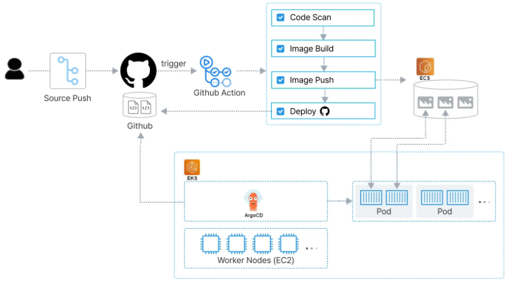
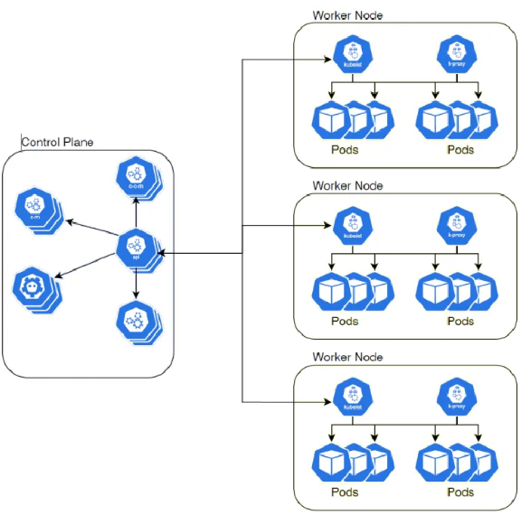
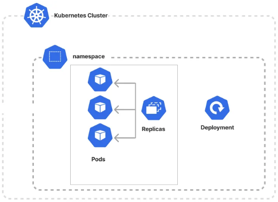
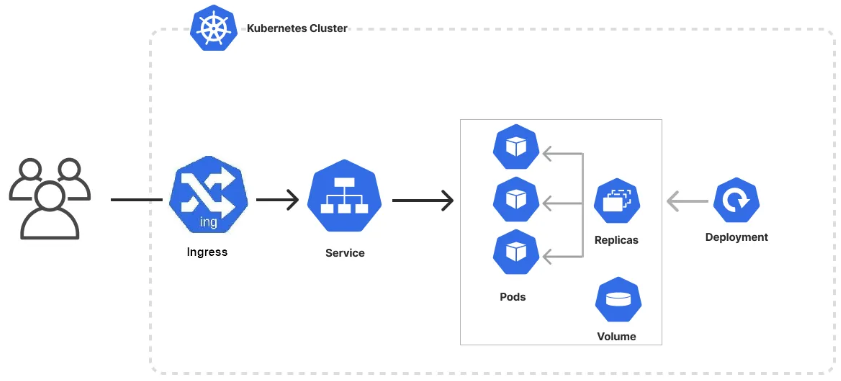
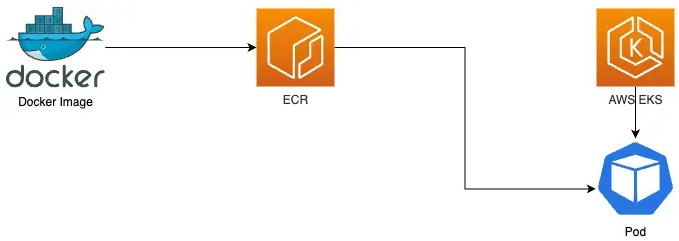
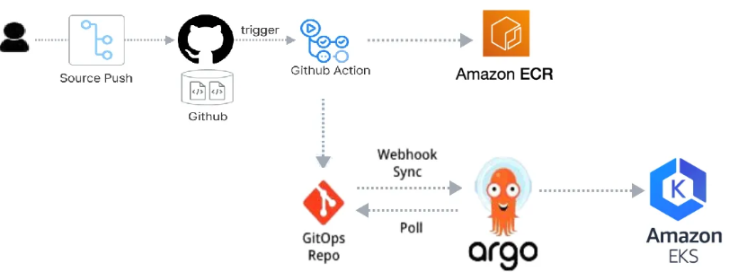

# 따배런 : 실전 DevOps 환경의 쿠버네티스 완벽 적용 실습(5주 과정)

## 1. 커리큘럼

    

 

 - __1. 쿠버네티스 기본 개념과 아키텍처__
    - 학습 목표
        - 클라우드와 클라우드네이티브의 차이 이해
        - 쿠버네티스 아키텍처 이해
        - kubeadm 이용 쿠버네티스 클러스터 구축
    - 학습 키워드
        - 클라우드와 클라우드 네이티브의 이해
        - 쿠버네티스 소개
        - 컨테이너 기술 개요
        - 쿠버네티스 아키텍처
    - 실습
        - 도커 컨테이너 빌드 및 배포
        - 쿠버네티스 클러스터 구축

    

 

 - __2. 쿠버네티스 애플리케이션 배포__
    - 학습 목표
        - 컨테이너 기반 애플리케이션을 K8s 클러스터에서 배포
        - 애플리케이션에 필요한 CPU, Memory 등을 리소스를 할당하여 애플리케이션을 배포
        - 애플리케이션 롤링 업데이트
    - 학습 키워드
        - Pod 및 Deployment를 통한 애플리케이션 배포
        - 애플리케이션 롤링 업데이트
    - 실습
        - 컨테이너화 된 애플리케이션 빌드 및 배포

    

 

 - __3. 쿠버네티스 네트워킹과 스토리지__
    - 학습 목표
        - 쿠버네티스의 CNI 이해
        - 컨테이너간 통신 방식을 이해하고, 쿠버네티스 서비스를 동작시키기
        - 인그레스로 ALB 구축 가능
        - 컨테이너의 데이터 저장소 관리
    - 학습 키워드
        - Pod 및 Deployment를 통한 애플리케이션 배포
        - 애플리케이션 롤링 업데이트
    - 실습
        - 인그레스 기반의 컨테이너 애플리케이션 배포

    

 

 - __4. Amazon EKS를 이용한 컨테이너 빌드 배포 서비스__
    - 학습 목표
        - EKS로 쿠버네티스 클러스터를 구축
        - 헬름의 동작 방식을 알고, 헬름 기반의 애플리케이션을 EKS에서 운영 가능
    - 학습 키워드
        - Amazon EKS의 특징
        - Amazon container 서비스 동작 원리 이해
        - EKS에서 컨테이너 애플리케이션 배포
    - 실습
        - EKS 인프라 구축
        - EKS 에서 애플리케이션 배포

    

 

 - __5. GitOps를 이용한 배포 서비스 자동화__
    - 학습 목표
        - GitOps와 CI/CD 이해
        - Github Actions을 통한 CI 구축
        - ArgoCD 이용 CD를 구축
    - 학습 키워드
        - GitOps의 이해
        - Github Actions 통한 CI
        - ArgoCD를 이용한 CD
    - 실습
        - Github Actions과 ArgoCD를 활용한 GitOps 운영

    

 

## 2. 실습 환경 구성 (AWS)

쿠버네티스에서 사용하는 인스턴스는 cpu 2, Memory 2GB 이상을 사용

 - Amazon EC2 만들기
    - 총 3개의 인스턴스를 만든다. (k8s-master, k8s-worker1, k8s-worker2)
    - OS 이미지: Ubuntu Server 22.04 LTS
    - 인스턴스 유형: t2.medium (2cpu, 4G memory)
    - 키 페어: 키 페어 생성 (mykey.pem)
    - 네트워크 설정
        - VPC: default
        - 서브넷 정보: ap-northeast-2a
        - 퍼블릭 IP 자동 할당
        - 보안 그룹: 보안그룹 생성 (k8s-sg, 모든 트래픽 허용)
        - Tag: Name: k8s-sg
    - Storage: 20G, gp3
    - 인스턴스 개수: 3
    - 로그인 정보: ubuntu / ubuntu
    - k8s-master 원격 로그인 후 쿠버네티스 설치

## 3. 클라우드와 클라우드 네이티브 이해

 - __클라우드__
    - 인터넷을 통해서 언제 어디서든지 원하는 때 원하는 만큼 컴퓨팅 자원(컴퓨팅, 스토리지, 네트워크, 애플리케이션)을 손쉽게 사용할 수 있게 해주는 서비스
 - __가상화__
    - 소프트웨어 기술을 이용해 컴퓨터와 네트워크, 스토리지를 만들어내는 기술
    - 하이퍼바이저라는 프로그램이 가상으로 서버와 네트워크, 스토리지들을 만들어서 실제 컴퓨터가 동작되는 것과 같이 운영
 - __클라우드 사용시 이점__
    - 초기 선투자 비용 없음
    - 규모의 경제로 지속적인 가격 인하
    - 속도 및 민첩성: 몇 분만에 서버 생성 및 운영 가능
    - 비즈니스에만 집중 가능
    - 글로벌 확장: 세계 곳곳의 여러 지역에서 서비스를 런칭할 수 있고, 프로비저닝 가능
 - __클라우드 네이티브__
    - CNCF : Cloud Native Computing Foundation
        - 세계 최대의 개발자, End User, 공급업체를 한자리에 모아 최대 규모의 오픈 소스 개발자 회의를 진행
        - 비영리 Linux Foundation 재단의 산하 기관
    - CNCF가 말하는 CloudNative는?
        - 클라우드 네이티브 기술을 통해 조직은 퍼블릭, 프라이빗 및 하이브리드 클라우드와 같은 현대적이고 역동적인 환경에서 확장 가능한 애플리케이션을 구축하고 실행할 수 있습니다. 컨테이너, 서비스 메시, 마이크로서비스, 변경할 수 없는 인프라 및 선언적 API가 이러한 접근 방식을 보여준다. 이러한 기술은 탄력적으로 관리 가능하며 관찰 가능한 느슨하게 결합된 시스템을 가능하게 한다. 강력한 자동화와 결합하여 엔지니어는 최소한의 노력으로 예측 가능한 방식으로 빈번하고 영향력 있는 변경을 수행할 수 있다.
        - CNCF는 벤더 중립적인 오픈 소스 프로젝트의 에코시스템을  성하고 유지함으로써 이 패러다임의 채택을 촉진하고자 합니다.
 - __컨테이너__
    - 애플리케이션 소프트웨어를 운영체제로부터 분리시켜 사용자에게 애플리케이션이 동작할 때 필요한 최소한의 실행 환경을 제공
 - __컨테이너 오케스트레이션__
    - 컨테이너의 라이프사이클 전반에 걸쳐 컨테이너의 배포, 관리, 확장, 네트워킹을 자동화하는 프로세스
    - 컨테이너를 통해 애플리케이션을 실행하는 데 필요한 환경을 구성하고 관리하며, 대규모 애플리케이션을 안정적으로 배포하고 관리하는 데 필요한 기능을 제공
 - __마이크로 서비스 아키텍처__
    - 컨테이너 기반의 마이크로 서비스 아키텍처 구현
    - Poly-glot  환경의 서비스 지원 가능
    - 개발 독립적, 운영 독립적, 유지 보수 및 최신 트렌드 적용이 독립적
    - 병목이 발생하는 서비스만 스케일 아웃
 - __CICD(Continuous Integration/Continuous Delivery or Deployment)__
    - 지속적 통합(Continuous Integration, CI)
        - 애플리케이션 코드의 새로운 변경 사항이 정기적으로 빌드 및 테스트를 거쳐 공유 리포지토리에 병합
        - 공유 리포지토리를 사용할 경우, 여러 명의 개발자가 작업할 경우 발생하는 소스 코드 충돌 문제 해결
    - 지속적 제공(Continuous Delivery, CD)
        - 변경 사항을 버그 테스트를 거쳐 리포지토리에 자동으로 업로드하는 것
        - 코드 변경 사항 병합,  프로덕션 빌드 제공의 단계에서 테스트 자동화/ 코드 릴리스 자동화가 포함되어야 함
    - 지속적 배포(Continuous Deployment, CD)
        - 리포지토리에서 고객이 사용 가능한 프로덕션 환경까지 자동으로 릴리스
        - 개발자가 애플리케이션에 변경 사항을 작성한 후 몇 분 이내에 클라우드 애플리케이션을 자동으로 실행할 수 있음

