# 네트워크 기본 학습

## 1. 네트워크 Layer별 프로토콜

### 1-1. OSI 7 Layer 계층별 데이터 종류와 프로토콜

| 레벨 | 계층            | 특징                                             | 데이터 종류        | 예시 프로토콜                   |
| ---- | --------------- | ------------------------------------------------ | ------------------ | ------------------------------- |
| 7    | 응용 계층       | 사용자와 직접 상호작용, 애플리케이션 서비스 제공 | 데이터 (Data)      | HTTP, HTTPS, FTP, SMTP, DNS     |
| 6    | 표현 계층       | 데이터 형식 변환, 인코딩/디코딩, 암호화/복호화   | 데이터 (Data)      | TLS, SSL, JPEG, MPEG            |
| 5    | 세션 계층       | 세션 생성, 유지, 종료 관리                       | 데이터 (Data)      | NetBIOS, RPC                    |
| 4    | 전송 계층       | 종단 간 통신, 신뢰성 보장, 흐름 제어             | 세그먼트 (Segment) | TCP, UDP                        |
| 3    | 네트워크 계층   | 경로 설정(라우팅), 논리적 주소(IP) 기반 전달     | 패킷 (Packet)      | IP, ICMP, ARP, Routing Protocol |
| 2    | 데이터링크 계층 | 물리적 주소(MAC) 기반 통신, 오류 검출            | 프레임 (Frame)     | Ethernet, ARP, PPP, Switch      |
| 1    | 물리 계층       | 실제 데이터 전송 (전기 신호, 비트 전송)          | 비트 (Bit)         | 케이블, 허브, 리피터            |

## 2. 네트워크 Layer 계층과 장비

### 2-1. 데이터 통신과 프로토콜

- **데이터 통신 시스템**
  - 컴퓨터와 원걸이ㅔ 있는 터미널 또는 다른 컴퓨터를 통해 회선으로 결합하여 정보를 처리하는 시스템
  - 메시지, 송신자, 수신자, 전송매체, 프로토콜의 5가지 기본요소로 구성
- **프로토콜**
  - 정보의 송/수신측 또는 네트워크 내에서 사전에 약속된 규약 또는 규범
  - 연결하는 과정, 통신 회선에서 접속방식, 통신회선을 통해 전달되는 정보의 형태, 오류 발생에 대한 제어, 송/수신측 간의 동기 방식 등에 대한 약속

### 2-2. OSI 7 Layer

#### **OSI 7 Layer**

- ISO에서는 개방형 시스템간 상호접속을 위해 표준화된 네트워크 구조를 제공하는 기본 참조모델을 제정
- 다른 기종 간의 상호 접속을 위한 가이드라인 제시
- `상위 계층`: 사용자가 통신을 쉽게 이용할 수 있도록 도와주는 역할
- `하위 계층`: 효율적이고 정확한 전송과 관계된 일을 담당

<br/>

#### **OSI 7 Layer 계층구조**

- 7계층 구조는 제반 통신절차 가운데 비슷한 기능을 갖는 모듈을 동일 계층으로 분할
- 각 계층 간의 독립성을 유지할 수 있도록 함
- 어느 한 모듈에 대한 변경이 다른 전체 모듈에 미치는 영향을 최소화
- 계층은 2개의 그룹으로 분리
  - 상위 3계층은 사용자를 위한 계층(소프트웨어)
  - 하위 4계층은 컴퓨터를 위한 계층(하드웨어)

<div align="center">
    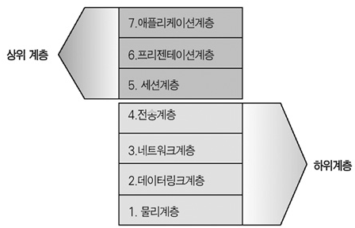
</div>
<br/>

### 2-3. OSI 7 Layer vs TCP/IP

- OSI 7 계층 모델은 이미 시장에서 도태된 네트워크 시스템
- 현대에는 OSI 7 계층 모델의 일부를 계승한 TCP/IP 모델을 대부분 사용
- 한번 업데이트가 이루어져 사실상 Updated TCP/IP Model이라 불리는 모델을 사용
- `TCP/IP Model`: 4계층으로 표현되는 모델
- `TCP/IP Updated Model`: 5계층으로 표현하는 모델로, 전 세계적 표준으로 사용되고 있다.

<div align="center">
    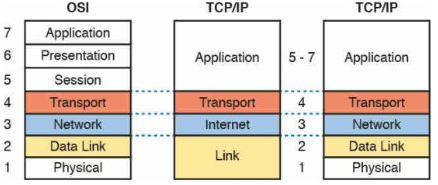<br/>
    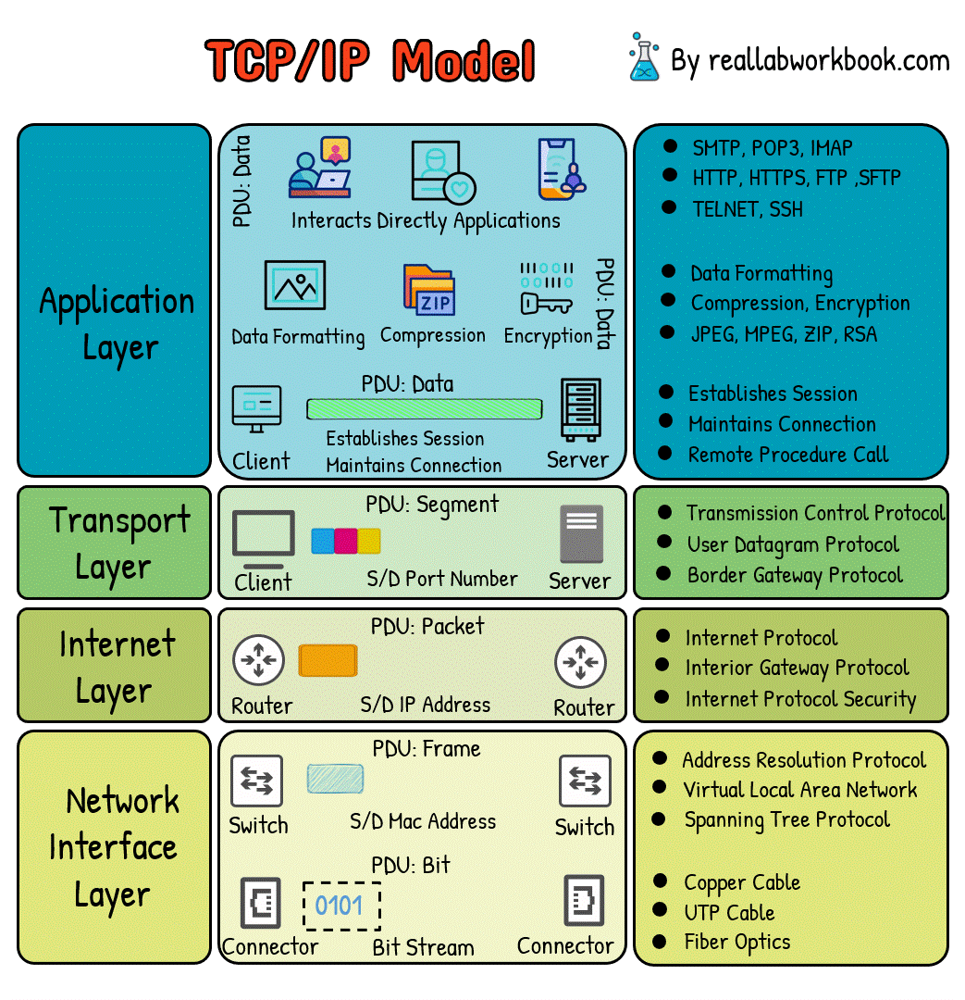<br/>
    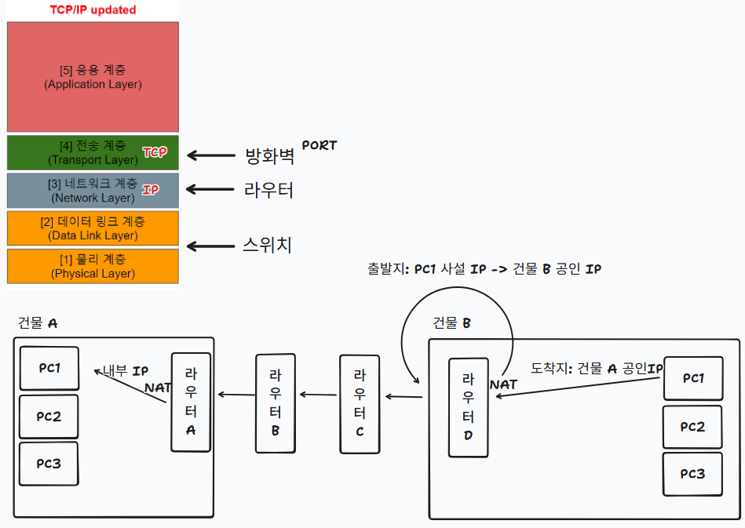<br/>
</div>
<br/>

## 3. 계층별 설명

### 3-1. 물리 계층(Physical Layer)

전기적, 기계적 특성을 이용하여 통신 케이블로 전기적 신호를 전송하며, 비트 단위의 PDU, 1/0의 인코딩 전압 및 케이블 사양 핀의 수 등을 정의한 계층이다.

- 데이터를 물리 매체 상으로 전송하는 역할을 담당하는 계층
- 물리적 링크의 설정/유지/해제를 담당
- 상용자 장비와 네트워크 종단장비 사이의 물리적, 전기적인 인터페이스 규정에 초점
- 전송 선로의 종류에 따른 전송 방식과 인코딩 방식을 결정
- `송신 측 물리 계층`은 `데이터링크 계층`으로부터 받은 데이터를 `비트단위로 변환`
- `수신 측 물리 계층`은 `전송 받은 비트`를 `데이터링크 계층`의 데이터로 올림

제일 하위의 레이어로서, 장치(device) 간의 물리적인 연결을 담당하는 부분이다.

이 레이어는 bits와 관련된 정보를 담고 있다. 한 node에서 다른 node로 bits를 전송하는 역할을 한다.

**Physical layer는 데이터를 받은 후, 0과 1로 변환하고, 이를 다음 레이어인 Data Link Layer로 전달한다.**

Physical Layer에서는 Bit Synchronization, Bit rate control와 같이 Bit와 관련된 처리들을 주로 담당한다.

<div align="center">
    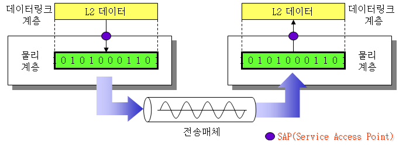
</div>
<br/>

### 3-2. 데이터 링크 계층(Data Link Layer)

물리적인 연결을 통하여 인접한 두 장치의 신뢰성 있는 정보 전송을 담당하며, 프레임 단위의 PDU, MAC 주소와 제어 정보를 전송, 헤더를 통해 캡슐화와 캡슐화 해제를 한다.

- 물리 계층에서 전송하는 비트들에 대한 동기 및 식별 기능과 원활한 데이터의 전송을 위한 흐름 제어 기능, 그리고 안전한 데이터 전송을 위한 오류제어 기능 등을 수행
  - 헤더: 데이터의 시작을 나타내는 표시와 목적지 주소를 포함
  - 트레일러: 데이터에 발생한 전송 오류를 검출하기 위한 오류 검출 코드 포함
- 두 Sub 계층으로 구성
  - LLC(Logical Link Control sublayer): 논리적 연결 제어
  - MAC(Media Access Control): 장비와 장비간의 물리적인 접속

이 레이어는 한 node에서 다른 node로 데이터를 전송할 때 오류가 발생하지 않도록 처리하는 역할을 한다.

**네트워크를 통해 packet이 도착했을 때 MAC address를 통해 host에게 전달하는 역할을 한다.**

**Physical Layer를 통해 전달받은 bit들을 Frame이라는 유의미한 단위로 만든다.**

또한 데이터 손실을 처리하는 Error control, 전송되는 데이터의 양을 조절하는 Flow control 등을 담당한다.

<div align="center">
    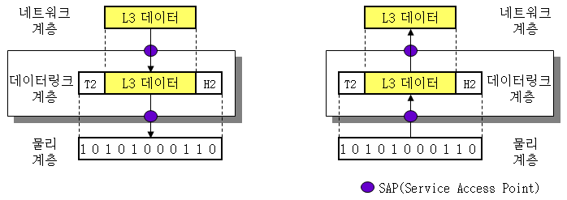<br/>
    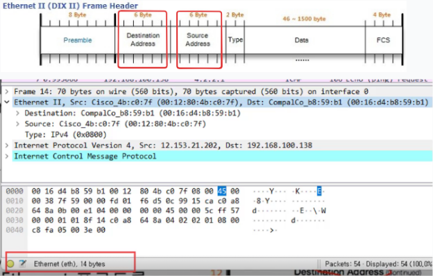<br/>
    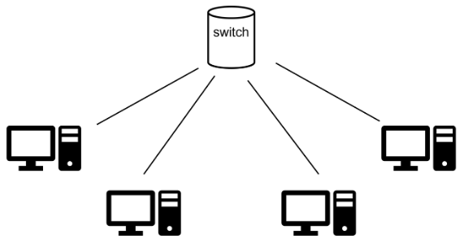
</div>
<br/>

- 맥 주소안에도 의미들이 포함되어 있따. (예: 제조사 정보) -`ipconfig /all`
- Lookup MAC Address: https://maclookup.app/

<br/>

### 3-3. 네트워크 계층(Network Layer)

중계 노드를 통해 전송하는 경우 어떻게 중계할 것인가를 규정하며, 패킷 단위의 PDU, 패킷은 목적지까지 경로를 설정, 헤더를 통해 캡슐화/캡슐화 해제를 한다.

- 송신 측에서 수신 측까지 데이터를 안전하게 전달하기 위해서 논리적 링크를 설정
- 다른 네트워크 대역, 멀리 떨어진 곳에 존재하는 네트워크까지 데이터를 전달 담당
- 대표적으로 ARP, IPv4, ICMP 프로토콜이 존재
- 상위 계층 데이터를 작은 크기의 패킷으로 분할하여 전송
- 개방형 시스템 사이에서 네트워크의 연결을 관리하고 유지하며 해제 - 스위칭: 2계층 장비 - 스위치는 패킷의 수신주소를 보고 정해진 방향으로 전송하여 동작 속도는 라우터보다 빠르다. - 라우팅: 3계층 장비 - 라우터는 라우팅 테이블을 찾아서 알고리즘으로 최단 경로를 계산 - 계산을 통해 전송경로를 결정 후 전송하여 스위치보다 동작 속도가 느리다.

서로 다른 네트워크에 위치하는 host 간에 데이터를 주고 받을 때 작동하며, 목적지까지 갈 수 있는 다양한 길들 중에 최단거리를 찾는 일 등을 한다.

목적지까지의 경로가 적합한지 확인하는 `Routing`, 각 장치를 고유하게 식별할 수 있게 하는 `Logical addressing`과 같은 처리를 담당한다.

<div align="center">
    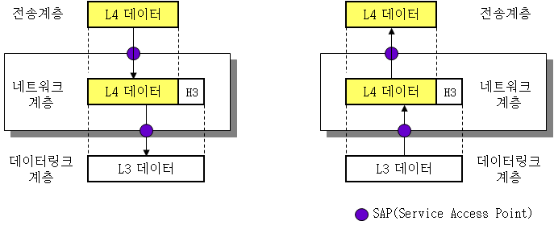<br/>
    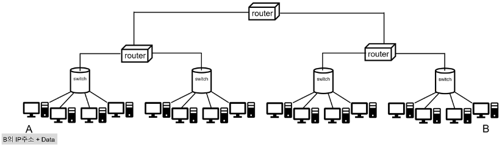
</div>
<br/>

### 3-4. 전송 계층(Transport Layer)

종단 간에 신뢰성있고 정확한 데이터를 전송하고, 세그먼트 단위의 PDU, 종단 간의 에러 복구와 흐름제어 담당, 헤더를 통해 캡슐화와 캡슐화 해제를 한다.

- 하위 계층의 첫 단계
- 세션을 맺고 있는 두 사용자 사이의 데이터 전송을 위한 종단간 제어
- 송신 컴퓨터의 응용프로그램(프로세스)에서 최종 수신 응용프로그램(프로세스)으로 전달(연결)
- 연결 지향 전송 방식의 TCP 전송 제어 프로토콜, 단순한 전송 방식의 UDP 데이터 그램 프로토콜

이 레이어에서의 데이터 단위를 `segment`라고 하며, 완전한 메세지(complete message)를 end-to-end로 전달하는 역할을 한다.

또한 데이터 전송이 성공적으로 완료되었는지 확인하고, error가 발견되면 데이터를 다시 보내는(re-transmit) 역할을 한다.

`TCP`와 `UDP`를 대표적인 예로 들 수 있다.

<div align="center">
    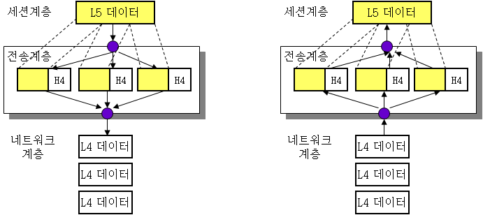
</div>
<br/>

#### **TCP 프로토콜 vs UDP 프로토콜**

- `UDP 프로토콜`은 포트 번호를 부여할 뿐 `IP 프로토콜`과는 거의 다르지 않다. 수신 확인이나 전송 오류 확인, 재전송 처리 등 수행하지 않는다.
- `TCP 프로토콜`은 헤더에 포트번호가 부여된다. `오류검사`, `재전송 처리` 등 일련의 과정도 규정되어 있다. 세션 통신을 수행하는 기능도 포함된다. (시퀀스 번호, 응답 확인 번호, 세션 플래그)

<div align="center">
    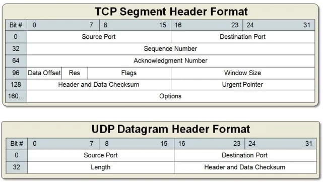
</div>
<br/>

#### **포트 번호**

- 0 ~ 1023: 잘 알려진 포트 (well-known port)
- 1024 ~ 49151: 등록된 포트 (registered port)
- 49152 ~ 65535: 동적 포트 (dynamic port)

<div align="center">
    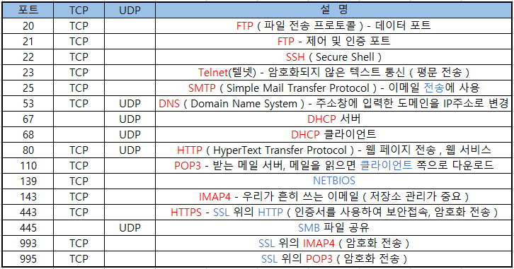
</div>
<br/>

### 3-5. 세션 계층(Session Layer)

이 레이어는 connection(연결) 유지, session의 유지 및 인증, 보안을 담당한다.

- 특정한 프로세스들 사이에서 세션이라 불리는 연결을 확립하고 유지하며 동기화
- 효율적인 세션 관리를 위해서 짧은 데이터 단위로 나눈 후에 전송 계층으로 내림
- NetBIOS, RPC

<div align="center">
    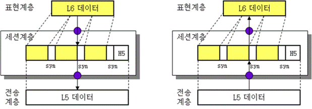
</div>
<br/>

### 3-6. 표현 계층(Presentation Layer)

이 레이어는 Translation Layer라고도 한다. Application Layer의 데이터를 네트워크에 전송하기 위해 요구되는 format으로 조작한다.

- 정보를 송수신자가 공통으로 이해할 수 있도록 데이터 표현방식으로 바꾸는 기능
- 데이터의 보안과 효율적인 전송을 위해 암호화와 압축을 수행하여 세션 계층으로 내림
- TLS, SSL, JPEG, MPEG

<div align="center">
    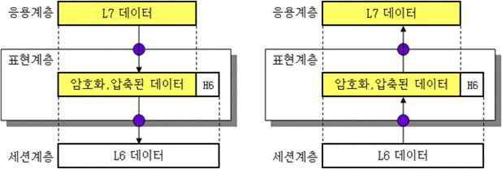
</div>
<br/>

### 3-7. 응용 계층(Application Layer)

최상위 계층으로서, 사용자/어플리케이션이 네트워크에 접속할 수 있게 해주는 계층이다.

end system이 이메일과 같은 서비스를 제공받기 위해 어떤 형식으로 메세지를 주고 받아야하는지에 대한 프로토콜이 모여 있는 레이어이다.

socket이나 port number가 이 레이어와 관련이 되어 있는 지식이다.

- 최상위 계층으로 응용 프로세스(이용자나 응용프로그램 등) 네트워크 환경에 접근하는 수단을 제공
- 응용 프로세스들이 상호간에 유용한 정보교환을 할 수 있도록 하는 창구 역할을 담당
- HTTP, HTTPS, FTP, SMTP, DNS

<div align="center">
    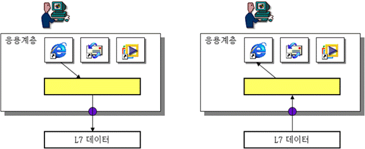
</div>
<br/>

## 4. 캡슐화/역캡슐화

데이터 전송 시 캡슐화(Encapsulation)가 이뤄지고 수신 시 역캡슐화(Decapsulation)가 이뤄진다. 데이터에 헤더를 붙이고 아래 계층에 보내는 것을 캡슐화, 데이터에 헤더를 제거하고 위 계층에 보내는 것을 역캡슐화라 한다.

<div align="center">
    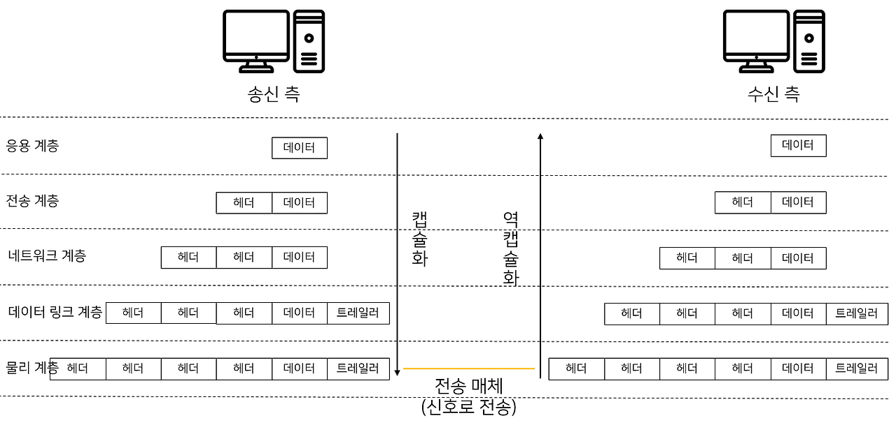<br/>
    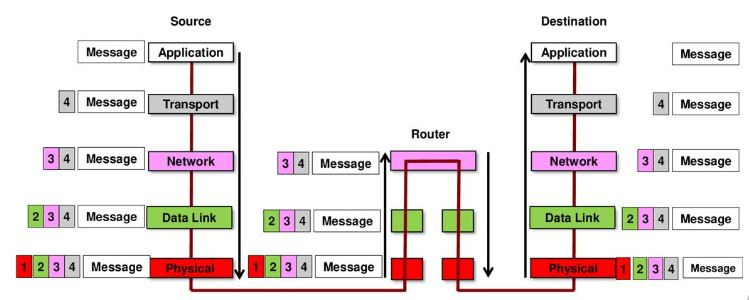<br/>
    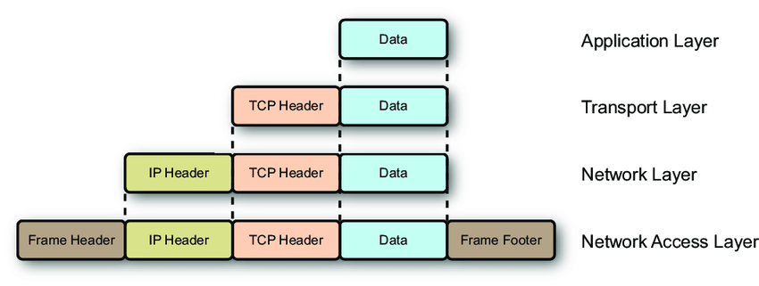<br/>
    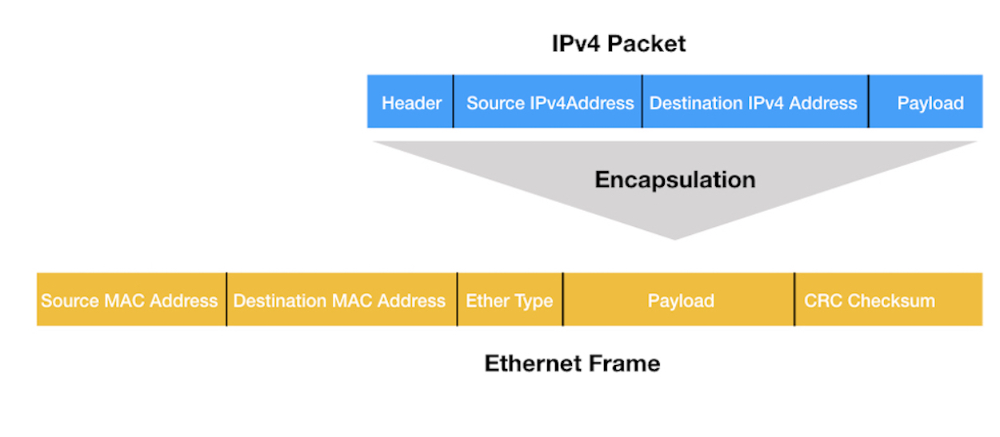<br/>
</div>

### 캡슐화

```
Application Data (1)
   ↓
TCP Segment (N개로 분할 가능)
   ↓
IP Packet (각 Segment마다 1개씩)
   ↓
Frame (각 Packet마다 1개씩)
```

- `Data → Segment (1 : N)`

```
Data (10KB)
→ Segment 1 (1500B)
→ Segment 2 (1500B)
→ Segment 3 ...
→ Segment N
```

- `Segment → Packet (1 : 1)`
  - IP는 그냥 감싸기만 함

```
Segment 1 → Packet 1
Segment 2 → Packet 2
...
```

- `Packet → Frame (1 : 1 per hop)`

```
Packet 1 → Frame 1
```

### 역캡슐화

```
Frame N개 수신
→ Packet N개
→ Segment N개
→ Data 1개로 재조립
```
