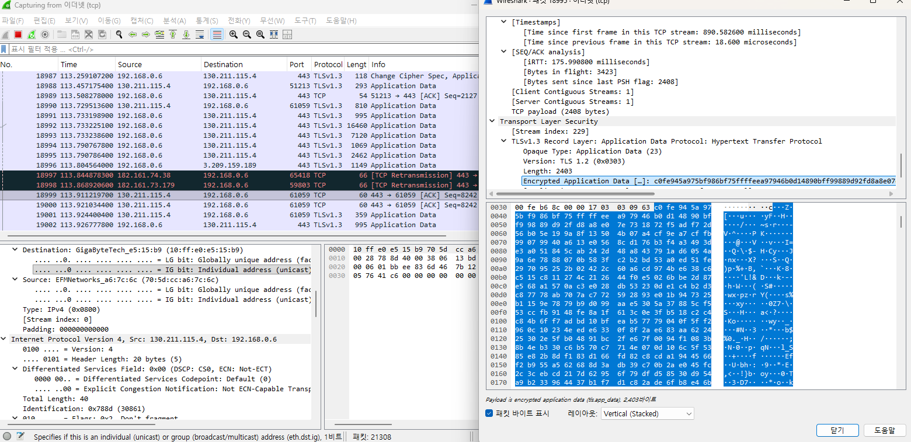
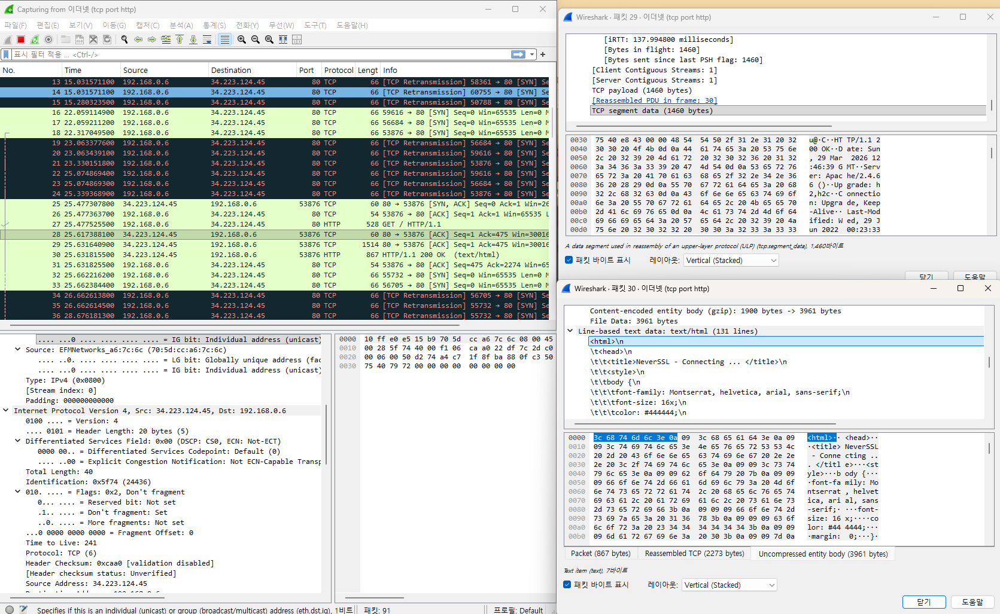

# 와이어샤크 기본 활욥법 이해

## 1. 와이어샤크 기본 개념 및 윈도우 프로그램 설치

- **주요 기능**
  - `패킷 캡처`: 네트워크 인터페이스를 통과하는 모든 트래픽을 실시간으로 수집합니다.
  - `프로토콜 분석`: HTTP, TCP, UDP, DNS 등 수백 가지의 통신 규약(프로토콜)을 상세하게 뜯어볼 수 있습니다.
  - `강력한 필터링`: "특정 IP 주소만 보기"나 "웹사이트 접속 기록만 보기"처럼 방대한 데이터 속에서 원하는 정보만 골라낼 수 있습니다.
  - `다중 플랫폼`: Windows, macOS, Linux 등 거의 모든 운영체제에서 사용 가능합니다.

### 1-1. 와이어샤크 설치

- WireShark: https://www.wireshark.org/

Wireshark는 패킷 인터페이스만을 제공하는 프로그램이다. Wireshark만으로는 패키 캡처를 할 수 없기 때문에 winpcap을 이용한다. winpcap은 NIC의 promiscuous mode를 활성화시킨다. promiscuous mode는 모든 패킷을 받을 수 있게 하는 모드로서 MAC주소를 검사하지 않는 모드이다.

`네트워크 인터페이스`는 자신에게 할당된 `MAC 주소`로 향하는 트래픽만을 수신한다. 그러나 `Promiscuous Mode(혼잡 모드)`에서는 `네트워크 인터페이스`가 네트워크를 통해 전달되는 `모든 패킷`을 수신하게 된다. 즉, 자신이 아닌 다른 장치로 향하는 패킷까지도 수신할 수 있다.

```
# 질문1. 네트워크 인터페이스가 모든 패킷을 수신?
라우터 -> 스위치 -> 나의 네트워크 인터페이스로 받아질텐데, 다른 장치 패킷은 어떻게 받는가?

1. 스위치(Switch)의 기본 동작: "너한테만 줄게"
과거의 '허브(Hub)'는 들어온 패킷을 연결된 모든 포트에 뿌렸지만, 현대의 스위치는 똑똑합니다.
 - 각 포트에 연결된 장치의 MAC 주소를 기억하고 있다가, 딱 목적지에 해당하는 포트로만 패킷을 보내줍니다.
 - 따라서 질문하신 대로, 일반적인 상황에서는 내 네트워크 인터페이스(NIC)에 다른 사람의 유니캐스트(1:1 통신) 패킷이 도달하지 않습니다.
 - 현대의 네트워크 환경(스위치 환경)에서는 기본적으로 내 것이 아닌 패킷은 내 컴퓨터 근처에도 오지 않는 것이 정상입니다.


2. 그럼에도 불구하고 다른 패킷이 보이는 이유
2-1.  브로드캐스트 & 멀티캐스트 (누구나 받는 패킷)
네트워크에는 "모두에게 알림"을 보내는 패킷들이 있습니다. (예: ARP 요청, DHCP 할당 등) 이런 패킷들은 스위치가 모든 포트에 뿌리기 때문에 아무 설정 없이도 와이어샤크에 잡힙니다.

2-2. 프러미스큐어스 모드 (Promiscuous Mode)
 - 일반 모드: 랜카드가 패킷을 보고 "어? 목적지 MAC 주소가 내 게 아니네?" 하고 바로 버립니다.
 - 프러미스큐어스 모드: "내 거든 아니든 일단 다 OS로 올려보내!"라고 명령하는 겁니다.
 - 주의: 이 모드를 켜도 스위치가 나에게 패킷을 보내주지 않으면 소용이 없습니다. 그래서 다음 단계가 필요합니다.


2-3. 포트 미러링
기업용 스위치에는 특정 포트를 통과하는 모든 트래픽을 복사해서 다른 포트(내 컴퓨터가 연결된 곳)로 보내주는 기능이 있습니다.
보안 장비나 와이어샤크 분석을 할 때 가장 정석적인 방법입니다.

2-4. ARP 스푸핑 (공격적 방법)
네트워크 장치들을 속여서 "내가 게이트웨이야!" 혹은 "내가 그 사람이야!"라고 거짓말을 하는 방식입니다.
그러면 스위치가 속아서 다른 사람의 패킷을 내 컴퓨터로 보내게 됩니다. (학습용 환경에서만 테스트해야 하는 보안 기술입니다.)
```

## 2. 와이어샤크 인터페이스 살펴보기

예시 사이트: http://neverssl.com/

- **캡처 필터**
  - 원하는 형태들만 캡처 (winpcap 드라이브 사용)
  - 대용량 패킷 수집시 용량이 너무 많을 수 있다.
  - 문법 예시
    - 특정 도메인 + 특정 포트: `host 192.168.0.1 && tcp port 80`
    - 발신지 필터: `src host 192.168.0.1`
    - 목적지 필터: `dst host 192.168.0.1`
    - 해당 포트 제외: `!port 8080`, `not port 8080`
- **화면 필터**
  - 캡처한 패킷들에 대해서 조회 필터링
  - 문법 예시
    - 특정 프로토콜 + 포트: `tcp.port == 80`
    - 목적지 필터: `ip.addr == 192.168.0.1`, `ip.dst_host == 192.168.0.1`

<div align="center">
  <br/>
  
</div>
