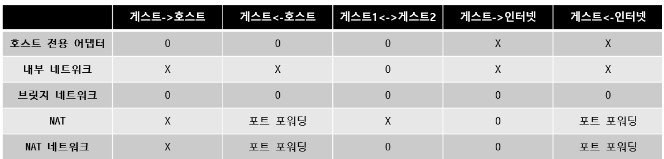

# Virtual Box

VirtualBox는 오라클(Oracle)에서 개발한 오픈 소스 가상화 소프트웨어로, 다양한 운영 체제를 가상 머신(Virtual Machine)으로 실행할 수 있게 해줍니다. VirtualBox를 사용하면 현재 사용하고 있는 물리적 컴퓨터(호스트 시스템) 위에 다른 운영 체제(게스트 시스템)를 설치하고 실행할 수 있습니다.

## 네트워크 종류 및 구성

 - __NAT(Network Address Translation)__: 게스트가 인터넷에 접근할 수 있도록 해 주며, 가상 머신이 호스트와 직접 통신하지 않도록 기본적으로 방어하는 방식입니다.

 - __브리지 어댑터(Bridged Adapter)__: 가상 머신이 물리 네트워크에 직접 연결되어 호스트와 동일한 네트워크 상에서 독립적인 IP 주소를 부여받습니다. 이를 통해 다른 네트워크 장치와 직접 통신할 수 있습니다.

 - __호스트 전용 어댑터(Host-Only Adapter)__: 가상 머신이 호스트와 직접 통신할 수 있는 전용 네트워크를 생성합니다. 외부 네트워크 접근 없이 호스트와 게스트 간에만 통신할 수 있습니다.

 - __내부 네트워크(Internal Network)__: 가상 머신들끼리만 네트워크를 공유할 수 있는 옵션으로, 외부 네트워크나 호스트 시스템과는 통신할 수 없습니다.

    

### NAT 모드

NAT 모드에서는 VirtualBox가 DHCP 요청을 처리하고, 게스트 OS에게 할당된 IP 주소와 라우팅을 위한 게이트웨이 주소를 알려주는데, 이때 각각의 모든 가상머신들이 별도의 설정이 없다면 동일한 IP 주소를 할당받는다.

그 이유는 NAT 모드에서는 각각의 가상머신이 그들만의 독립된 네트워크 안에 속해있는 것으로 가상화 되기 때문이다. 따라서, 각각의 가상머신들이 그들의 트래픽을 게이트웨이로 보내면, VirtualBox는 각각의 가상머신의 패킷을 게스트가 아닌 호스트가 보내는 패킷처럼 재작성하게 된다.

이는 곧 호스트의 네트워크 연결 상태와 게스트의 네트워크 연결 상태가 동일한 것을 의미한다. 또한, 호스트의 외부에서 게스트에 접근하는 것이 포트포워딩 등의 방법을 제외한 일반적인 방법으로는 불가하다.

 - 기본적으로 호스트에서 가상 머신에 접속 불가능 하지만 포트포워딩을 하여 접속이 가능하다.
 - 생성된 가상머신끼리 통신이 불가능
 - 만들어진 가상머신들이 모두 동일한 IP를 가짐
 - DHCP가 되지 않는 공유기에 여러 컴퓨터가 물린 것과 같은 상황

    

### NAT 네트워크 모드

NAT 네트워크 모드는 NAT와 거의 동일하지만, 게스트 간에 통신이 가능하다. 게스트를 통해 인터넷 접속은 원하지만, 외부로부터의 게스트에 대한 접근 차단을 원할 때 주로 사용한다.

    

### Briedge(브릿지) 모드

브릿지 모드는 가상머신이 호스트와 같은 네트워크에 존재하게 하고 싶은 경우 사용하게 된다. 이 경우 가상 NIC는 호스트의 물리적 NIC에 연결된다. 이 때문에, ISP에서 제공하는 공인 IP 주소를 많이 보유할 수 있는 경우 사용한다. 또한, 호스트가 여러 물리적 NIC를 사용하는 경우, 호스트의 네트워크 환경이 바뀔 때마다 가상머신의 브릿지 연결도 재설정 해주어야 하는 단점이 있다.

    

### 호스트 전용 어댑터 모드

게스트의 외부 네트워크와의 접근은 아예 차단되며, 호스트와 게스트 간의 연결만 허용되는 경우다.

 - 포트포워딩이 없어도 호스트에서 게스트에 통신이 가능하다.

    

### 내부 네트워크 모드

호스트 전용 어댑터 모드에서 호스트와의 연결조차 끊긴 경우라고 생각하면 된다. 즉, 게스트 간의 통신만 가능하다.

악성코드 분석 등의 보안 분석 시스템에 활용되며, DHCP와 같은 서비스를 제공하지 않으므로, 시스템을 정적으로 구성하거나, DHCP/Name 서비스를 제공하는 별도의 가상머신이 필요하다.

    

