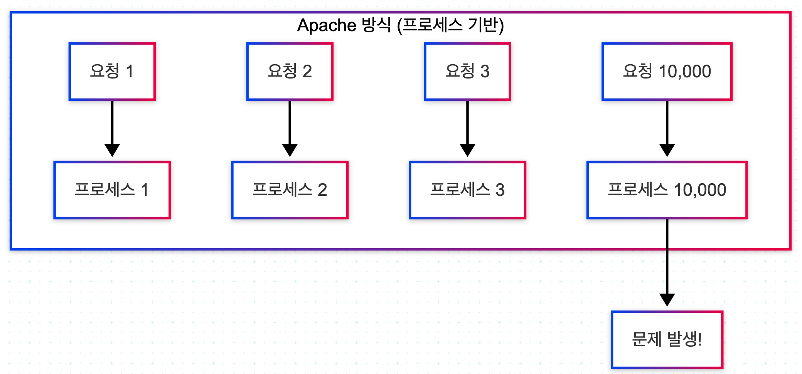
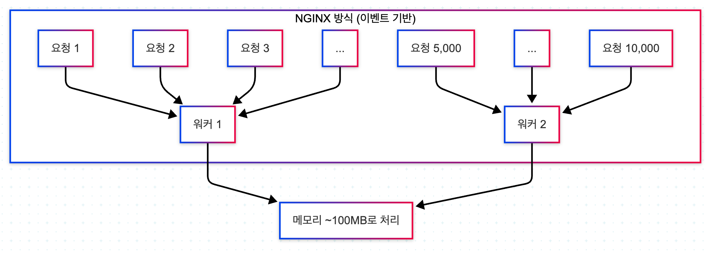
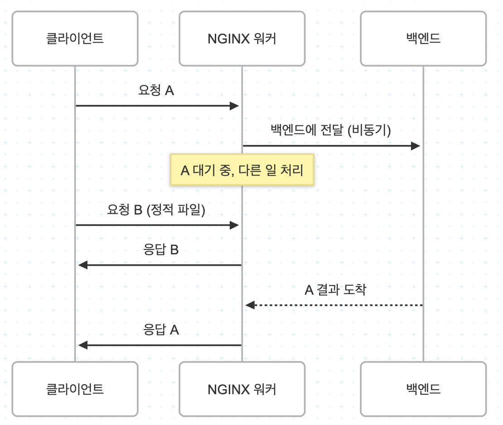
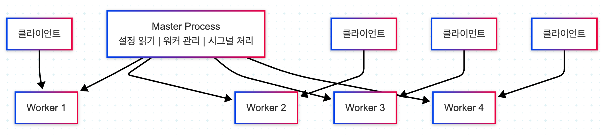
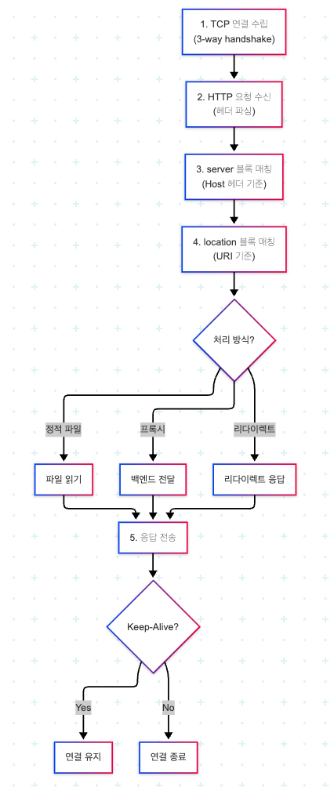

# Nginx

## 1. Apache의 단점을 해결한 Nginx Core Concept

### 1-1. Apache의 구조적 한계

- ❌ 문제점 1: 요청마다 스레드/프로세스 생성
  - 사용자 1000명 접속 → 1000개의 스레드
  - 서버 자원 폭발 (CPU + 메모리)
  - 메모리 부족
  - 컨텍스트 스위칭 비용 증가
  - 성능 급락
- ❌ 문제점 2: C10K 문제
  - 동시에 10,000명 접속 시 처리 어려움
  - 연결 유지(Connection Keep-Alive) 시 더 심각

<div align="center">
    
</div>
<br/>

### 1-2. Nginx가 해결한 방식

- ✅ 1. 이벤트 기반 (Event Loop)
  - 하나의 Worker가 수천 개 요청 처리
  - non-blocking 방식
- ✅ 2. 비동기 I/O
  - 파일 읽기 / 네트워크 대기 중에도 다른 요청 처리
  - 👉 Apache: 하나의 요청이 블로킹되면 → 해당 스레드 대기
  - 👉 Nginx: 기다리는 동안 다른 요청 처리

<div align="center">
    <br/>
    
</div>
<br/>

### 1-3. Master / Worker

- `Master Process (관리자 역할)`
  - 설정 파일 읽기 (nginx.conf)
  - Worker 프로세스 생성 / 종료
  - 프로세스 상태 관리
  - 신호(signal) 처리: reload, stop, restart
  - 실제 요청 처리 ❌ (클라이언트 요청 안 받음)
  - 오직 컨트롤 타워 역할
- 👉 Nginx가 무중단 재시작 가능한 이유
  - Master가 새로운 설정 로드
  - 새로운 Worker 생성
  - 기존 Worker는 요청 끝날 때까지 유지
  - 점진적으로 교체
- `Worker Process (실제 일꾼)`
  - 실제 요청 처리 (HTTP, HTTPS)
  - 클라이언트 연결 관리
  - 이벤트 루프 기반 처리

<div align="center">
    
</div>
<br/>

### 1-4. Nginx 요청 처리 흐름

<div align="center">
    
</div>
<br/>

## 2. Nginx 설치 및 환경 구성

- `Nginx 설치`

```bash
# Linux (Ubuntu / Debian)
sudo apt update
sudo apt install nginx -y

# Linux (CentOS / Rocky / Amazon Linux)
sudo yum install epel-release -y
sudo yum install nginx -y

# macOS (Homebrew)
brew install nginx

# 기본 Nginx 실행/종료
sudo systemctl start nginx      # 실행
sudo systemctl stop nginx       # 종료
sudo systemctl restart nginx    # 재실행
sudo systemctl reload nginx     # 리로드
```

- `Nginx 명령어`

```bash
# 설정 문법 검사
nginx -t

# 설정 reload
# 내부적으로 Master Process에 signal 전달
nginx -s reload

# 종료
nginx -s quit    # graceful 종료
nginx -s stop    # 강제 종료
```

### 2-1. 주요 디렉토리

```
/etc/nginx/
├── nginx.conf          ← 메인 설정
├── sites-available/    ← 설정 파일 모음
├── sites-enabled/      ← 실제 적용된 설정
├── conf.d/             ← 추가 설정
```
