# Nignx 기본 사용법

## 1. 부모 자식 관계를 기반으로 하는 Nginx의 Context Block

Nginx는 중첩된 블록 구조로 동작한다 (부모 → 자식 상속)

<div align="center">
    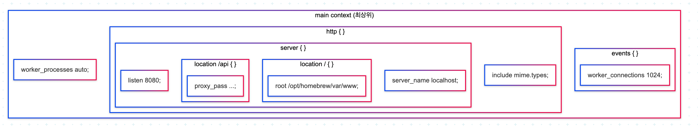
</div>
<br/>

```conf
# CPU 코어 수 만큼 자동으로 설정 (main context)
worker_processes auto;

events {
	worker_connections 1024;
}

http {
	include mime.types;

	server {
		listen 8080;
		server_name localhost;

		location / {
			root /opt/homebrew/var/www;
			index index.html;
		}

		location /api {
			proxy_pass http://localhost:3000;
		}
	}

}
```

## 2. Nginx 표준 문법 특수한 상속 기법과 덮어쓰기 방식

```conf
http {
    gzip on;
    client_max_body_size 10m;

    server {
        listen 8080;
        # gzip on;

        location / {
            # gzip on; 자동 상속됨
        }

        location /raw {
            gzip off; # 덮어쓰기
        }

        location /upload {
            client_max_body_size 100m; # 업로드는 100MB까지 허용 (여기서만)
        }
    }
}
```

<div align="center">
    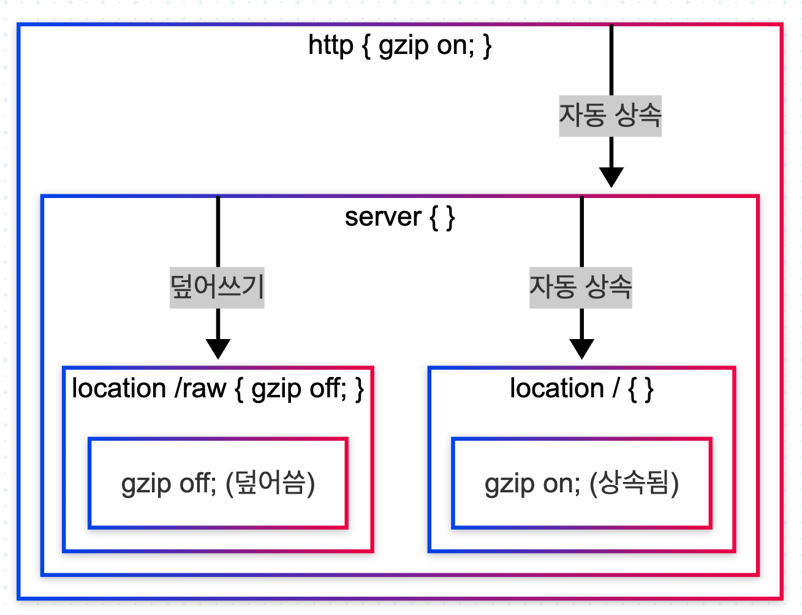<br/>
    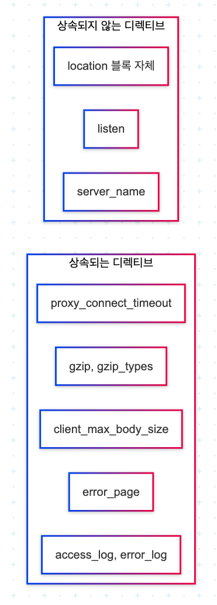
</div>
<br/>

## 3. Include와 확장성을 고려하여 추상화 개념을 도입한 Nignx 모듈화 패턴

<div align="center">
    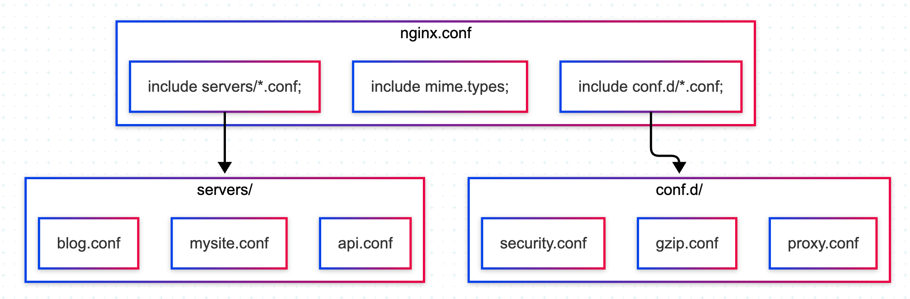
</div>
<br/>

### 3-1. include

include는 다른 설정 파일 내용을 현재 위치에 삽입하는 문법이다.

- `nginx.conf`
  - nginx.conf는 세부 구현을 많이 담지 않고, 전체 시스템을 어떻게 구성할지만 정의한다.
  - worker 설정
  - events 설정
  - http 컨텍스트 시작
  - 공통 설정 include
  - 사이트 설정 include

```conf
worker_processes auto;

events {
   worker_connections 1024;
}

http {
   include mime.types;

   # 공통 설정 include
   include conf.d/*.conf;

   # 사이트별 설정 include
   include servers/*.conf;
}
```

- `conf.d/*.conf`
  - conf.d/에는 여러 사이트가 공통으로 쓰는 정책을 넣는다.
  - gzip 정책
  - 보안 헤더
  - proxy 공통 옵션
  - timeout
  - body size
  - log format

```conf
# conf.d/gzip.conf
gzip on;
gzip_vary on;
gzip_min_length 1024;
gzip_types text/plain text/css application/json application/javascript;

# conf.d/proxy.conf
proxy_connect_timeout 5s;
proxy_send_timeout 60s;
proxy_read_timeout 60s;
proxy_set_header Host $host;
proxy_set_header X-Real-IP $remote_addr;
proxy_set_header X-Forwarded-For $proxy_add_x_forwarded_for;

# conf.d/security.conf
server_tokens off;
client_max_body_size 20M;
```

- `servers/*.conf`
  - servers/에는 도메인이나 서비스 단위의 설정을 넣는다.

```conf
# servers/example.com.conf
server {
    listen 80;
    server_name example.com;

    location / {
        root /var/www/example;
        index index.html;
    }
}

# servers/api.example.conf
server {
    listen 80;
    server_name api.example.com;

    location / {
        proxy_pass http://127.0.0.1:8080;
    }
}
```

<div align="center">
    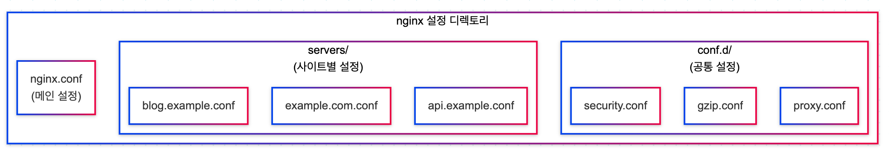
</div>
<br/>

## 4. Nginx 처리량 관점에서의 Process Model Setting

Nginx는 이벤트 기반(Event-driven) 아키텍처를 사용하는 고성능 웹 서버로, 처리량(Throughput)은 주로 프로세스 모델 설정에 의해 결정된다.

- `처리량 계산의 기본 공식`
  - 총 처리 가능 연결 수 ≈ worker_processes × worker_connections
  - worker_processes: 워커 프로세스 갯수 (CPU 코어 수)
  - worker_connections: 워커 1개가 동시에 처리할 수 있는 최대 연결 수
  - 해당 값은 파일 디스크립터 제한(OS)에 영향을 받는다.
  - 만약, 정적 파일 서빙이 아닌 백엔드 서버 프록시 역할을 한다면 클라이언트 요청, 백엔드 요청으로 1/2 동시 처리가 될 것이다.

### 4-1. 관련 설정

- worker_processes: 실제 요청을 처리하는 프로세스 수
- error_log: 에러 로그 파일 위치 및 로그 레벨 설정
- pid: Master Process의 PID 저장 파일
- worker_connections: Worker 1개가 처리 가능한 최대 연결 수
- use: OS별 최적 이벤트 처리 방식 선택
- multi_accept: Worker가 한 번에 여러 연결을 accept 할지 여부

```conf
worker_processes auto;
# worker_processes 4;

error_log /opt/homebrew/var/log/nginx/error.log warn;
pid /opt/homebrew/var/run/nginx.pid;

events {
	worker_connections 1024;
    use epoll;   # Linux
	use kqueue; # macos
	multi_accept on;
}
```

### 4-2. 처리량에 제한을 주는 요소

```bash
# OS 파일 디스크립터 제한 확인
ulimit -n

# 파일 디스크립터 제한 변경
ulimit -n 65535
```

<br/>

## 5. 성능을 최적화하는 방법과 설정하기 위한 기본 Nginx Template 포맷

### 5-1. 성능 최적화의 핵심 원칙

- Worker 수는 CPU 코어 수에 맞춘다.
- Worker당 연결 수를 서비스 규모에 맞게 조정한다.
- OS 파일 디스크립터 제한을 함께 올린다.
- 정적 파일은 Nginx가 직접 처리하게 한다.
- 프록시 공통 옵션과 Keep-Alive를 적절히 설정한다.
- gzip, 캐시, sendfile 등 I/O 관련 최적화를 적용한다.
- 로그는 필요한 수준만 남기고 과도한 디버그 로그를 피한다.

### 5-2. 관련 설정

#### 연결 및 네트워크 처리 최적화

- `keepalive_timeout`: Keep-Alive는 같은 TCP 연결을 재사용하게 해줘서 응답 속도와 효율을 높여준다. 하지만 너무 길면 연결이 오래 점유되어 동시 연결 자원을 낭비한다.
- `reset_timedout_connection`: 타임아웃된 연결을 빨리 정리해서 불필요한 자원 점유를 줄인다. 느리거나 비정상적인 클라이언트 연결이 많은 환경에서 도움이 된다.
- `client_header_timeout` / `client_body_timeout` / `send_timeout`: 느린 요청이나 응답으로 인해 Worker가 오래 묶이지 않도록 적절한 timeout을 설정한다. 너무 짧으면 정상 사용자도 실패할 수 있으니 서비스 특성에 맞춰야 한다.

```conf
http {
    keepalive_timeout 15;
    reset_timedout_connection on;
    client_header_timeout 10s;
    client_body_timeout 10s;
    send_timeout 30s;
}
```

<div align="center">
    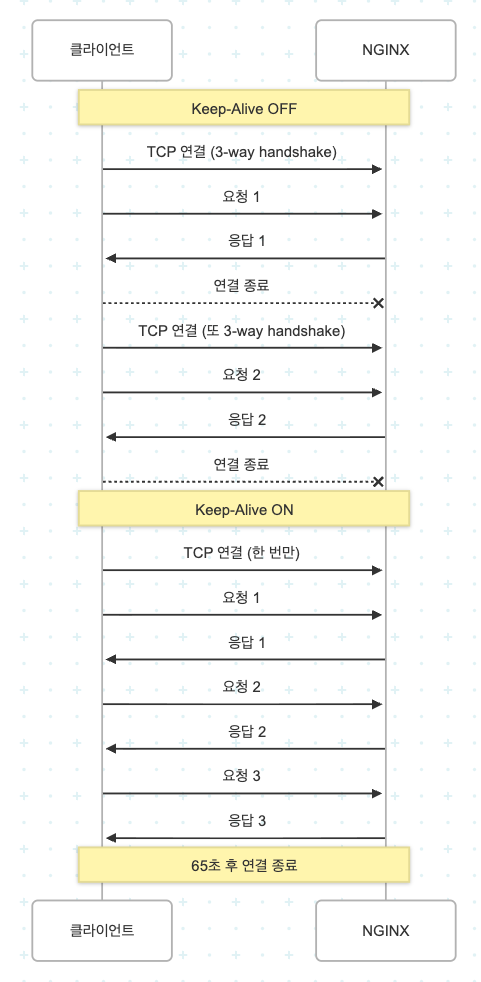
</div>
<br/>

#### 정적 파일 전송 최적화

- `sendfile`: 파일 전송 시 커널 레벨 최적화를 사용해 성능을 높인다. 정적 파일 서비스에서는 거의 기본적으로 켜는 편이다.
- `tcp_nopush`: 패킷을 효율적으로 묶어서 전송
- `tcp_nodelay`: 지연 없이 바로 전송
- `open_file_cache`: 자주 접근하는 정적 파일의 파일 디스크립터 / 메타데이터를 캐시해서 디스크 접근 비용을 줄인다. 정적 파일 요청이 많은 환경에서 유리하다.

```conf
http {
    sendfile on;
    tcp_nopush on;
    tcp_nodelay on;
    open_file_cache max=10000 inactive=30s;
    open_file_cache_valid 60s;
    open_file_cache_min_uses 2;
    open_file_cache_errors on;
}
```

<div align="center">
    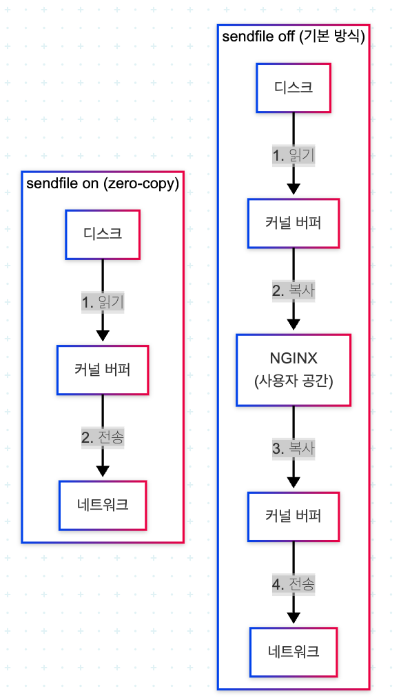<br/>
    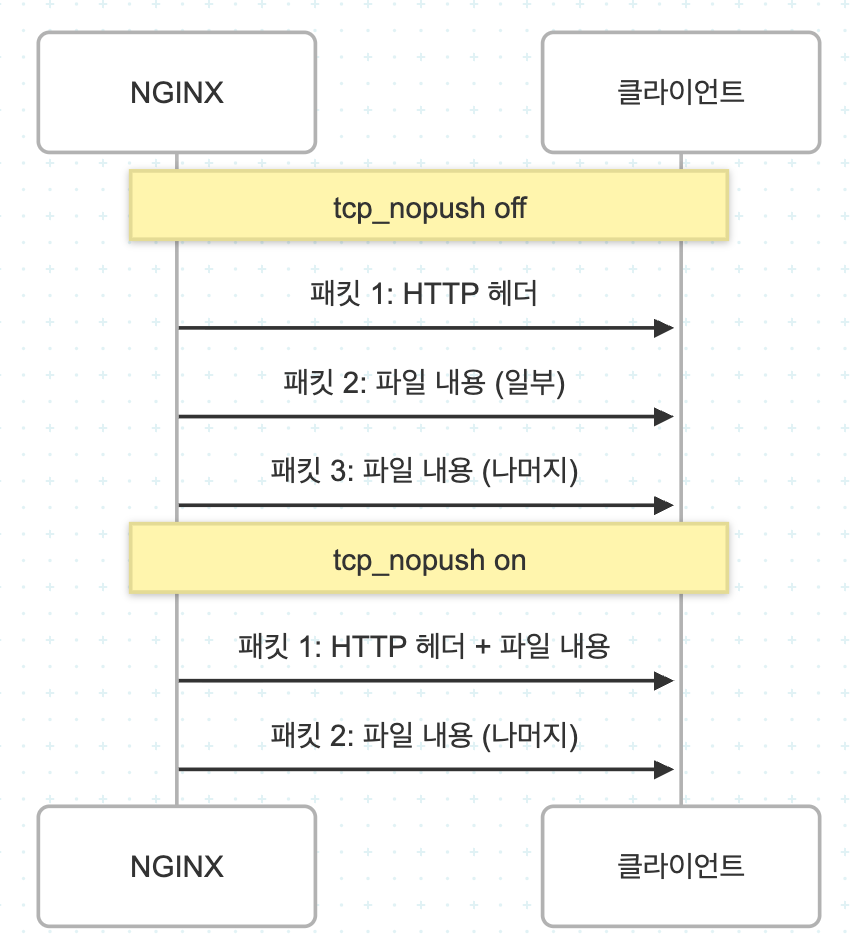<br/>
    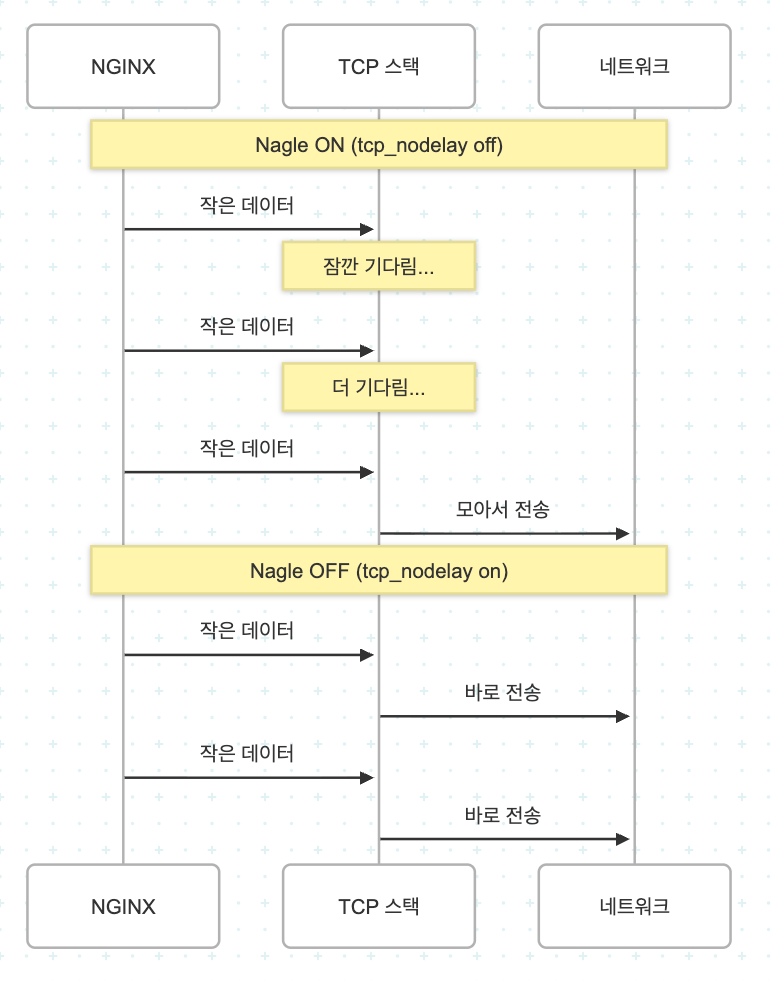
</div>
<br/>

#### 압축 최적화

텍스트 기반 응답은 gzip 압축을 켜면 네트워크 전송량을 크게 줄일 수 있다. 특히 HTML, CSS, JS, JSON 응답에서 효과가 좋다. 다만 너무 높은 압축 레벨은 CPU 사용량을 늘리므로 보통 4~6 정도가 적절하다.

주의할 점은 이미 압축된 파일(jpg, png, zip 등)은 추가 압축 효과가 거의 없다는 점이다.

```conf
http {
    gzip on;
    gzip_min_length 1024;
    gzip_comp_level 5;
    gzip_types text/plain text/css application/json application/javascript application/xml;
    gzip_vary on;
}
```

<div align="center">
    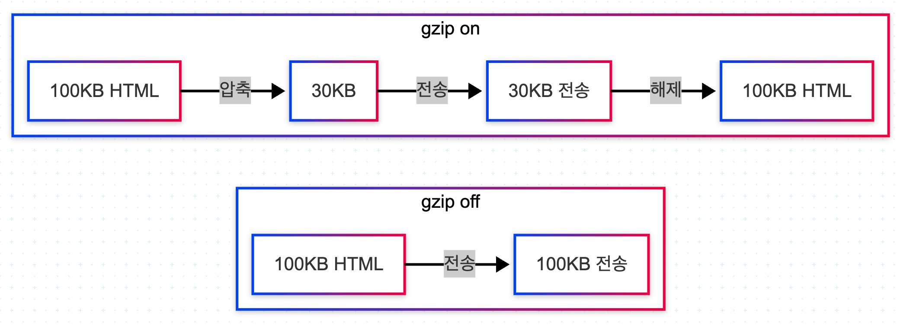<br/>
    <br/>
    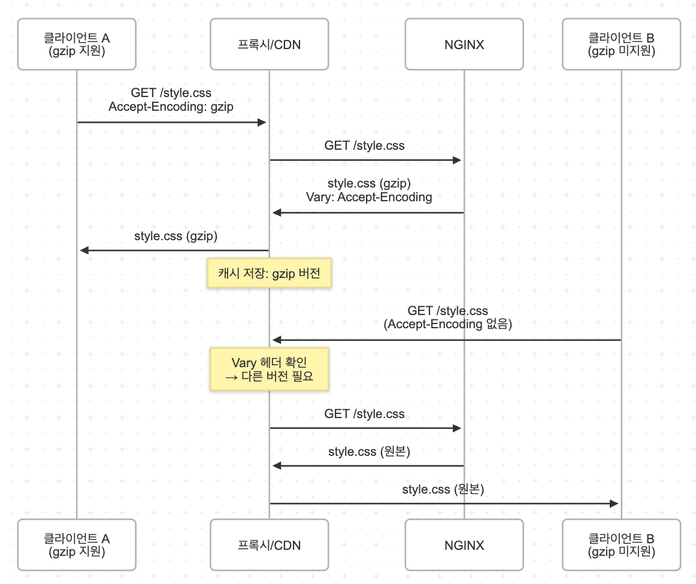
</div>
