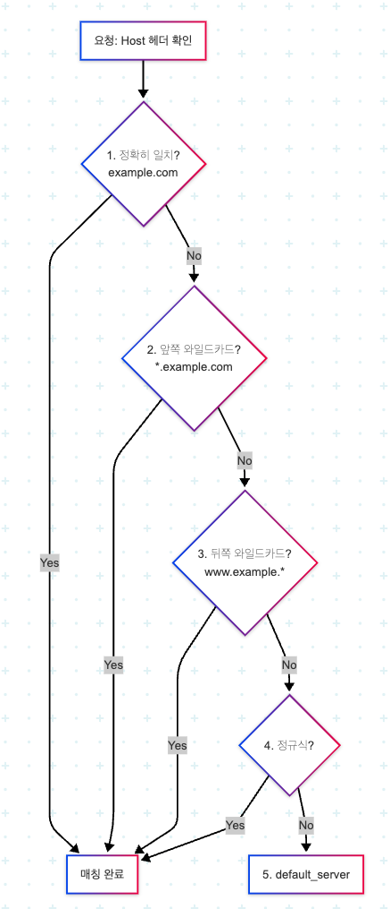
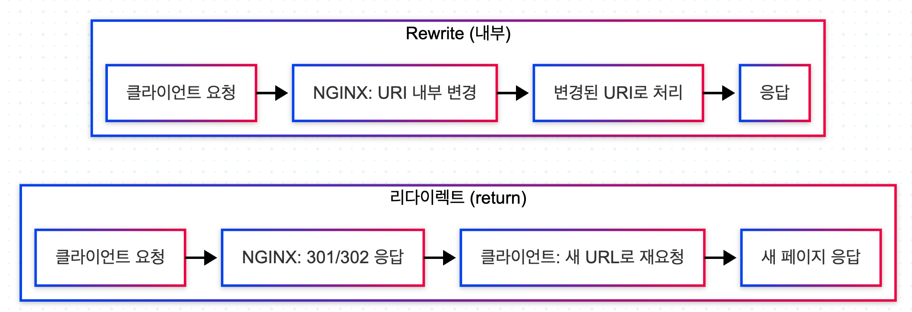

# Edge Case를 구현하기 위한 Nginx 만의 꼼수 패턴

## 1. 정적 파일 서빙 Path Matching 기법 root와 alias

- root는 URI를 유지해서 붙이고, alias는 location을 제거해서 치환한다

```conf
server {
    listen 8080;
    root /var/www/html;

    location /images {
        root /var/www/static;
        # /images/logo.png
        # alias /var/www/static/img;
    }

    # 1. URI와 폴더 구조가 일치 = root
    # /css/style.css -> /var/www/html/css/style.css
    location /css {
        root /var/www/html;
    }

    # 2. URI와 폴더 구조가 다르다 = alias
    # /static/style.css -> /var/www/assets/style.css
    location /static {
        alias /var/www/assets;
    }

}
```

<br/>

## 2. 여러 도메인 호스팅을 위한 Virtual Host Setting

Nginx에서는 하나의 서버에서 여러 도메인을 운영하기 위해 Virtual Host 개념을 server 블록으로 구현한다.

각 server 블록은 하나의 사이트(도메인)를 의미하며, 요청의 Host 헤더를 기준으로 어떤 서버 블록을 사용할지 결정한다.

### 2-1. 동작 원리

- `클라이언트 요청`

```
GET / HTTP/1.1
Host: example.com
```

- `Nginx 처리 흐름`

```
1. listen 포트 확인 (예: 80)
2. server_name 비교
3. 매칭되는 server 블록 선택
4. 해당 server 내부 location 처리
```

<div align="center">
    <br/>
    우선 순위
</div>

### 2-2. 관련 설정

- `기본 Virtual Host 설정`

```conf
server {
    listen 80;
    server_name example.com;

    root /var/www/example;
    index index.html;

    location / {
        try_files $uri $uri/ =404;
    }
}
```

- `여러 도메인 설정`

```conf
# 기본 서버: 매칭되는 server가 없을 경우
server {
    listen 80 default_server;
    server_name _;

    return 444;
}

server {
    listen 80;
    server_name example.com www.example.com;

    root /var/www/example;
}

server {
    listen 80;
    server_name api.example.com;

    location / {
        proxy_pass http://127.0.0.1:8080;
    }
}
```

- `HTTPS (SSL) Virtual Host`

```conf
server {
    listen 443 ssl;
    server_name example.com;

    ssl_certificate     /etc/nginx/ssl/example.crt;
    ssl_certificate_key /etc/nginx/ssl/example.key;

    root /var/www/example;
}

# HTTP -> HTTPS 리다이렉트
server {
    listen 80;
    server_name example.com;

    return 301 https://$host$request_uri;
}
```

### 2-3. 사용 예시

```conf
http {
    # 1. 기본 설정되지 않은 요청 처리 (default_server)
    server {
        listen 80 default_server;
        server_name _;
        return 444;  # NGINX 전용 코드: 연결 끊기
    }

    # 2. 메인 사이트 (정확한 일치 - 1순위)
    server {
        listen 80;
        server_name example.com www.example.com;
        root /var/www/example;

        location / {
            return 200 "Main Site: example.com\n";
            add_header Content-Type text/plain;
        }
    }

    # 3. 블로그 사이트 (서브도메인)
    server {
        listen 80;
        server_name blog.example.com;
        root /var/www/blog;

        location / {
            return 200 "Blog Site: blog.example.com\n";
            add_header Content-Type text/plain;
        }
    }

    # 4. API 서버 (포트 분리)
    server {
        listen 8080;
        server_name example.com;
        root /var/www/api;

        location / {
            return 200 "API Server: example.com:8080\n";
            add_header Content-Type text/plain;
        }
    }

    # 5. 와일드카드 매칭 (앞쪽 와일드카드 - 2순위)
    server {
        listen 80;
        server_name *.example.com;

        location / {
            return 200 "Wildcard Match: $host\n";
            add_header Content-Type text/plain;
        }
    }
}
```

<br/>

## 3. Redirection과 Rewrite Directive

Nginx에서 요청 URL을 변경하는 방법은 크게 두 가지다.

- `Redirection (리다이렉트)` → 클라이언트에게 새로운 URL로 이동하라고 응답 (HTTP 3xx)
- `Rewrite (내부 URL 변경)` → 클라이언트는 모르고, 서버 내부에서 요청 경로만 변경

<div align="center">
    
</div>
<br/>

### 3-1. Redirection (리다이렉트)

- 301: 영구 이동 (Permanent)
- 302: 임시 이동 (Temporary)
- 307: 메서드 유지 리다이렉트
- 308: 영구 + 메서드 유지

```conf
# old-page -> new-page
location /old-page {
    return 301 /new-page;
}

# 점검 페이지로 Redireect
server {
    listen 80;
    server_name example.com;

    return 302 /maintenance.html;
}

# 특정 조건시에만 점검 페이지
server {
    listen 80;
    server_name example.com;

    # 점검 시작: touch /etc/nginx/maintenance.flag
    # 점검 종료: rm /etc/nginx/maintenance.flag
    if (-f /etc/nginx/maintenance.flag) {
        return 302 /maintenance.html;
    }

    location = /maintenance.html {
        root /var/www/html;
    }
}

# HTTP -> HTTPS
server {
    listen 80;
    server_name example.com;

    return 301 https://$host$request_uri;
}
```

### 3-2. Rewrite (내부 URL 변경)

- rewrite 플래그
  - redirect: 302 임시 리다이렉트
  - last: URI 변경 후 location 매칭 다시 시작
  - break: URI 변경 후 현재 location에서 계속
  - permanent: 301 영구 리다이렉트

```conf
# 변경 후 새로운 location 다시 탐색
rewrite ^/api/(.*)$ /backend/$1 last;

# 현재 location 유지
rewrite ^/api/(.*)$ /backend/$1 break;

# redirect / permanent
rewrite ^/old$ /new permanent;

# API 경로 변경
location /api/ {
    rewrite ^/api/(.*)$ /$1 break;
    proxy_pass http://backend;
}

# 파일 다운로드 경로 변경
location /download/ {
    rewrite ^/download/(.*)$ /files/$1 break;
}

# 이미지 CDN 경로 변경
location /img/ {
    rewrite ^/img/(.*)$ /images/$1 break;
}
```

### 3-3. 사용 예시

```CONF
http {
    # 1. HTTP를 HTTPS로 강제 리다이렉트
    server {
        listen 8000;
        server_name example.com www.example.com;
        return 301 https://$host$request_uri;
    }

    # 2. HTTPS 메인 서버
    server {
        listen 8443;
        server_name www.example.com;

        # 단순 리다이렉트 (return 사용)
        location /old-page {
            return 301 /new-page;
        }

        location /new-page {
            return 200 "This is NEW page\n";
            add_header Content-Type text/plain;
        }

        # rewrite with last (location 재매칭)
        location /download/ {
            rewrite ^/download/(.*)$ /files/$1 last;
        }

        location /files/ {
            return 200 "Files location: $uri\n";
            add_header Content-Type text/plain;
        }

        location /api/ {
            rewrite ^/api/v1/(.*)$ /api/v2/$1 last;
        }

        location /api/v2/ {
            return 200 "API endpoint: $uri\n";
            add_header Content-Type text/plain;
        }

        # 정규식 패턴 매칭
        location /blog/ {
            rewrite ^/blog/([0-9]+)$ /posts?id=$1 last;
        }

        location /posts {
            return 200 "Post ID: $args\n";
            add_header Content-Type text/plain;
        }

        location / {
            return 200 "Main Site (HTTPS)\n";
            add_header Content-Type text/plain;
        }
    }
}
```
