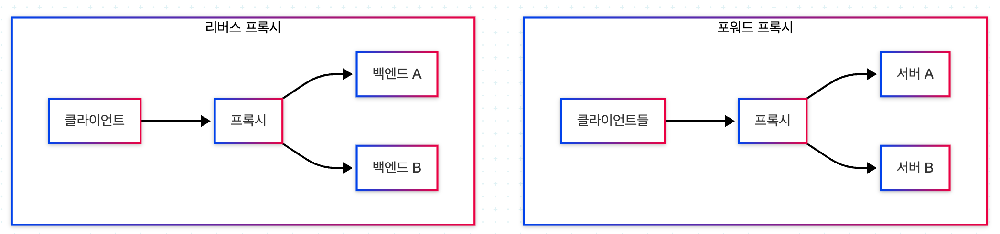
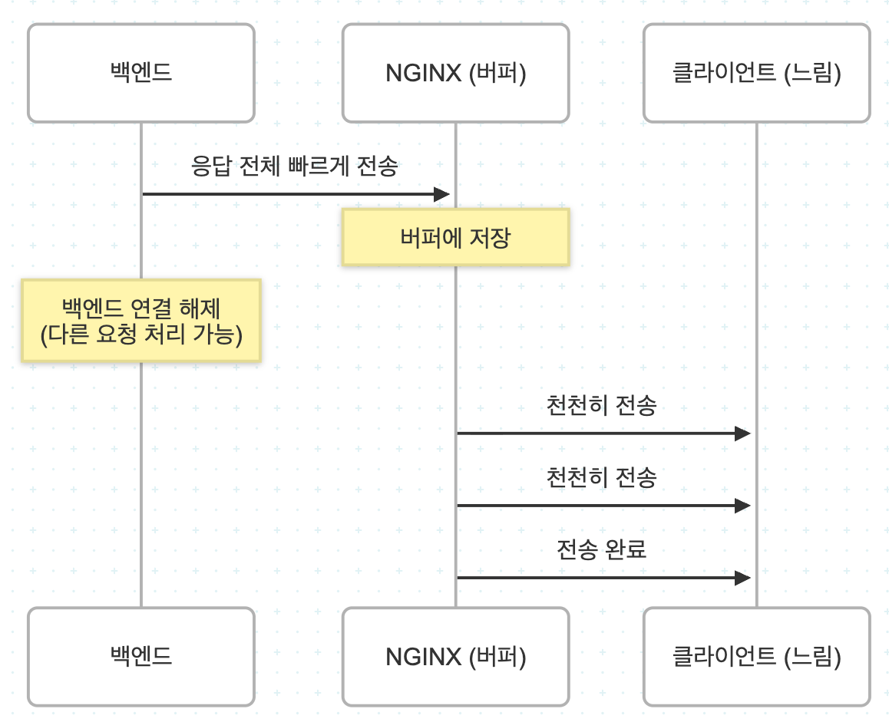
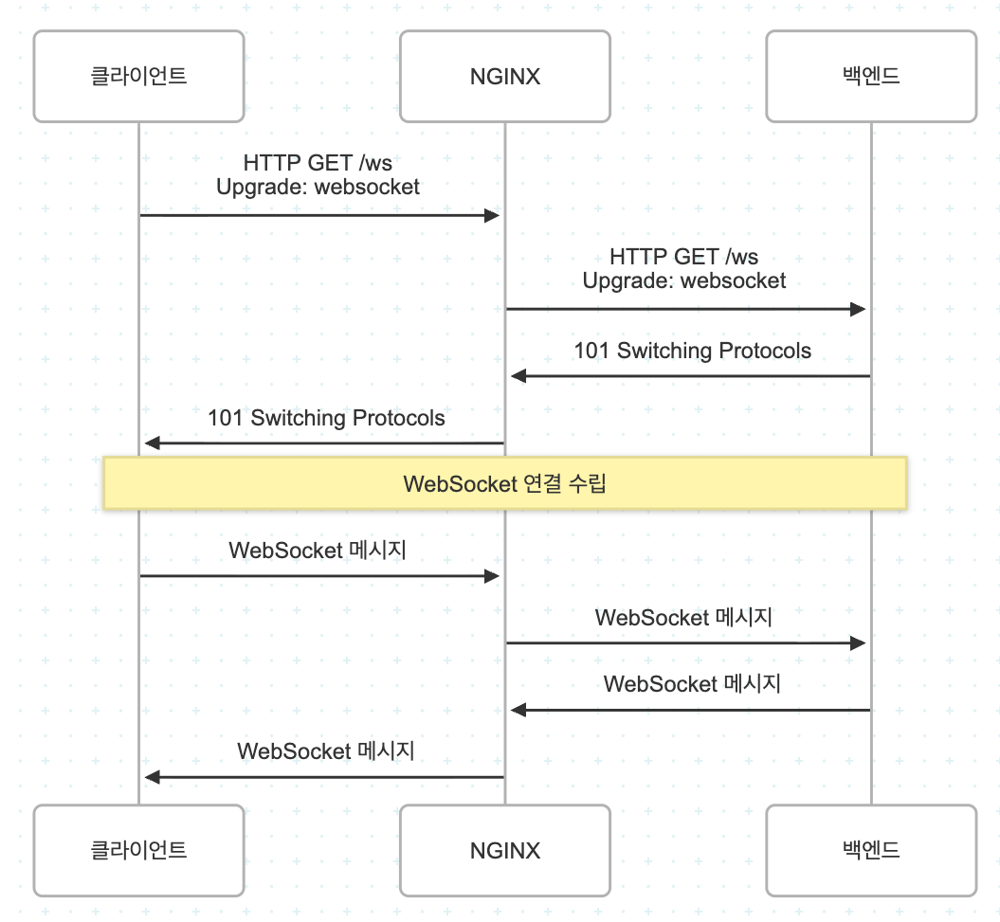
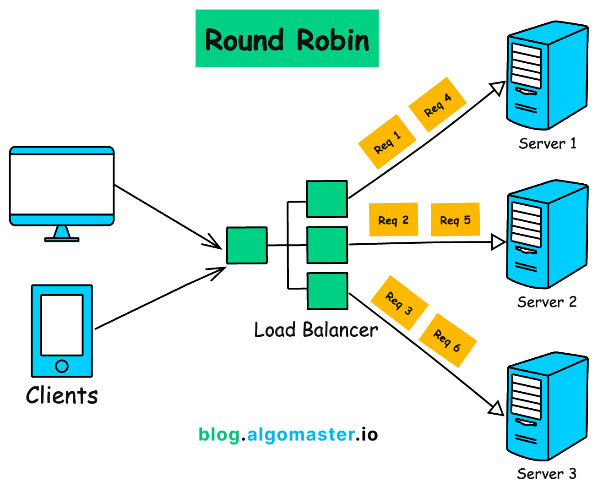
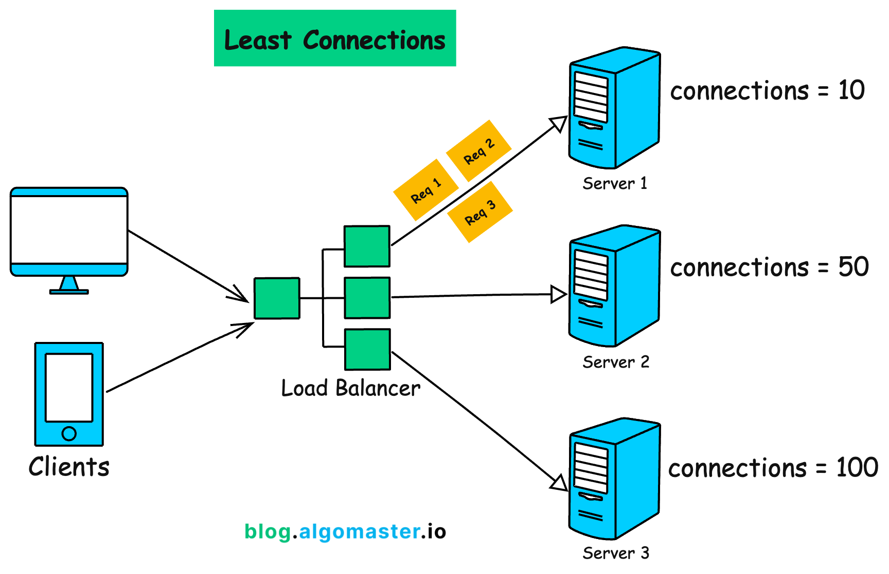
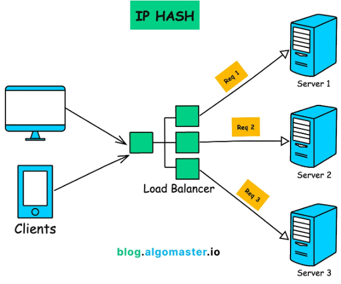

# Reverse Proxy 관점에서의 Nginx 사용법

## 1. HTTP1.0/HTTP1.1을 기반으로 하는 Dynamic Reverse Proxy

Dynamic Reverse Proxy는 클라이언트 요청을 받아 백엔드 서버로 전달하고, 그 응답을 다시 클라이언트에게 반환하는 역할을 한다.

- **동작 구조**
  - 클라이언트가 HTTP 요청 전송
  - Nginx가 요청을 수신
  - 설정된 upstream(백엔드 서버)으로 요청 전달
  - 백엔드 서버가 처리 후 응답 반환
  - Nginx가 응답을 클라이언트에게 전달
- **관련 설정**
  - `proxy_pass`: 요청을 전달할 대상 서버 지정
  - `proxy_http_version 1.1`: HTTP/1.1 사용 (Keep-Alive 및 성능 향상)
  - `proxy_set_header`: 클라이언트의 요청 정보를 Nginx가 받아서 전달한다.

```conf
upstream backend_server {
    server 10.0.0.1:8080;
    server 10.0.0.2:8080;
}

server {
    listen 80;

    location /api/ {
        proxy_pass http://backend_server;

        # HTTP 버전 설정
        proxy_http_version 1.1;

        # Connection 유지 (중요)
        proxy_set_header Connection "";

        # 원본 요청 정보 전달
        proxy_set_header Host $host;
        proxy_set_header X-Real-IP $remote_addr;
        proxy_set_header X-Forwarded-For $proxy_add_x_forwarded_for;
    }
}
```

<div align="center">
    
</div>
<br/>

### 사용 예시

```conf
location /api/ {
    proxy_pass http://localhost:3000;
}

upstream backend {
    server 127.0.0.1:3000;
    server 127.0.0.1:3001;
}

server {
    location /api/ {
        proxy_pass http://backend
    }
}

location /api/ {
    proxy_pass http://backend;

    proxy_set_header Host $host;
    proxy_set_header X-Real-IP $remote_addr;
    proxy_set_header X-Forwarded-For $proxy_add_x_forwarded_for;
    proxy_set_header X-Forwarded-Proto $scheme;

    proxy_buffering on; # 버퍼링 활성화
    proxy_buffer_size 4k; # 응답 헤더 버퍼
    proxy_buffers 8 4k; # 응답 본문 버퍼
    proxy_busy_buffers_size 8k; # 클라이언트에 보내는 중인 버퍼
}

upstream backend {
    server 127.0.0.1:3000;
    server 127.0.0.1:3001;

    keepalive 32;
}

location /api/ {
    proxy_pass http://backend;

    # Nginx와 백엔드와의 연결 재사용 설정
    proxy_http_version 1.1;
    proxy_set_header Connection "";
}
```

<div align="center">
    <br/>
    버퍼링 기능
</div>
<br/>

## 2. WebSocket을 기반으로 하는 Dynamic Reverse Proxy 및 서버 기능 테스트

<div align="center">
    
</div>
<br/>

### 2-1. 동작 원리

WebSocket 기반 Dynamic Reverse Proxy는 Nginx가 클라이언트와 백엔드 서버 간의 WebSocket 연결을 중계하는 역할을 한다.

- HTTP 요청으로 시작 → WebSocket으로 업그레이드
- 이후 지속적인 양방향 통신 유지

```bash
# 1) 초기 요청 (HTTP)
GET /ws HTTP/1.1
Upgrade: websocket
Connection: Upgrade

# 프로토콜 업그레이드
서버가 101 Switching Protocols 응답
HTTP → WebSocket 전환

# 이후 통신
TCP 연결 유지
지속적인 양방향 데이터 전송
```

- `설정 예시`
  - proxy_http_version 1.1: WebSocket은 HTTP/1.1 기반 Upgrade 필요. HTTP/1.0에서는 동작 불가.
  - Upgrade 헤더: 클라이언트 요청의 Upgrade 헤더 전달
  - Connection 헤더: Upgrade 요청을 유지하도록 설정
  - timeout 설정: WebSocket은 장기 연결

```conf
server {
    listen 80;

    location /ws/ {
        proxy_pass http://backend_ws;

        # WebSocket 필수 설정
        proxy_http_version 1.1;
        proxy_set_header Upgrade $http_upgrade;
        proxy_set_header Connection "Upgrade";

        # Host 유지
        proxy_set_header Host $host;
        proxy_set_header X-Real-IP $remote_addr;

        # timeout (중요)
        proxy_read_timeout 3600s;
    }
}
```

### 2-2. 사용 예시

- `nginx 설정`

```conf
worker_processes 1;

events {
    worker_connections 1024;
}

http {
    upstream api_backend {
        server 127.0.0.1:3000;
        server 127.0.0.1:3001;
        keepalive 32;
    }

    server {
        listen 80;
        server_name example.com;


        # API 프록시
        location /api/ {
            proxy_pass http://api_backend;

            # 헤더 설정
            proxy_set_header Host $host;
            proxy_set_header X-Real-IP $remote_addr;
            proxy_set_header X-Forwarded-For $proxy_add_x_forwarded_for;
            proxy_set_header X-Forwarded-Proto $scheme;

            # keepalive
            proxy_http_version 1.1;
            proxy_set_header Connection "";
        }

        # WebSocket
        location /ws/ {
            proxy_pass http://api_backend;
            proxy_http_version 1.1;
            proxy_set_header Upgrade $http_upgrade;
            proxy_set_header Connection "upgrade";
            proxy_set_header Host $host;
            proxy_read_timeout 86400s;
        }
    }
}
```

- `백엔드 서버 코드`

```js
// app.js
const http = require("http");

const server = http.createServer((req, res) => {
  console.log(`[Server 1] Received request: ${req.method} ${req.url}`);

  res.writeHead(200, { "content-type": "text/plain" });
  res.end(`Backend SErver 1 (Port 3000): ${req.url}\n`);
});

server.listen(3000, () => {
  console.log("[Server 1] Listening on port 3000");
});

// app2.js
const http = require("http");

const server = http.createServer((req, res) => {
  console.log(`[Server 2] Received request: ${req.method} ${req.url}`);

  res.writeHead(200, { "content-type": "text/plain" });
  res.end(`Backend SErver 2 (Port 3001): ${req.url}\n`);
});

server.listen(3001, () => {
  console.log("[Server 2] Listening on port 3001");
});
```

<br/>

## 3. Load Balancing Using Nginx 그리고 5가지 알고리즘

Load Balancing은 여러 서버(Backend)에 트래픽을 분산하여 성능 향상 + 장애 대응 + 확장성 확보를 가능하게 하는 기술이다. Nginx는 Reverse Proxy 역할과 함께 로드 밸런서로 동작할 수 있다.

- 트래픽 분산
- 장애 서버 자동 제외 (failover)
- 서버 확장 용이 (scale-out)
- SSL termination과 결합 가능

```conf
upstream backend {
    server 10.0.0.1:8080;
    server 10.0.0.2:8080;
    server 10.0.0.3:8080;
}

server {
    location / {
        proxy_pass http://backend;
    }
}
```

### 3-1. Round Robin

- 요청을 순서대로 서버에 분배 (기본값)
- 단순하고 균등한 분산

```conf
upstream backend {
    # 가중치: 값이 높을수록 요청을 많이 받는다.
    server 10.0.0.1 weight=3;
    server 10.0.0.2 weight=2;
    server 10.0.0.3 weight=5;

    # backup: 다른 서버가 죽었을 때 동작
    server 10.0.0.4 backup;

    # down: 해당 서버를 일시적으로 제외 (비활성화)
    server 10.0.0.5 down;

    # 30초 동안 3번 실패시 제외. 30초 후 다시 활성화
    server 10.0.0.6 max_fails=3 fail_timeout=30s;
}
```

- `코드로 구현`

```python
# 단순 라운드 로빈
class RoundRobin:
    def __init__(self, servers):
        self.servers = servers
        self.current_index = -1

    def get_next_server(self):
        self.current_index = (self.current_index + 1) % len(self.servers)
        return self.servers[self.current_index]

# 가중치 라운드 로빈
class WeightedRoundRobin:
    def __init__(self, servers):
        self.servers = servers
        self.weights = weights
        self.current_index = -1
        self.current_weight = 0

    def get_next_server(self):
        while True:
            self.current_index = (self.current_index + 1) % len(self.servers)
            if self.current_index == 0:
                self.current_weight -= 1
                if self.current_weight <= 0:
                    self.current_weight = max(self.weights)
            if self.weights[self.current_index] >= self.current_weight:
                return self.servers[self.current_index]

# 사용 예시
servers = ["Server1", "Server2", "Server3"]
weights = [5, 1, 1]
load_balancer = WeightedRoundRobin(servers, weights)

for i in range(7):
    server = load_balancer.get_next_server()
    print(f"Request {i + 1} -> {server}")
```

<div align="center">
    
</div>
<br/>

### 3-2. Least Connections

- 현재 연결 수가 가장 적은 서버로 요청 전달
- 트래픽이 불균형할 때 효과적
- 응답 시간이 긴 요청에 유리

```conf
upstream backend {
    ip_hash;
    server 10.0.0.1;
    server 10.0.0.2;
}
```

- `코드로 구현`

```python
import random

class LeastConnections:
    def __init__(self, servers):
        self.servers = {server: 0 for server in servers}

    def get_next_server(self):
        min_connections = min(self.servers.values())
        least_loaded_servers = [server for server, connections in self.servers.items() if connections == min_connections]
        selected_server = random.choice(least_loaded_servers)
        self.servers[selected_server] += 1
        return selected_server

    def release_connection(self, server):
        if self.servers[server] > 0:
            self.servers[server] -= 1

# 사용 예시
servers = ["Server1", "Server2", "Server3"]
load_balancer = LeastConnections(servers)

for i in range(7):
    server = load_balancer.get_next_server()
    print(f"Request {i + 1} -> {server}")
    load_balancer.release_connection(server)
```

<div align="center">
    
</div>
<br/>

### 3-3. IP Hash (세션 유지)

- 클라이언트 IP 기반으로 동일 서버에 연결
- 세션 유지 (Sticky Session)
- 로그인 상태 유지에 유리

```conf
upstream backend {
    ip_hash;
    server 10.0.0.1;
    server 10.0.0.2;
}
```

- `코드로 구현`

```python
import hashlib

class IPHash():
    def __init__(self, servers):
        self.servers = servers

    def get_next_server(self, client_ip):
        hash_value = hashlib.md5(client_ip.encode()).hexdigest()
        index = int(hash_value, 16) % len(self.servers)
        return self.servers[index]

# 사용 예시
servers = ["Server1", "Server2", "Server3"]
load_balancer = IPHash(servers)

client_ips = ["192.168.0.1", "192.168.0.2", "192.168.0.3", "192.168.0.4"]
for ip in client_ips:
    server = load_balancer.get_next_server(ip)
    print(f"Client {ip} -> {server}")
```

<div align="center">
    
</div>
<br/>

### 3-4. Hash (Generic Hash)

- 특정 값 기반으로 서버 선택
- URI / 쿠키 / 헤더 등 기준 설정 가능
- 캐시 서버 분산에 적합 (정적 파일)

```conf
upstream backend {
    # hash $cookie_sessionid consistent;
    # hash $http_x_user_id consistent;
    # hash "$request_uri$arg_version" consistent;
    hash $request_uri;
    server 10.0.0.1;
    server 10.0.0.2;
}
```

### 3-5. 사용 예시

```conf
upstream api_servers {
   least_conn;

   server 10.0.0.1:3000 weight=3 max_fails=3 fail_timeout=30s;
   server 10.0.0.2:3000 weight=2 max_fails=3 fail_timeout=30s;
   server 10.0.0.3:3000 weight=1 max_fails=3 fail_timeout=30s;
   server 10.0.0.4:3000 backup;

   keepalive 32;
}

upstream static_servers {
   hash $request_uri consistent;

   server 10.0.1.1:80;
   server 10.0.1.2:80;
}

server {
   listen 80;
   server_name example.com;

   # API - least_conn으로 부하 분산
   location /api/ {
       proxy_pass http://api_servers;

       proxy_http_version 1.1;
       proxy_set_header Connection "";
       proxy_set_header Host $host;
       proxy_set_header X-Real-IP $remote_addr;
       proxy_set_header X-Forwarded-For $proxy_add_x_forwarded_for;

       proxy_next_upstream error timeout http_502 http_503 http_504;
       proxy_next_upstream_tries 2;
   }

   # 정적 파일 - hash consistent로 캐시 효율 증가
   location /static/ {
       proxy_pass http://static_servers;
   }

   # WebSocket
   location /ws/ {
       proxy_pass http://api_servers;

       proxy_http_version 1.1;
       proxy_set_header Upgrade $http_upgrade;
       proxy_set_header Connection "upgrade";

       proxy_read_timeout 86400s;
   }
}
```

<br/>

## 4. Nginx에서의 성능 최적화의 모든 것

- 파일 디스크립터
  - 클라이언트 연결, 백엔드 연결, 정적 파일, 로그 파일 모두 해당 갯수를 사용
  - worker_rlimit_nofile >= worker_connections \* 2 + 여유분

```bash
# 제한 확인
ulimit -n

# 프로세스가 열 수 있는 최대 파일 디스크립터 갯수
worker_rlimit_nofile 65535;
```

### 4-1. 요약 설정

```conf
worker_rlimit_nofile 65535;

events {
    worker_connections 4096
}

# worker_rlimit_nofile >= worker_connections * 2 + 여유분

http {
    open_file_cache max=10000 inactive=60s; # 최대 10000개 캐시, 60초 안쓰면 제거
    open_file_cache_valid 30s; # 캐시 유효성 검사 주기
    open_file_cache_min_uses 2; # 최소 2번 이상 접근된 파일만 캐시
    open_file_cache_errors on; # 파일 없음 -> 이것도 에러로 캐시

    client_max_body_size 100m; # 요청 본문 최대 크기 ( 기본값 1m)
    client_body_buffer_size 16k; # 요청 본문 버퍼 크기 (기본값 8k or 16k)
    client_header_buffer_size 1k;   # 요청 헤더 크기
    large_client_header_buffers 4 8k;   # 큰 요청 헤더용 버퍼

    client_body_timeout 30s; # 요청 본문을 받는 타임아웃
    client_header_timeout 30s; # 요청 헤더를 받는 타임아웃
    send_timeout 30s; # 응답을 보내는 타임아웃

    server {
        listen 8080 backlog=4096;
    }

}
```

<br/>

## 5. HTTPS SSL/TLS CA 인증서 적용 및 HTTP/2 Protocol 구현하기

- `자체 서명 인증서 생성`

```bash
openssl req -x509 -nodes -days 365 -newkey rsa:2048 \
-keyout /opt/homebrew/etc/nginx/ssl/privkey.pem \
-out /opt/homebrew/etc/nginx/ssl/fullchain.pem \
-subj "/CN=localhost"
```

- `Nginx 설정`

```conf
worker_processes auto;

events {
  worker_connections 1024;
}

http {
  # HTTP → HTTPS 리다이렉트
  server {
      listen 80;
      server_name example.com;
      return 301 https://$host$request_uri;
  }

  # HTTPS + HTTP/2 서버
  server {
      listen 443 ssl;
      http2 on;
      server_name example.com;

      # SSL 인증서 경로
      ssl_certificate /opt/homebrew/etc/nginx/ssl/fullchain.pem;
      ssl_certificate_key /opt/homebrew/etc/nginx/ssl/privkey.pem;

      ssl_protocols TLSv1.2 TLSv1.3;
      ssl_ciphers HIGH:!aNULL:!MD5; # 암호화 알고리즘
      ssl_prefer_server_ciphers on; # 서버 우선 암호화 방식 사용

      # 성능 최적화 옵션
      ssl_session_cache shared:SSL:10m; # 세션 캐시 설정
      ssl_session_timeout 10m; # 세션 타임아웃 설정

      # 보안 헤더
      add_header Strict-Transport-Security "max-age=31536000; includeSubDomains" always;

      # HTTP/2 관련 설정: 하나의 연결에서 동시에 처리할 수 있는 스트림 갯수
      http2_max_concurrent_streams 128;

      location / {
          root /opt/homebrew/var/www;
          index index.html;
      }
  }
}
```
